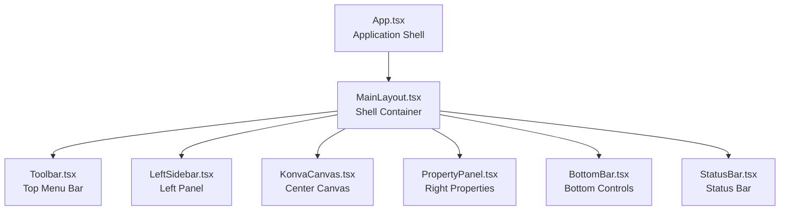
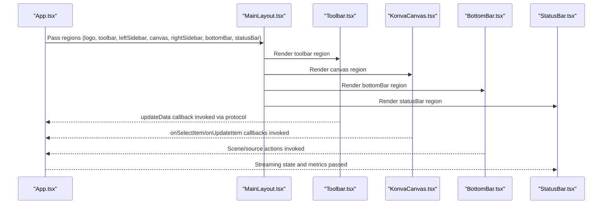
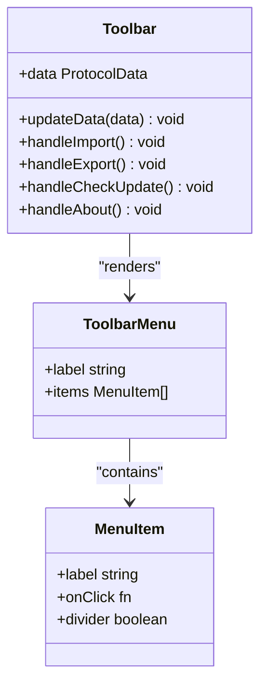
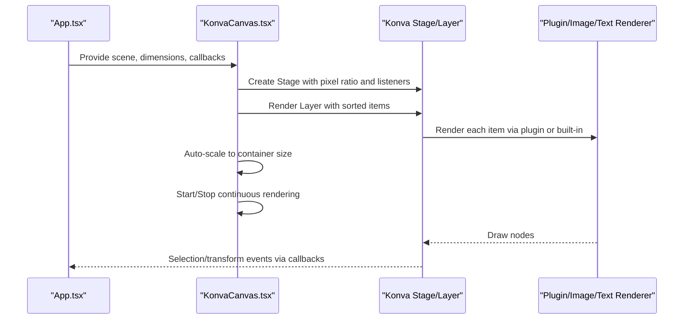
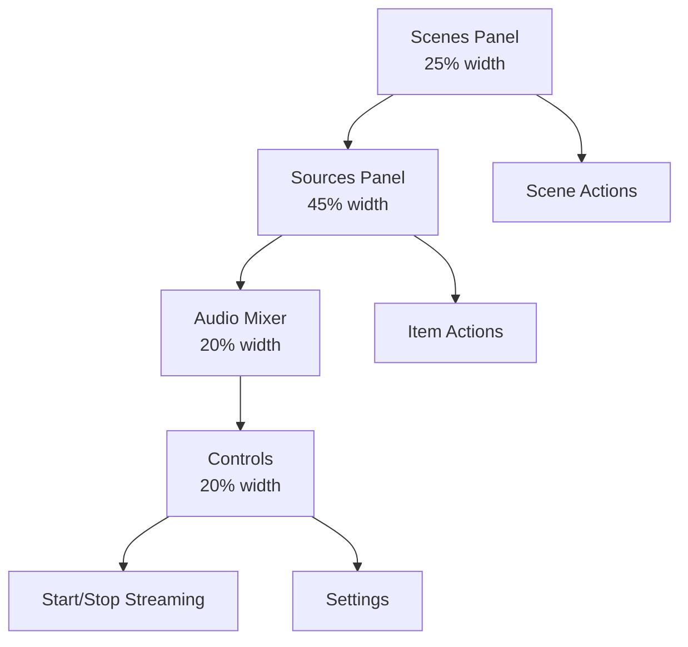
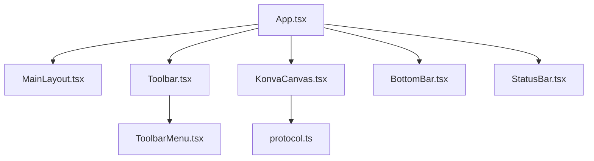

# Layout System

<cite>
**Referenced Files in This Document**
- [main-layout.tsx](file://src/components/main-layout.tsx)
- [toolbar.tsx](file://src/components/toolbar.tsx)
- [toolbar-menu.tsx](file://src/components/toolbar-menu.tsx)
- [left-sidebar.tsx](file://src/components/left-sidebar.tsx)
- [status-bar.tsx](file://src/components/status-bar.tsx)
- [bottom-bar.tsx](file://src/components/bottom-bar.tsx)
- [konva-canvas.tsx](file://src/components/konva-canvas.tsx)
- [App.tsx](file://src/App.tsx)
- [protocol.ts](file://src/types/protocol.ts)
- [index.css](file://src/index.css)
- [tailwind.config.js](file://tailwind.config.js)
</cite>

## Table of Contents
1. [Introduction](#introduction)
2. [Project Structure](#project-structure)
3. [Core Components](#core-components)
4. [Architecture Overview](#architecture-overview)
5. [Detailed Component Analysis](#detailed-component-analysis)
6. [Dependency Analysis](#dependency-analysis)
7. [Performance Considerations](#performance-considerations)
8. [Troubleshooting Guide](#troubleshooting-guide)
9. [Conclusion](#conclusion)

## Introduction
This document explains the layout system architecture of LiveMixer Web, focusing on the MainLayout component and its surrounding UI regions. It covers toolbar organization, sidebar positioning, canvas area management, and status bar implementation. It also documents the layout prop system, component composition patterns, responsive design principles, and how different UI regions communicate and coordinate.

## Project Structure
The layout system centers around a single application shell that composes multiple specialized panels and regions. The shell delegates content to optional regions, enabling flexible composition without hard-coded dependencies.

**Diagram sources**
- [App.tsx:913-1022](file://src/App.tsx#L913-L1022)
- [main-layout.tsx:14-76](file://src/components/main-layout.tsx#L14-L76)

**Section sources**
- [main-layout.tsx:14-76](file://src/components/main-layout.tsx#L14-L76)
- [App.tsx:913-1022](file://src/App.tsx#L913-L1022)

## Core Components
- MainLayout: A flexible shell that accepts optional ReactNode props for each region. It applies consistent dark theme styling and ensures each region renders only when provided.
- Toolbar: Provides top-level menus and actions (edit, view, config, tools, help) and a link to the project repository.
- LeftSidebar: Placeholder for future features; currently renders empty content.
- Canvas Area: Hosts the Konva-based interactive canvas with auto-scaling and continuous rendering support.
- BottomBar: Scene and source management with controls for adding/removing/moving items and toggling visibility/locking.
- StatusBar: Displays streaming status, duration, output resolution, CPU usage, and FPS.

**Section sources**
- [main-layout.tsx:3-12](file://src/components/main-layout.tsx#L3-L12)
- [toolbar.tsx:11-165](file://src/components/toolbar.tsx#L11-L165)
- [left-sidebar.tsx:1-8](file://src/components/left-sidebar.tsx#L1-L8)
- [konva-canvas.tsx:97-124](file://src/components/konva-canvas.tsx#L97-L124)
- [bottom-bar.tsx:37-57](file://src/components/bottom-bar.tsx#L37-L57)
- [status-bar.tsx:4-10](file://src/components/status-bar.tsx#L4-L10)

## Architecture Overview
The layout follows a composition pattern: App.tsx constructs the shell and injects child components into MainLayout’s regions. Each region is self-contained and communicates with the rest through props and callbacks.

**Diagram sources**
- [App.tsx:915-1000](file://src/App.tsx#L915-L1000)
- [main-layout.tsx:24-76](file://src/components/main-layout.tsx#L24-L76)
- [toolbar.tsx:11-165](file://src/components/toolbar.tsx#L11-L165)
- [konva-canvas.tsx:113-124](file://src/components/konva-canvas.tsx#L113-L124)
- [bottom-bar.tsx:59-79](file://src/components/bottom-bar.tsx#L59-L79)
- [status-bar.tsx:12-18](file://src/components/status-bar.tsx#L12-L18)

## Detailed Component Analysis

### MainLayout: Shell and Prop System
- Purpose: Provide a structured shell with optional regions for toolbar, sidebars, canvas, bottom bar, and status bar.
- Props: logo, toolbar, userSection, canvas, leftSidebar, rightSidebar, bottomBar, statusBar.
- Behavior: Renders each region only when provided; otherwise omits it. Uses Tailwind classes for consistent spacing, borders, and backdrop blur.

```mermaid
flowchart TD
Start(["Render MainLayout"]) --> CheckLogo{"Has logo?"}
CheckLogo --> |Yes| RenderLogo["Render logo region"]
CheckLogo --> |No| SkipLogo["Skip logo region"]
Start --> CheckToolbar{"Has toolbar?"}
CheckToolbar --> |Yes| RenderToolbar["Render toolbar region"]
CheckToolbar --> |No| SkipToolbar["Skip toolbar region"]
Start --> CheckUserSection{"Has userSection?"}
CheckUserSection --> |Yes| RenderUser["Render userSection region"]
CheckUserSection --> |No| SkipUser["Skip userSection region"]
Start --> CheckLeftSidebar{"Has leftSidebar?"}
CheckLeftSidebar --> |Yes| RenderLeft["Render leftSidebar region"]
CheckLeftSidebar --> |No| SkipLeft["Skip leftSidebar region"]
Start --> CheckCanvas{"Has canvas?"}
CheckCanvas --> |Yes| RenderCanvas["Render canvas region"]
CheckCanvas --> |No| SkipCanvas["Skip canvas region"]
Start --> CheckRightSidebar{"Has rightSidebar?"}
CheckRightSidebar --> |Yes| RenderRight["Render rightSidebar region"]
CheckRightSidebar --> |No| SkipRight["Skip rightSidebar region"]
Start --> CheckBottomBar{"Has bottomBar?"}
CheckBottomBar --> |Yes| RenderBottom["Render bottomBar region"]
CheckBottomBar --> |No| SkipBottom["Skip bottomBar region"]
Start --> CheckStatusBar{"Has statusBar?"}
CheckStatusBar --> |Yes| RenderStatus["Render statusBar region"]
CheckStatusBar --> |No| SkipStatus["Skip statusBar region"]
RenderLogo --> End(["Layout Complete"])
RenderToolbar --> End
RenderUser --> End
RenderLeft --> End
RenderCanvas --> End
RenderRight --> End
RenderBottom --> End
RenderStatus --> End
SkipLogo --> End
SkipToolbar --> End
SkipUser --> End
SkipLeft --> End
SkipCanvas --> End
SkipRight --> End
SkipBottom --> End
SkipStatus --> End
```

**Diagram sources**
- [main-layout.tsx:24-76](file://src/components/main-layout.tsx#L24-L76)

**Section sources**
- [main-layout.tsx:3-12](file://src/components/main-layout.tsx#L3-L12)
- [main-layout.tsx:24-76](file://src/components/main-layout.tsx#L24-L76)

### Toolbar: Organization and Menus
- Structure: Groups related actions into logical menus (Edit, View, Config, Tools, Help).
- Menu Items: Each menu item is a ToolbarMenu with label and items array supporting labels, click handlers, and dividers.
- Actions: Includes import/export of configuration, fullscreen toggle, grid/guides visibility, audio mixer, scene transitions, plugin manager, update checks, and documentation links.
- GitHub Link: A trailing link to the project repository.

**Diagram sources**
- [toolbar.tsx:6-9](file://src/components/toolbar.tsx#L6-L9)
- [toolbar.tsx:11-165](file://src/components/toolbar.tsx#L11-L165)
- [toolbar-menu.tsx:9-18](file://src/components/toolbar-menu.tsx#L9-L18)
- [toolbar-menu.tsx:20-56](file://src/components/toolbar-menu.tsx#L20-L56)

**Section sources**
- [toolbar.tsx:11-165](file://src/components/toolbar.tsx#L11-L165)
- [toolbar-menu.tsx:20-56](file://src/components/toolbar-menu.tsx#L20-L56)

### Left Sidebar: Reserved Space
- Current state: Empty placeholder for future features.
- Design: Full-height container with scrollable content area.

**Section sources**
- [left-sidebar.tsx:1-8](file://src/components/left-sidebar.tsx#L1-L8)

### Canvas Area: Interactive Rendering and Scaling
- Component: KonvaCanvas renders the active scene with auto-scaling to fit available space while preserving aspect ratio.
- Continuous Rendering: Maintains a render loop to keep captureStream active during streaming.
- Selection and Transforms: Supports item selection, drag-and-drop, and transform handles with locking and visibility controls.
- Plugins: Delegates rendering to plugin-defined renderers when available.

**Diagram sources**
- [konva-canvas.tsx:113-124](file://src/components/konva-canvas.tsx#L113-L124)
- [konva-canvas.tsx:302-357](file://src/components/konva-canvas.tsx#L302-L357)
- [konva-canvas.tsx:144-176](file://src/components/konva-canvas.tsx#L144-L176)

**Section sources**
- [konva-canvas.tsx:97-124](file://src/components/konva-canvas.tsx#L97-L124)
- [konva-canvas.tsx:302-357](file://src/components/konva-canvas.tsx#L302-L357)
- [konva-canvas.tsx:144-176](file://src/components/konva-canvas.tsx#L144-L176)

### Bottom Bar: Scene and Source Management
- Composition: Three main areas: Scenes (25%), Sources (45%), Audio Mixer (20%), and Controls (20%).
- Interactions: Scene selection, add/delete/reorder scenes; source selection, add/delete/reorder sources; visibility/lock toggles; audio mixer integration; streaming control; settings access.
- Dialogs: Confirmation dialogs for delete operations; add-source selection dialog.

**Diagram sources**
- [bottom-bar.tsx:93-213](file://src/components/bottom-bar.tsx#L93-L213)
- [bottom-bar.tsx:215-393](file://src/components/bottom-bar.tsx#L215-L393)
- [bottom-bar.tsx:395-407](file://src/components/bottom-bar.tsx#L395-L407)
- [bottom-bar.tsx:409-451](file://src/components/bottom-bar.tsx#L409-L451)

**Section sources**
- [bottom-bar.tsx:37-57](file://src/components/bottom-bar.tsx#L37-L57)
- [bottom-bar.tsx:93-213](file://src/components/bottom-bar.tsx#L93-L213)
- [bottom-bar.tsx:215-393](file://src/components/bottom-bar.tsx#L215-L393)
- [bottom-bar.tsx:395-407](file://src/components/bottom-bar.tsx#L395-L407)
- [bottom-bar.tsx:409-451](file://src/components/bottom-bar.tsx#L409-L451)

### Status Bar: Metrics and Streaming Info
- Fields: Streaming status (with icon and label), stream duration (when streaming), output resolution, CPU usage, and FPS.
- Theming: Uses gradient backgrounds and neutral borders for depth.

**Section sources**
- [status-bar.tsx:4-10](file://src/components/status-bar.tsx#L4-L10)
- [status-bar.tsx:12-18](file://src/components/status-bar.tsx#L12-L18)

## Dependency Analysis
- App.tsx composes all regions and passes state/callbacks to each component.
- MainLayout depends only on the presence of its props; it does not import other components directly, keeping coupling low.
- ToolbarMenu is a reusable UI primitive used by Toolbar.
- KonvaCanvas integrates with the protocol types and plugin registry for rendering.
- BottomBar coordinates with App.tsx to manage scenes and items.

**Diagram sources**
- [App.tsx:913-1022](file://src/App.tsx#L913-L1022)
- [toolbar.tsx:4-4](file://src/components/toolbar.tsx#L4-L4)
- [toolbar-menu.tsx:20-56](file://src/components/toolbar-menu.tsx#L20-L56)
- [konva-canvas.tsx:20-22](file://src/components/konva-canvas.tsx#L20-L22)
- [protocol.ts:103-114](file://src/types/protocol.ts#L103-L114)

**Section sources**
- [App.tsx:913-1022](file://src/App.tsx#L913-L1022)
- [toolbar.tsx:4-4](file://src/components/toolbar.tsx#L4-L4)
- [toolbar-menu.tsx:20-56](file://src/components/toolbar-menu.tsx#L20-L56)
- [konva-canvas.tsx:20-22](file://src/components/konva-canvas.tsx#L20-L22)
- [protocol.ts:103-114](file://src/types/protocol.ts#L103-L114)

## Performance Considerations
- Continuous Rendering: KonvaCanvas exposes start/stop methods to maintain a render loop while streaming, ensuring captureStream remains active.
- Auto-scaling: Uses ResizeObserver and requestAnimationFrame to compute scale and adjust the stage size efficiently.
- Conditional Rendering: MainLayout avoids rendering unused regions, reducing DOM overhead.
- Backdrop Blur and Shadows: Applied selectively to maintain readability without excessive GPU cost.

**Section sources**
- [konva-canvas.tsx:144-176](file://src/components/konva-canvas.tsx#L144-L176)
- [konva-canvas.tsx:302-357](file://src/components/konva-canvas.tsx#L302-L357)
- [main-layout.tsx:24-76](file://src/components/main-layout.tsx#L24-L76)

## Troubleshooting Guide
- Toolbar Import/Export Failures: Errors during JSON parsing or invalid format trigger alerts; verify the file format matches the expected protocol structure.
- Streaming Issues: Ensure LiveKit URL and token are configured; check console logs for errors and confirm continuous rendering is active during capture.
- Canvas Scaling Problems: Verify container dimensions and that ResizeObserver is firing; ensure stage size updates on window resize.
- BottomBar Actions Disabled: Some actions are disabled when no scene/item is selected or when constraints are not met (e.g., last scene cannot be deleted).

**Section sources**
- [toolbar.tsx:14-48](file://src/components/toolbar.tsx#L14-L48)
- [toolbar.tsx:50-65](file://src/components/toolbar.tsx#L50-L65)
- [App.tsx:726-788](file://src/App.tsx#L726-L788)
- [konva-canvas.tsx:302-357](file://src/components/konva-canvas.tsx#L302-L357)
- [bottom-bar.tsx:161-163](file://src/components/bottom-bar.tsx#L161-L163)

## Conclusion
The layout system is intentionally modular and composable. MainLayout acts as a thin shell, delegating UI responsibilities to specialized components. The prop-driven design enables easy customization of each region, while shared callbacks and state in App.tsx coordinate actions across the shell. Responsive behavior is achieved through auto-scaling and flexible containers, and performance is optimized via selective rendering and efficient canvas updates.