# Property Panel System

<cite>
**Referenced Files in This Document**
- [property-panel.tsx](file://src/components/property-panel.tsx)
- [add-source-dialog.tsx](file://src/components/add-source-dialog.tsx)
- [configure-source-dialog.tsx](file://src/components/configure-source-dialog.tsx)
- [configure-timer-dialog.tsx](file://src/components/configure-timer-dialog.tsx)
- [dialog.tsx](file://src/components/ui/dialog.tsx)
- [media-stream-manager.ts](file://src/services/media-stream-manager.ts)
- [protocol.ts](file://src/types/protocol.ts)
- [plugin-registry.ts](file://src/services/plugin-registry.ts)
- [video-input-dialog.tsx](file://src/plugins/builtin/webcam/video-input-dialog.tsx)
- [audio-input-dialog.tsx](file://src/plugins/builtin/audio-input/audio-input-dialog.tsx)
- [webcam-index.tsx](file://src/plugins/builtin/webcam/index.tsx)
- [audio-index.tsx](file://src/plugins/builtin/audio-input/index.tsx)
- [plugin-types.ts](file://src/types/plugin.ts)
</cite>

## Table of Contents
1. [Introduction](#introduction)
2. [Project Structure](#project-structure)
3. [Core Components](#core-components)
4. [Architecture Overview](#architecture-overview)
5. [Detailed Component Analysis](#detailed-component-analysis)
6. [Dependency Analysis](#dependency-analysis)
7. [Performance Considerations](#performance-considerations)
8. [Troubleshooting Guide](#troubleshooting-guide)
9. [Conclusion](#conclusion)

## Introduction

The Property Panel System is a comprehensive framework for editing scene item properties in the LiveMixer web application. It provides a unified interface for configuring various media sources including cameras, microphones, screens, images, videos, timers, clocks, and text elements. The system follows a plugin-based architecture that allows for extensible property editing capabilities while maintaining consistent user experience across different source types.

The system consists of three primary subsystems:
- **Property Panel**: Main interface for editing scene item properties with transform controls, opacity settings, and filter configurations
- **Dialog System**: Modal interfaces for adding and configuring sources with webcam setup, screen capture configuration, and timer settings
- **Media Stream Management**: Centralized service for managing browser media streams across all plugins and components

## Project Structure

The property panel system is organized around several key architectural patterns:

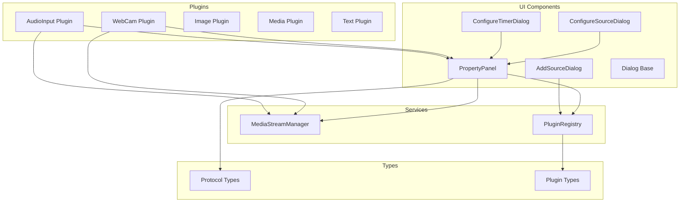

**Diagram sources**
- [property-panel.tsx:643-691](file://src/components/property-panel.tsx#L643-L691)
- [add-source-dialog.tsx:98-122](file://src/components/add-source-dialog.tsx#L98-L122)
- [media-stream-manager.ts:39-65](file://src/services/media-stream-manager.ts#L39-L65)

**Section sources**
- [property-panel.tsx:643-691](file://src/components/property-panel.tsx#L643-L691)
- [add-source-dialog.tsx:98-122](file://src/components/add-source-dialog.tsx#L98-L122)
- [media-stream-manager.ts:39-65](file://src/services/media-stream-manager.ts#L39-L65)

## Core Components

### Property Panel Architecture

The Property Panel serves as the central hub for editing scene item properties. It implements a sophisticated state management system that handles both local UI state and synchronization with the global application state.

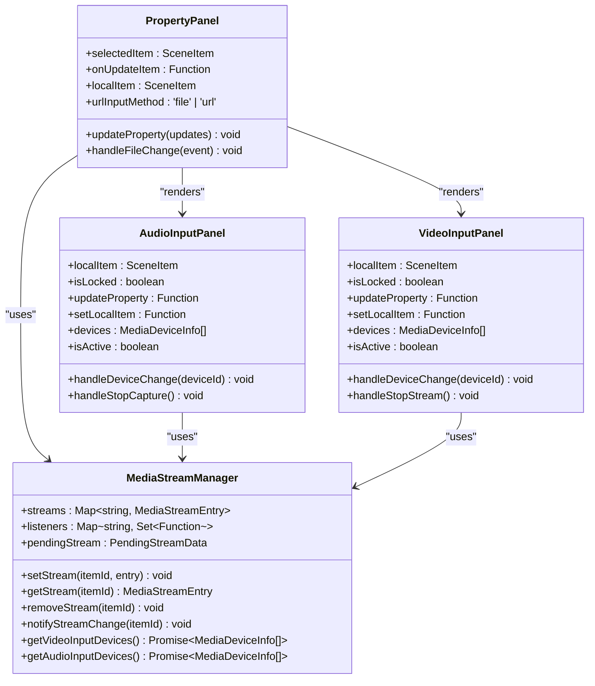

**Diagram sources**
- [property-panel.tsx:27-359](file://src/components/property-panel.tsx#L27-L359)
- [media-stream-manager.ts:39-141](file://src/services/media-stream-manager.ts#L39-L141)

### Dialog System Components

The dialog system provides modal interfaces for source configuration with validation and real-time feedback:

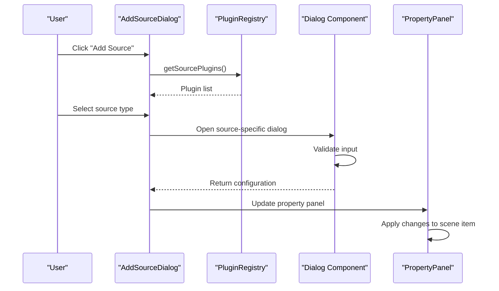

**Diagram sources**
- [add-source-dialog.tsx:105-122](file://src/components/add-source-dialog.tsx#L105-L122)
- [configure-source-dialog.tsx:82-97](file://src/components/configure-source-dialog.tsx#L82-L97)
- [configure-timer-dialog.tsx:58-79](file://src/components/configure-timer-dialog.tsx#L58-L79)

**Section sources**
- [property-panel.tsx:643-691](file://src/components/property-panel.tsx#L643-L691)
- [add-source-dialog.tsx:98-122](file://src/components/add-source-dialog.tsx#L98-L122)
- [media-stream-manager.ts:39-141](file://src/services/media-stream-manager.ts#L39-L141)

## Architecture Overview

The property panel system follows a layered architecture with clear separation of concerns:

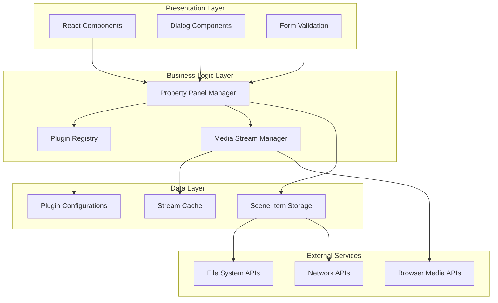

**Diagram sources**
- [property-panel.tsx:643-691](file://src/components/property-panel.tsx#L643-L691)
- [plugin-registry.ts:5-167](file://src/services/plugin-registry.ts#L5-L167)
- [media-stream-manager.ts:39-323](file://src/services/media-stream-manager.ts#L39-L323)

### Transform and Filter System

The system implements a comprehensive transform and filter configuration system:

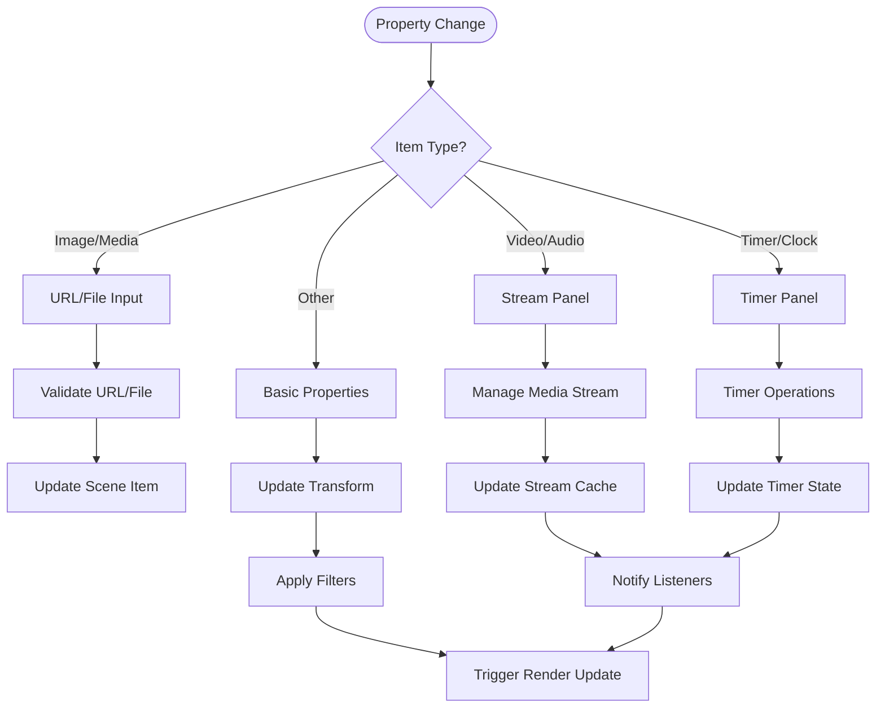

**Diagram sources**
- [property-panel.tsx:840-916](file://src/components/property-panel.tsx#L840-L916)
- [media-stream-manager.ts:56-65](file://src/services/media-stream-manager.ts#L56-L65)

**Section sources**
- [property-panel.tsx:840-916](file://src/components/property-panel.tsx#L840-L916)
- [media-stream-manager.ts:56-65](file://src/services/media-stream-manager.ts#L56-L65)

## Detailed Component Analysis

### Property Panel Implementation

The Property Panel component serves as the main interface for editing scene item properties with comprehensive support for different source types:

#### Transform Controls

The transform system provides precise control over item positioning, sizing, and appearance:

| Property | Range | Default | Description |
|----------|-------|---------|-------------|
| Position X/Y | Any number | 0 | Horizontal and vertical coordinates |
| Width/Height | 1+ pixels | 1+ | Item dimensions |
| Opacity | 0.0-1.0 | 1.0 | Transparency level |
| Rotation | 0-360° | 0° | Clockwise rotation |
| Border Radius | 0+ pixels | 0 | Corner rounding |

#### Property Synchronization Mechanism

The system implements a two-way synchronization mechanism:

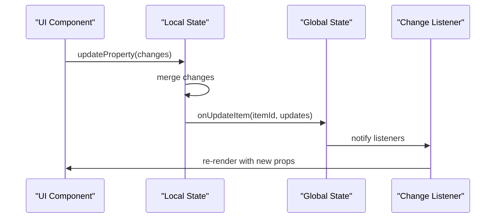

**Diagram sources**
- [property-panel.tsx:675-691](file://src/components/property-panel.tsx#L675-L691)

#### Plugin Property Integration

The system dynamically renders plugin-specific properties based on the plugin's propsSchema:

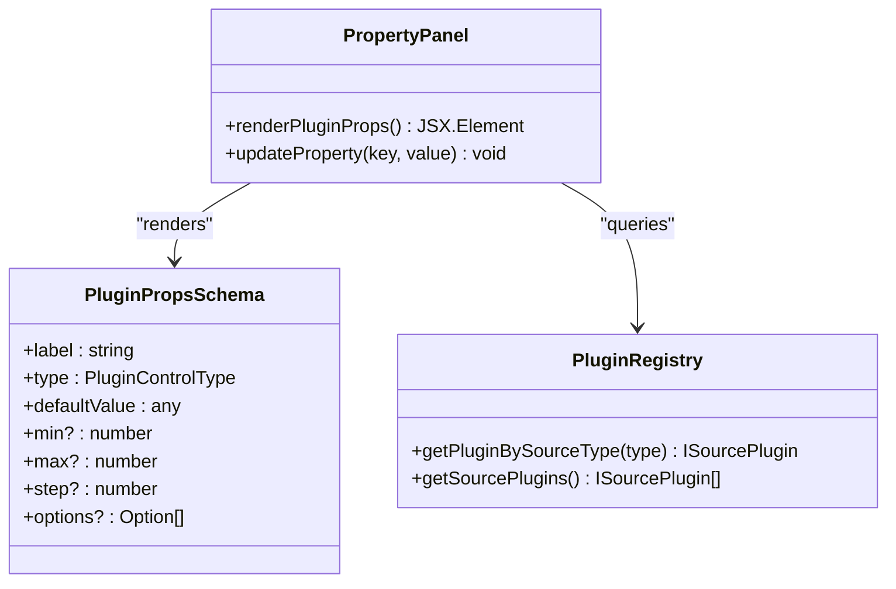

**Diagram sources**
- [property-panel.tsx:918-1040](file://src/components/property-panel.tsx#L918-L1040)
- [plugin-registry.ts:144-157](file://src/services/plugin-registry.ts#L144-L157)

**Section sources**
- [property-panel.tsx:675-691](file://src/components/property-panel.tsx#L675-L691)
- [property-panel.tsx:918-1040](file://src/components/property-panel.tsx#L918-L1040)
- [plugin-registry.ts:144-157](file://src/services/plugin-registry.ts#L144-L157)

### Dialog System Components

#### Add Source Dialog

The Add Source Dialog provides a unified interface for discovering and selecting available source types:

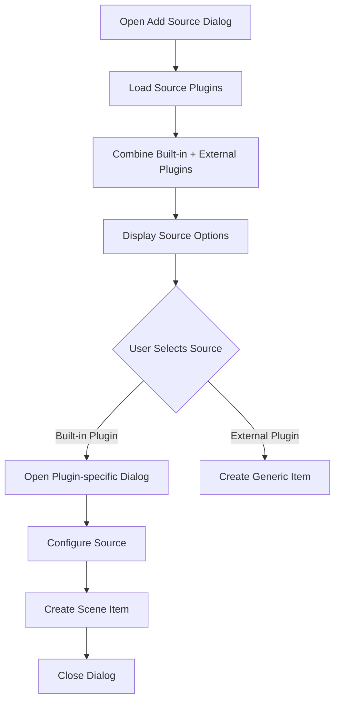

**Diagram sources**
- [add-source-dialog.tsx:105-122](file://src/components/add-source-dialog.tsx#L105-L122)
- [add-source-dialog.tsx:119-122](file://src/components/add-source-dialog.tsx#L119-L122)

#### Configure Source Dialog

The Configure Source Dialog handles URL and file-based sources with validation:

| Input Method | Supported Formats | Validation | Preview |
|--------------|-------------------|------------|---------|
| URL | http://, https://, blob: | URL format validation | Automatic |
| File | image/*, video/*, audio/* | MIME type validation | Local URL preview |

#### Timer Configuration Dialog

The Timer Configuration Dialog provides comprehensive timing controls:

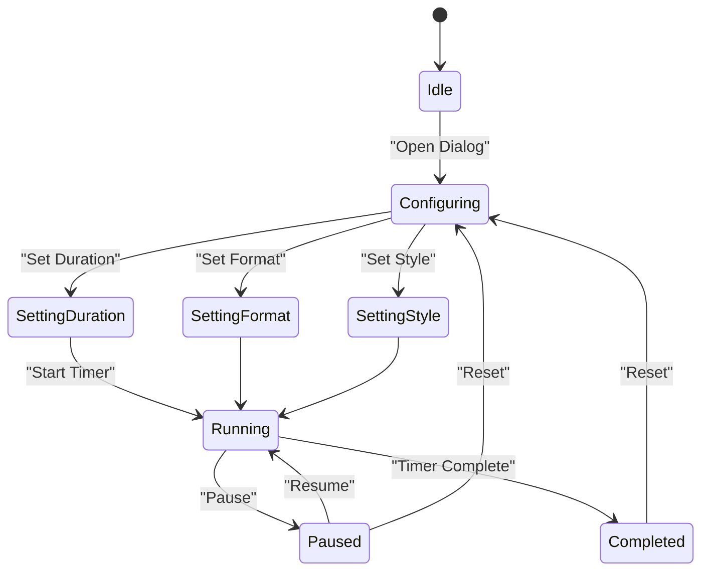

**Diagram sources**
- [configure-timer-dialog.tsx:58-79](file://src/components/configure-timer-dialog.tsx#L58-L79)
- [configure-timer-dialog.tsx:146-193](file://src/components/configure-timer-dialog.tsx#L146-L193)

**Section sources**
- [add-source-dialog.tsx:105-122](file://src/components/add-source-dialog.tsx#L105-L122)
- [configure-source-dialog.tsx:82-97](file://src/components/configure-source-dialog.tsx#L82-L97)
- [configure-timer-dialog.tsx:58-79](file://src/components/configure-timer-dialog.tsx#L58-L79)

### Media Stream Management

The Media Stream Manager provides centralized control over browser media streams:

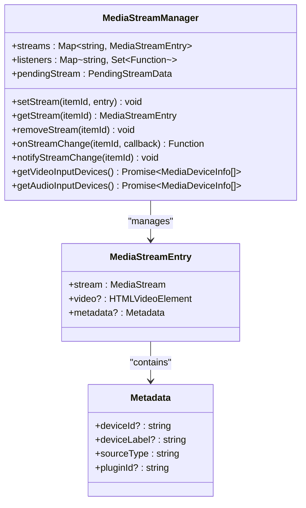

**Diagram sources**
- [media-stream-manager.ts:39-141](file://src/services/media-stream-manager.ts#L39-L141)
- [media-stream-manager.ts:18-27](file://src/services/media-stream-manager.ts#L18-L27)

#### Stream Lifecycle Management

The system implements robust stream lifecycle management with automatic cleanup and error handling:

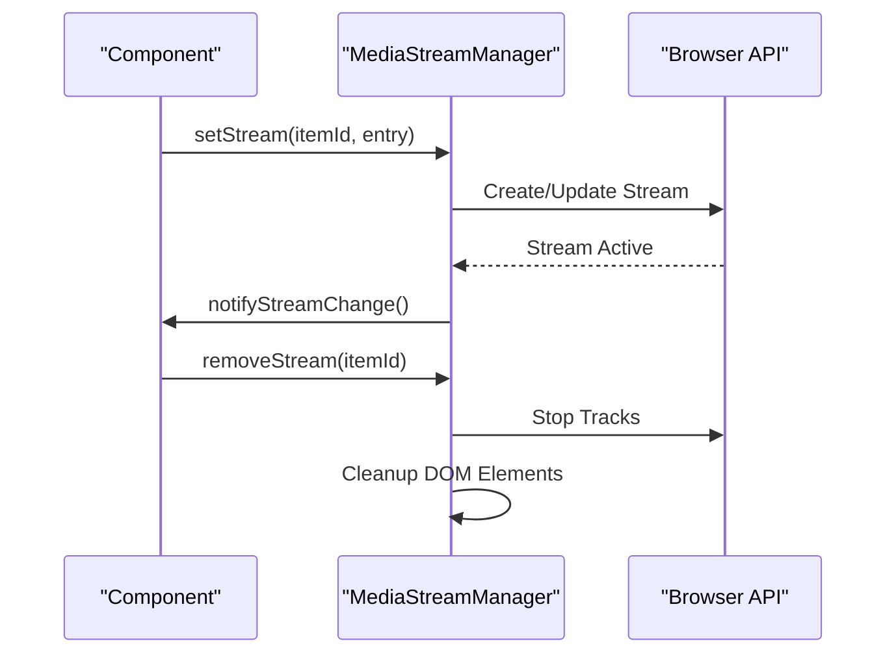

**Diagram sources**
- [media-stream-manager.ts:56-91](file://src/services/media-stream-manager.ts#L56-L91)
- [media-stream-manager.ts:130-141](file://src/services/media-stream-manager.ts#L130-L141)

**Section sources**
- [media-stream-manager.ts:39-141](file://src/services/media-stream-manager.ts#L39-L141)
- [media-stream-manager.ts:56-91](file://src/services/media-stream-manager.ts#L56-L91)

### Plugin Integration System

The system supports extensive plugin integration through a well-defined plugin architecture:

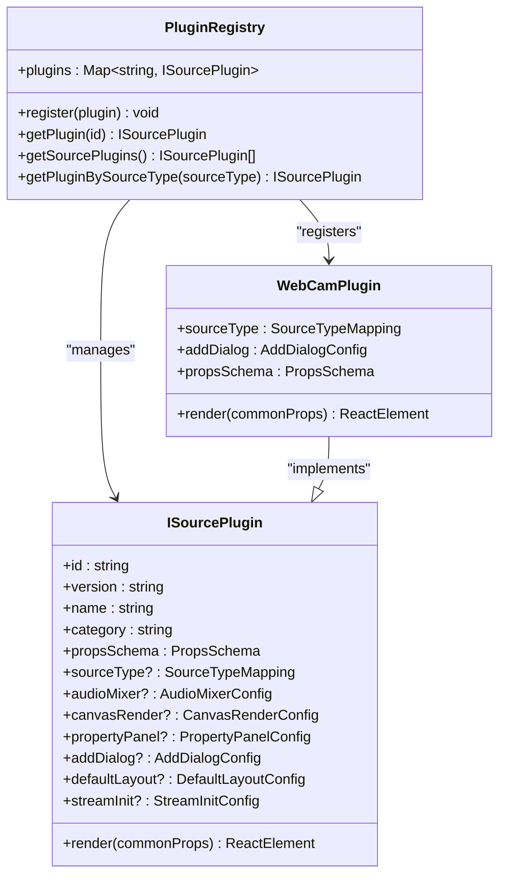

**Diagram sources**
- [plugin-types.ts:164-262](file://src/types/plugin.ts#L164-L262)
- [plugin-registry.ts:78-118](file://src/services/plugin-registry.ts#L78-L118)
- [webcam-index.tsx:110-234](file://src/plugins/builtin/webcam/index.tsx#L110-L234)

#### Custom Property Editor Pattern

The system supports custom property editors through the PropertyPanelConfig:

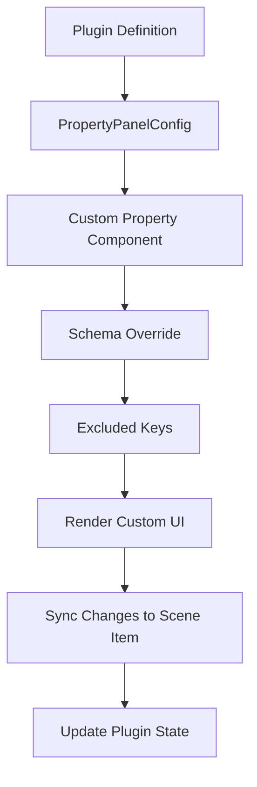

**Diagram sources**
- [plugin-types.ts:104-114](file://src/types/plugin.ts#L104-L114)
- [property-panel.tsx:918-1040](file://src/components/property-panel.tsx#L918-L1040)

**Section sources**
- [plugin-types.ts:164-262](file://src/types/plugin.ts#L164-L262)
- [plugin-registry.ts:78-118](file://src/services/plugin-registry.ts#L78-L118)
- [webcam-index.tsx:110-234](file://src/plugins/builtin/webcam/index.tsx#L110-L234)

## Dependency Analysis

The property panel system exhibits excellent modularity with clear dependency boundaries:

```mermaid
graph TB
subgraph "Core Dependencies"
React[React Core]
RadixUI[@radix-ui/react-dialog]
Lucide[Lucide Icons]
end
subgraph "Internal Dependencies"
PropertyPanel[Property Panel]
DialogSystem[Dialog System]
MediaManager[Media Stream Manager]
PluginSystem[Plugin System]
end
subgraph "External Dependencies"
BrowserAPIs[Browser Media APIs]
FileSystemAPIs[File System APIs]
NetworkAPIs[Network APIs]
end
React --> PropertyPanel
RadixUI --> DialogSystem
Lucide --> PropertyPanel
PropertyPanel --> MediaManager
PropertyPanel --> PluginSystem
DialogSystem --> MediaManager
MediaManager --> BrowserAPIs
PluginSystem --> FileSystemAPIs
PluginSystem --> NetworkAPIs
```

**Diagram sources**
- [property-panel.tsx:1-25](file://src/components/property-panel.tsx#L1-L25)
- [dialog.tsx:1-123](file://src/components/ui/dialog.tsx#L1-L123)
- [media-stream-manager.ts:1-12](file://src/services/media-stream-manager.ts#L1-L12)

### Circular Dependency Prevention

The system avoids circular dependencies through careful architectural decisions:

- **Service Layer Separation**: MediaStreamManager and PluginRegistry are pure service classes
- **Interface-Based Design**: Components depend on interfaces rather than concrete implementations
- **Event-Driven Communication**: Components communicate through event listeners rather than direct references

**Section sources**
- [property-panel.tsx:1-25](file://src/components/property-panel.tsx#L1-L25)
- [dialog.tsx:1-123](file://src/components/ui/dialog.tsx#L1-L123)
- [media-stream-manager.ts:1-12](file://src/services/media-stream-manager.ts#L1-L12)

## Performance Considerations

### State Management Optimization

The property panel system implements several performance optimizations:

- **Selective Re-rendering**: Only affected components re-render when properties change
- **Debounced Updates**: Complex property changes are debounced to prevent excessive re-renders
- **Efficient Stream Management**: Media streams are cached and reused when possible
- **Lazy Loading**: Plugin-specific panels are loaded only when needed

### Memory Management

The system includes comprehensive memory management:

- **Automatic Cleanup**: Media streams are automatically cleaned up when components unmount
- **Reference Tracking**: Streams are tracked using stable references to prevent leaks
- **Event Listener Cleanup**: All event listeners are properly removed during cleanup

### Real-time Performance

For real-time applications, the system provides:

- **Efficient Change Detection**: Minimal state updates trigger minimal UI changes
- **Batched Updates**: Multiple property changes are batched into single updates
- **Optimized Rendering**: Complex transforms are optimized for GPU acceleration

## Troubleshooting Guide

### Common Issues and Solutions

#### Property Panel Not Updating

**Symptoms**: Changes made in property panel don't reflect in scene items

**Causes**:
- Item is locked (`locked: true`)
- Property update function not called
- State synchronization issues

**Solutions**:
- Check if item has `locked: true` property
- Verify `onUpdateItem` prop is properly passed
- Ensure `selectedItem` prop is updated correctly

#### Media Stream Issues

**Symptoms**: Webcam/microphone streams not working or showing errors

**Causes**:
- Missing browser permissions
- Device conflicts
- Stream already in use

**Solutions**:
- Check browser permission settings
- Verify device is not in use by another application
- Restart stream capture process

#### Dialog Validation Failures

**Symptoms**: Dialogs refuse to close or show validation errors

**Causes**:
- Invalid input data
- Missing required fields
- Form validation errors

**Solutions**:
- Check input format (URL, file type, etc.)
- Verify required fields are filled
- Review error messages for specific validation failures

#### Plugin Integration Problems

**Symptoms**: Custom property editors not appearing or plugins not registering

**Causes**:
- Plugin registration failures
- Missing plugin dependencies
- Incorrect plugin configuration

**Solutions**:
- Verify plugin registration in registry
- Check plugin dependencies and compatibility
- Review plugin configuration in sourceType mapping

**Section sources**
- [property-panel.tsx:675-691](file://src/components/property-panel.tsx#L675-L691)
- [media-stream-manager.ts:77-91](file://src/services/media-stream-manager.ts#L77-L91)
- [webcam-index.tsx:260-337](file://src/plugins/builtin/webcam/index.tsx#L260-L337)

## Conclusion

The Property Panel System represents a sophisticated and well-architected solution for managing scene item properties in the LiveMixer web application. The system successfully balances flexibility with usability through its plugin-based architecture, comprehensive validation system, and efficient state management.

Key strengths of the system include:

- **Extensibility**: Plugin-based architecture allows for easy addition of new source types and property editors
- **Consistency**: Unified interface ensures consistent user experience across different source types
- **Performance**: Optimized rendering and state management provide smooth user interactions
- **Reliability**: Comprehensive error handling and cleanup mechanisms ensure system stability
- **Maintainability**: Clear separation of concerns and modular design facilitate ongoing development

The system provides a solid foundation for extending property editing capabilities and integrating new media sources while maintaining the high standards of performance and user experience expected in professional streaming applications.