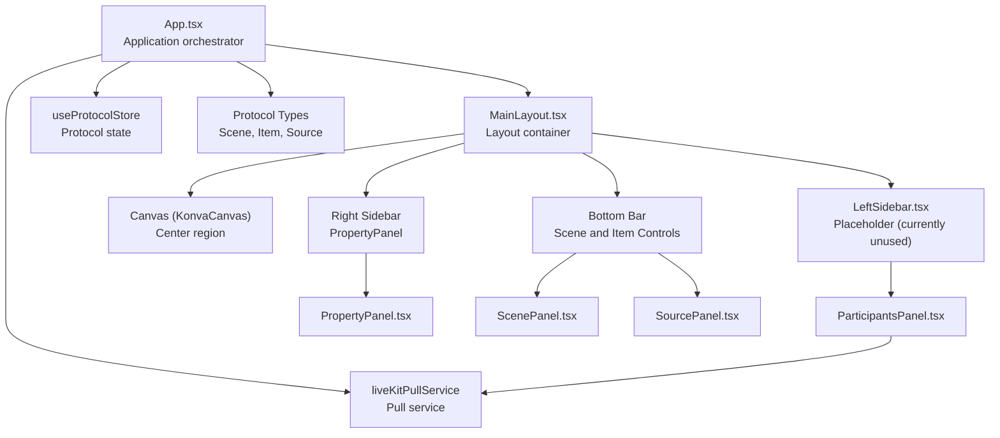
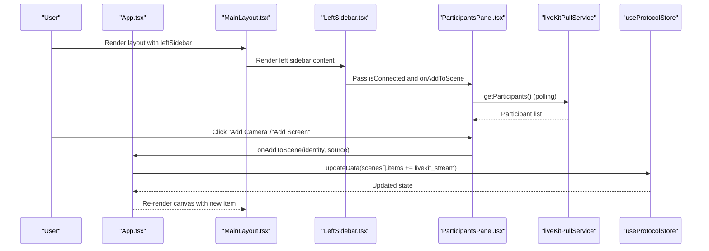
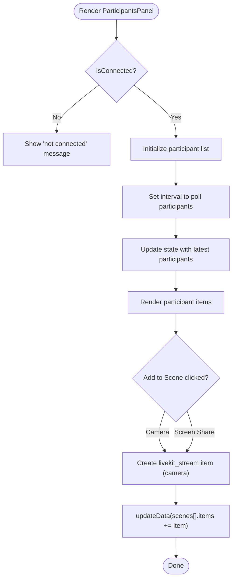
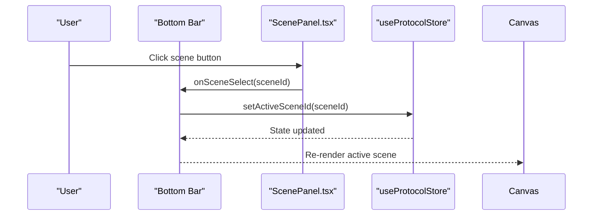
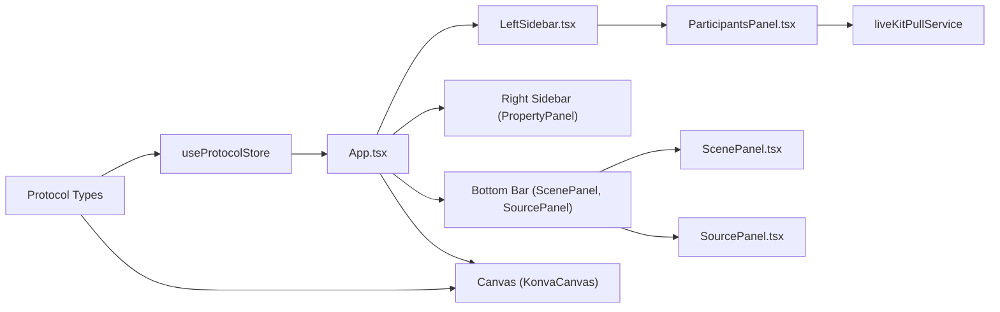

# Sidebar Components

<cite>
**Referenced Files in This Document**
- [left-sidebar.tsx](file://src/components/left-sidebar.tsx)
- [scene-panel.tsx](file://src/components/scene-panel.tsx)
- [source-panel.tsx](file://src/components/source-panel.tsx)
- [participants-panel.tsx](file://src/components/participants-panel.tsx)
- [main-layout.tsx](file://src/components/main-layout.tsx)
- [App.tsx](file://src/App.tsx)
- [protocol.ts](file://src/store/protocol.ts)
- [protocol.ts (types)](file://src/types/protocol.ts)
- [livekit-pull.ts](file://src/services/livekit-pull.ts)
</cite>

## Table of Contents
1. [Introduction](#introduction)
2. [Project Structure](#project-structure)
3. [Core Components](#core-components)
4. [Architecture Overview](#architecture-overview)
5. [Detailed Component Analysis](#detailed-component-analysis)
6. [Dependency Analysis](#dependency-analysis)
7. [Performance Considerations](#performance-considerations)
8. [Troubleshooting Guide](#troubleshooting-guide)
9. [Conclusion](#conclusion)

## Introduction
This document explains the LiveMixer Web sidebar component system with a focus on the left sidebar’s current implementation and the panels it hosts. It covers the scene panel, source panel, and participants panel, detailing how they are organized, how content is managed, and how user interactions drive scene and item manipulation. It also describes the integration with the main canvas, the role of the sidebar in the overall workflow, and how the system can be extended for customization and filtering.

## Project Structure
The sidebar system is part of the main layout and integrates with the application state and services:
- The main layout defines the left, center, and right regions.
- The left sidebar currently hosts the participants panel and a control button for pulling streams.
- The right sidebar hosts the property panel for editing selected canvas items.
- The bottom bar provides scene navigation and item controls.
- The central canvas displays the active scene.

**Diagram sources**
- [main-layout.tsx:36-62](file://src/components/main-layout.tsx#L36-L62)
- [App.tsx:913-1000](file://src/App.tsx#L913-L1000)
- [left-sidebar.tsx:1-7](file://src/components/left-sidebar.tsx#L1-L7)
- [participants-panel.tsx:128-195](file://src/components/participants-panel.tsx#L128-L195)
- [scene-panel.tsx:16-75](file://src/components/scene-panel.tsx#L16-L75)
- [source-panel.tsx:14-75](file://src/components/source-panel.tsx#L14-L75)
- [protocol.ts:38-67](file://src/store/protocol.ts#L38-L67)
- [livekit-pull.ts:49-352](file://src/services/livekit-pull.ts#L49-L352)

**Section sources**
- [main-layout.tsx:14-76](file://src/components/main-layout.tsx#L14-L76)
- [App.tsx:913-1000](file://src/App.tsx#L913-L1000)

## Core Components
- Left sidebar placeholder: A minimal container that reserves space for future left-side features. It is currently unused in the current implementation.
- Participants panel: Displays connected participants and allows adding their camera or screen share as live streams into the active scene.
- Scene panel (via bottom bar): Lists scenes and enables selection to switch the active scene.
- Source panel (conceptual): A panel for browsing and selecting sources; it is not currently integrated into the left sidebar in the current implementation.

Key integration points:
- The left sidebar is passed into MainLayout and rendered as a column with a fixed width.
- The participants panel connects to the pull service to fetch participant lists and statuses.
- The bottom bar provides scene navigation and item controls, complementing the left sidebar’s participant-focused role.

**Section sources**
- [left-sidebar.tsx:1-7](file://src/components/left-sidebar.tsx#L1-L7)
- [participants-panel.tsx:128-195](file://src/components/participants-panel.tsx#L128-L195)
- [scene-panel.tsx:16-75](file://src/components/scene-panel.tsx#L16-L75)
- [source-panel.tsx:14-75](file://src/components/source-panel.tsx#L14-L75)
- [main-layout.tsx:36-62](file://src/components/main-layout.tsx#L36-L62)

## Architecture Overview
The sidebar system participates in a unidirectional data flow:
- Application state (scenes, items, canvas configuration) is stored in a centralized store.
- UI components render based on this state and trigger updates via store actions.
- Services (e.g., pull service) provide external data (participants) consumed by panels.

**Diagram sources**
- [App.tsx:927-951](file://src/App.tsx#L927-L951)
- [participants-panel.tsx:135-154](file://src/components/participants-panel.tsx#L135-L154)
- [livekit-pull.ts:201-214](file://src/services/livekit-pull.ts#L201-L214)
- [protocol.ts:38-67](file://src/store/protocol.ts#L38-L67)

## Detailed Component Analysis

### Left Sidebar
- Purpose: Reserved area for future left-side panels. Currently renders a placeholder container.
- Role in workflow: Does not actively participate in scene or item management in the current build.
- Extensibility: Can host a scene panel or source browser in future iterations.

**Section sources**
- [left-sidebar.tsx:1-7](file://src/components/left-sidebar.tsx#L1-L7)
- [main-layout.tsx:36-42](file://src/components/main-layout.tsx#L36-L42)

### Participants Panel
- Responsibilities:
  - Fetches and displays participant list via polling.
  - Shows participant status (speaking, camera, mic, screen share).
  - Provides buttons to add camera or screen share as live streams to the active scene.
- Data source: Uses the pull service to retrieve participant info and track states.
- Interaction pattern:
  - When enabled, the panel polls participants every second and updates the list.
  - On click, triggers a callback to add a new live stream item to the active scene with computed layout and stream source.

**Diagram sources**
- [participants-panel.tsx:135-154](file://src/components/participants-panel.tsx#L135-L154)
- [participants-panel.tsx:184-190](file://src/components/participants-panel.tsx#L184-L190)
- [App.tsx:827-897](file://src/App.tsx#L827-L897)
- [livekit-pull.ts:201-214](file://src/services/livekit-pull.ts#L201-L214)

**Section sources**
- [participants-panel.tsx:128-195](file://src/components/participants-panel.tsx#L128-L195)
- [livekit-pull.ts:49-352](file://src/services/livekit-pull.ts#L49-L352)
- [App.tsx:827-897](file://src/App.tsx#L827-L897)

### Scene Panel (via Bottom Bar)
- Responsibilities:
  - Displays available scenes with item counts.
  - Highlights the active scene.
  - Allows switching scenes by clicking.
- Data source: Scenes array from the protocol store.
- Interaction pattern:
  - Selecting a scene updates the active scene ID in the app state.
  - The canvas re-renders the newly active scene.

**Diagram sources**
- [scene-panel.tsx:33-52](file://src/components/scene-panel.tsx#L33-L52)
- [App.tsx:971-983](file://src/App.tsx#L971-L983)
- [protocol.ts:38-67](file://src/store/protocol.ts#L38-L67)

**Section sources**
- [scene-panel.tsx:16-75](file://src/components/scene-panel.tsx#L16-L75)
- [App.tsx:971-983](file://src/App.tsx#L971-L983)

### Source Panel (Conceptual)
- Purpose: A panel to browse and select sources (e.g., webcam, microphone, audio files).
- Current status: Not integrated into the left sidebar in the current implementation.
- Expected behavior:
  - List sources with type-specific icons.
  - Provide tooltips with source details.
  - Allow adding selected sources to the active scene.

Note: The component exists and can be wired into the left sidebar in future builds.

**Section sources**
- [source-panel.tsx:14-75](file://src/components/source-panel.tsx#L14-L75)

### Main Layout Integration
- The main layout defines three sidebar regions: left, center, and right.
- The left sidebar is rendered with a fixed width and backdrop blur.
- The right sidebar hosts the property panel for editing selected items.
- The center region hosts the canvas.

**Section sources**
- [main-layout.tsx:36-62](file://src/components/main-layout.tsx#L36-L62)
- [App.tsx:913-1000](file://src/App.tsx#L913-L1000)

## Dependency Analysis
- State management:
  - The protocol store holds scenes, items, and canvas configuration.
  - Scene and item updates propagate to the canvas and property panel.
- Services:
  - The pull service manages participant data and emits changes.
  - The property panel interacts with media stream managers for device enumeration and stream control.
- UI composition:
  - MainLayout composes left, center, right, bottom, and status areas.
  - Panels are composed inside these areas and receive props for data and callbacks.

**Diagram sources**
- [protocol.ts:38-67](file://src/store/protocol.ts#L38-L67)
- [App.tsx:913-1000](file://src/App.tsx#L913-L1000)
- [participants-panel.tsx:128-195](file://src/components/participants-panel.tsx#L128-L195)
- [livekit-pull.ts:49-352](file://src/services/livekit-pull.ts#L49-L352)
- [scene-panel.tsx:16-75](file://src/components/scene-panel.tsx#L16-L75)
- [source-panel.tsx:14-75](file://src/components/source-panel.tsx#L14-L75)

**Section sources**
- [protocol.ts:38-67](file://src/store/protocol.ts#L38-L67)
- [protocol.ts (types):84-114](file://src/types/protocol.ts#L84-L114)
- [App.tsx:913-1000](file://src/App.tsx#L913-L1000)

## Performance Considerations
- Participants polling: The participants panel polls every second. Consider debouncing or reducing frequency if participant churn is low.
- Rendering lists: Large lists of scenes or sources should be virtualized if performance becomes a concern.
- Stream management: Adding many live streams can increase CPU/GPU usage; ensure streams are stopped when not needed.
- Layout rendering: The main layout uses fixed-width sidebars; avoid unnecessary reflows by keeping content heights stable.

## Troubleshooting Guide
- Participants panel shows “not connected”:
  - Ensure the pull connection is established via the control button in the left sidebar.
  - Verify LiveKit URL and token settings.
- Participants list does not update:
  - Confirm the pull service is connected and emitting participant changes.
  - Check browser permissions for microphone/camera access.
- Adding participant to scene fails:
  - Ensure an active scene exists and the participant has a valid camera or screen share track.
  - Verify the layout calculation does not exceed canvas bounds.

**Section sources**
- [participants-panel.tsx:156-169](file://src/components/participants-panel.tsx#L156-L169)
- [livekit-pull.ts:60-179](file://src/services/livekit-pull.ts#L60-L179)
- [App.tsx:827-897](file://src/App.tsx#L827-L897)

## Conclusion
The current sidebar system centers on the left sidebar’s participants panel and the bottom bar’s scene panel. The left sidebar placeholder is ready for future enhancements such as a scene or source panel. The system integrates tightly with the protocol store and pull service, enabling dynamic participant-driven content creation. Extending the left sidebar with a scene panel or source browser would complete a cohesive authoring workflow alongside the existing property panel on the right.