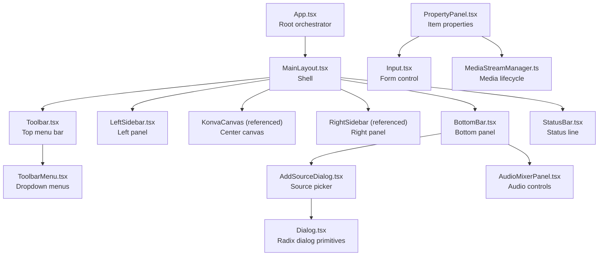
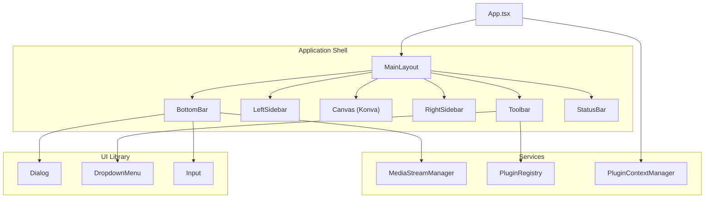
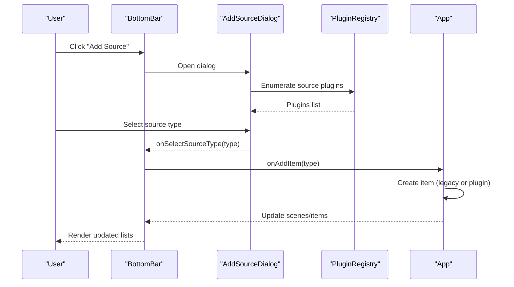
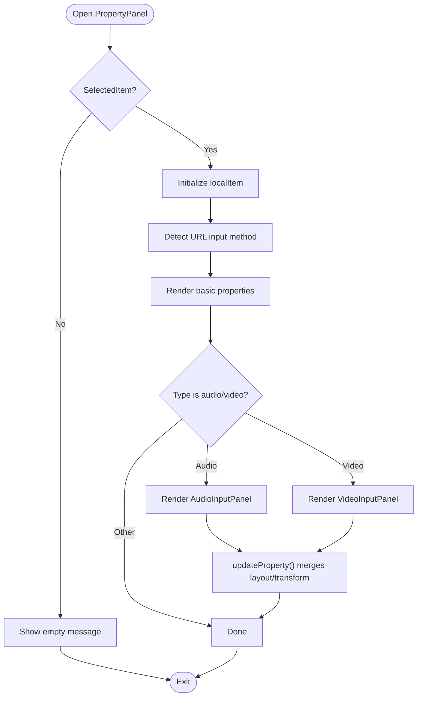
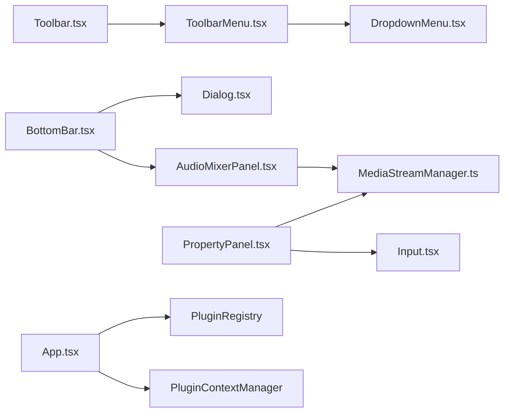

# User Interface Components

<cite>
**Referenced Files in This Document**
- [main-layout.tsx](file://src/components/main-layout.tsx)
- [toolbar.tsx](file://src/components/toolbar.tsx)
- [toolbar-menu.tsx](file://src/components/toolbar-menu.tsx)
- [left-sidebar.tsx](file://src/components/left-sidebar.tsx)
- [bottom-bar.tsx](file://src/components/bottom-bar.tsx)
- [property-panel.tsx](file://src/components/property-panel.tsx)
- [status-bar.tsx](file://src/components/status-bar.tsx)
- [dialog.tsx](file://src/components/ui/dialog.tsx)
- [dropdown-menu.tsx](file://src/components/ui/dropdown-menu.tsx)
- [input.tsx](file://src/components/ui/input.tsx)
- [add-source-dialog.tsx](file://src/components/add-source-dialog.tsx)
- [audio-mixer-panel.tsx](file://src/components/audio-mixer-panel.tsx)
- [media-stream-manager.ts](file://src/services/media-stream-manager.ts)
- [protocol.ts](file://src/types/protocol.ts)
- [App.tsx](file://src/App.tsx)
</cite>

## Table of Contents
1. [Introduction](#introduction)
2. [Project Structure](#project-structure)
3. [Core Components](#core-components)
4. [Architecture Overview](#architecture-overview)
5. [Detailed Component Analysis](#detailed-component-analysis)
6. [Dependency Analysis](#dependency-analysis)
7. [Performance Considerations](#performance-considerations)
8. [Troubleshooting Guide](#troubleshooting-guide)
9. [Conclusion](#conclusion)

## Introduction
This document describes the LiveMixer Web UI component system. It explains the main layout architecture (toolbar, sidebar panels, property panel, bottom bar, status bar), the component hierarchy inside the application shell, and how interactive elements, dialogs, and form controls work together. It also documents Radix UI integration patterns, custom component implementations, props/events, and practical usage examples with code snippet paths. Accessibility and responsive design principles are addressed throughout.

## Project Structure
LiveMixer Web organizes UI components under src/components, with a dedicated UI library folder for Radix-based primitives. The application shell composes these components into a cohesive desktop-like layout. Services and types support state, media streams, and data contracts.

**Diagram sources**
- [App.tsx:128-800](file://src/App.tsx#L128-L800)
- [main-layout.tsx:14-77](file://src/components/main-layout.tsx#L14-L77)
- [toolbar.tsx:11-165](file://src/components/toolbar.tsx#L11-L165)
- [toolbar-menu.tsx:20-56](file://src/components/toolbar-menu.tsx#L20-L56)
- [left-sidebar.tsx:1-8](file://src/components/left-sidebar.tsx#L1-L8)
- [bottom-bar.tsx:59-526](file://src/components/bottom-bar.tsx#L59-L526)
- [add-source-dialog.tsx:98-204](file://src/components/add-source-dialog.tsx#L98-L204)
- [audio-mixer-panel.tsx:190-234](file://src/components/audio-mixer-panel.tsx#L190-L234)
- [dialog.tsx:17-54](file://src/components/ui/dialog.tsx#L17-L54)
- [input.tsx:4-25](file://src/components/ui/input.tsx#L4-L25)
- [media-stream-manager.ts:39-323](file://src/services/media-stream-manager.ts#L39-L323)

**Section sources**
- [main-layout.tsx:14-77](file://src/components/main-layout.tsx#L14-L77)
- [App.tsx:128-800](file://src/App.tsx#L128-L800)

## Core Components
- MainLayout: Provides the application shell with top toolbar, left/right sidebars, center canvas, bottom bar, and status bar. Accepts optional regions as ReactNode props for extensibility.
- Toolbar: Hosts primary menus (Edit, View, Config, Tools, Help) and links to external resources. Integrates internationalization and import/export handlers.
- ToolbarMenu: A reusable dropdown menu wrapper around Radix UI primitives.
- LeftSidebar: Placeholder for future left-side panels.
- BottomBar: Multi-pane panel for scenes, sources, audio mixer, and streaming controls. Includes dialogs for delete confirmations and source selection.
- PropertyPanel: Per-item property editor supporting basic attributes, transforms, and specialized panels for audio/video inputs. Integrates with MediaStreamManager for device enumeration and stream lifecycle.
- StatusBar: Displays streaming status, duration, output resolution, CPU usage, and FPS.
- UI Library: Dialog, DropdownMenu, and Input components built on Radix UI and styled with Tailwind.

**Section sources**
- [main-layout.tsx:3-12](file://src/components/main-layout.tsx#L3-L12)
- [toolbar.tsx:6-9](file://src/components/toolbar.tsx#L6-L9)
- [toolbar-menu.tsx:15-18](file://src/components/toolbar-menu.tsx#L15-L18)
- [left-sidebar.tsx:1-8](file://src/components/left-sidebar.tsx#L1-L8)
- [bottom-bar.tsx:37-57](file://src/components/bottom-bar.tsx#L37-L57)
- [property-panel.tsx:22-25](file://src/components/property-panel.tsx#L22-L25)
- [status-bar.tsx:4-10](file://src/components/status-bar.tsx#L4-L10)
- [dialog.tsx:9-123](file://src/components/ui/dialog.tsx#L9-L123)
- [dropdown-menu.tsx:9-201](file://src/components/ui/dropdown-menu.tsx#L9-L201)
- [input.tsx:4-25](file://src/components/ui/input.tsx#L4-L25)

## Architecture Overview
The application composes a responsive desktop-like shell. The App orchestrates protocol state, plugin context, and services. The MainLayout renders regions; BottomBar and PropertyPanel coordinate with services for media and plugin interactions.

**Diagram sources**
- [App.tsx:128-800](file://src/App.tsx#L128-L800)
- [main-layout.tsx:14-77](file://src/components/main-layout.tsx#L14-L77)
- [bottom-bar.tsx:59-526](file://src/components/bottom-bar.tsx#L59-L526)
- [toolbar.tsx:11-165](file://src/components/toolbar.tsx#L11-L165)
- [media-stream-manager.ts:39-323](file://src/services/media-stream-manager.ts#L39-L323)

## Detailed Component Analysis

### MainLayout
- Purpose: Defines the global layout with named regions for toolbar, canvas, sidebars, bottom bar, and status bar.
- Props: logo, toolbar, userSection, canvas, leftSidebar, rightSidebar, bottomBar, statusBar.
- Behavior: Uses Tailwind for responsive stacking and backdrop blur effects. Regions render only when provided.

**Section sources**
- [main-layout.tsx:14-77](file://src/components/main-layout.tsx#L14-L77)

### Toolbar
- Purpose: Top menu bar with localized labels and actions.
- Props: data (ProtocolData), updateData (callback).
- Features:
  - Import/export configuration with validation and alerts.
  - Menus for Edit, View, Config, Tools, Help.
  - External link to project repository.
- Events: Menu item click handlers trigger side effects (logging, opening dialogs).

**Section sources**
- [toolbar.tsx:6-9](file://src/components/toolbar.tsx#L6-L9)
- [toolbar.tsx:14-76](file://src/components/toolbar.tsx#L14-L76)

### ToolbarMenu
- Purpose: Wraps Radix UI DropdownMenu for toolbar menus.
- Props: label (menu title), items (array of label/onClick/divider).
- Behavior: Renders separators and triggers onClick callbacks.

**Section sources**
- [toolbar-menu.tsx:15-18](file://src/components/toolbar-menu.tsx#L15-L18)
- [toolbar-menu.tsx:20-56](file://src/components/toolbar-menu.tsx#L20-L56)

### BottomBar
- Purpose: Bottom dock with three major areas: Scenes, Sources, Audio Mixer, and Controls.
- Props: scenes, activeSceneId, selection callbacks, streaming state, settings handler, add/delete/move handlers, and onUpdateItem.
- Interactions:
  - Scene list with add/delete/reorder.
  - Source list with visibility/lock toggles and reorder.
  - AudioMixerPanel for active audio sources.
  - Streaming toggle and settings button.
  - Confirmation dialogs for delete operations.
  - AddSourceDialog for selecting new source types.

**Diagram sources**
- [bottom-bar.tsx:59-526](file://src/components/bottom-bar.tsx#L59-L526)
- [add-source-dialog.tsx:98-204](file://src/components/add-source-dialog.tsx#L98-L204)
- [App.tsx:279-370](file://src/App.tsx#L279-L370)

**Section sources**
- [bottom-bar.tsx:37-57](file://src/components/bottom-bar.tsx#L37-L57)
- [bottom-bar.tsx:59-526](file://src/components/bottom-bar.tsx#L59-L526)
- [add-source-dialog.tsx:43-47](file://src/components/add-source-dialog.tsx#L43-L47)
- [add-source-dialog.tsx:98-204](file://src/components/add-source-dialog.tsx#L98-L204)

### PropertyPanel
- Purpose: Edits properties for the currently selected SceneItem.
- Props: selectedItem (SceneItem), onUpdateItem (callback).
- Behavior:
  - Synchronizes local state with selectedItem.
  - Specialized panels for audio/video inputs, device enumeration, and stream lifecycle.
  - Updates are merged into layout/transform sub-objects.
  - Respects locked state to disable edits.
- Integration: Uses Input and Label from the UI library; integrates with MediaStreamManager for device queries and stream management.

**Diagram sources**
- [property-panel.tsx:643-720](file://src/components/property-panel.tsx#L643-L720)
- [property-panel.tsx:27-359](file://src/components/property-panel.tsx#L27-L359)
- [property-panel.tsx:361-641](file://src/components/property-panel.tsx#L361-L641)

**Section sources**
- [property-panel.tsx:22-25](file://src/components/property-panel.tsx#L22-L25)
- [property-panel.tsx:643-720](file://src/components/property-panel.tsx#L643-L720)
- [property-panel.tsx:27-359](file://src/components/property-panel.tsx#L27-L359)
- [property-panel.tsx:361-641](file://src/components/property-panel.tsx#L361-L641)

### AudioMixerPanel
- Purpose: Real-time audio mixer for active audio sources in the current scene.
- Props: audioItems (SceneItem[]), onUpdateItem (callback).
- Features:
  - Per-channel level meter using Web Audio Analyser.
  - Vertical volume sliders and mute toggles.
  - Device label display and active indicators.
- Integration: Subscribes to MediaStreamManager for stream changes and updates levels.

**Section sources**
- [audio-mixer-panel.tsx:185-234](file://src/components/audio-mixer-panel.tsx#L185-L234)
- [audio-mixer-panel.tsx:90-179](file://src/components/audio-mixer-panel.tsx#L90-L179)
- [audio-mixer-panel.tsx:11-84](file://src/components/audio-mixer-panel.tsx#L11-L84)

### Dialog System (Radix UI)
- Dialog: Root, Portal, Overlay, Content, Header/Footer, Title, Description.
- DropdownMenu: Root, Trigger, Content, Item, Checkbox/Radio items, Submenus, Separator, Shortcut.
- Input: Styled forwardRef input with Tailwind classes and focus/placeholder styles.
- Usage: BottomBar composes Dialog for confirmations; ToolbarMenu composes DropdownMenu; PropertyPanel composes Input.

**Section sources**
- [dialog.tsx:9-123](file://src/components/ui/dialog.tsx#L9-L123)
- [dropdown-menu.tsx:9-201](file://src/components/ui/dropdown-menu.tsx#L9-L201)
- [input.tsx:4-25](file://src/components/ui/input.tsx#L4-L25)

### MediaStreamManager
- Purpose: Centralized media stream management for plugins and UI.
- Responsibilities:
  - Store, update, remove streams per item.
  - Device enumeration helpers (video/audio input/output) with permission handling.
  - Event notifications for stream changes.
  - Pending stream handoff between dialogs and app.
- Integration: Used by PropertyPanel’s audio/video panels and AudioMixerPanel.

**Section sources**
- [media-stream-manager.ts:18-34](file://src/services/media-stream-manager.ts#L18-L34)
- [media-stream-manager.ts:39-323](file://src/services/media-stream-manager.ts#L39-L323)

### Protocol Data Model
- SceneItem: Supports multiple types (image, media, text, screen, window, video_input, audio_input, audio_output, timer, clock, livekit_stream, container, scene_ref) with layout/transform, visibility/locking, and type-specific properties.
- Scene: Contains items and activation state.
- ProtocolData: Root model including canvas config, scenes, and metadata.

**Section sources**
- [protocol.ts:20-82](file://src/types/protocol.ts#L20-L82)
- [protocol.ts:84-89](file://src/types/protocol.ts#L84-L89)
- [protocol.ts:103-114](file://src/types/protocol.ts#L103-L114)

### Usage Examples and Composition Patterns
- Compose MainLayout with Toolbar, BottomBar, PropertyPanel, and StatusBar:
  - [App.tsx:128-800](file://src/App.tsx#L128-L800)
  - [main-layout.tsx:14-77](file://src/components/main-layout.tsx#L14-L77)
- Toolbar menu composition:
  - [toolbar.tsx:80-149](file://src/components/toolbar.tsx#L80-L149)
  - [toolbar-menu.tsx:20-56](file://src/components/toolbar-menu.tsx#L20-L56)
- PropertyPanel with form controls:
  - [property-panel.tsx:739-750](file://src/components/property-panel.tsx#L739-L750)
  - [input.tsx:4-25](file://src/components/ui/input.tsx#L4-L25)
- Dialog-driven source creation:
  - [bottom-bar.tsx:517-523](file://src/components/bottom-bar.tsx#L517-L523)
  - [add-source-dialog.tsx:98-204](file://src/components/add-source-dialog.tsx#L98-L204)
  - [App.tsx:279-370](file://src/App.tsx#L279-L370)

**Section sources**
- [App.tsx:128-800](file://src/App.tsx#L128-L800)
- [toolbar.tsx:80-149](file://src/components/toolbar.tsx#L80-L149)
- [toolbar-menu.tsx:20-56](file://src/components/toolbar-menu.tsx#L20-L56)
- [property-panel.tsx:739-750](file://src/components/property-panel.tsx#L739-L750)
- [input.tsx:4-25](file://src/components/ui/input.tsx#L4-L25)
- [bottom-bar.tsx:517-523](file://src/components/bottom-bar.tsx#L517-L523)
- [add-source-dialog.tsx:98-204](file://src/components/add-source-dialog.tsx#L98-L204)
- [App.tsx:279-370](file://src/App.tsx#L279-L370)

## Dependency Analysis
- Component coupling:
  - BottomBar depends on Dialog primitives and AudioMixerPanel; it also depends on PluginRegistry to filter audio-enabled items.
  - PropertyPanel depends on MediaStreamManager for device enumeration and stream lifecycle.
  - ToolbarMenu wraps Radix UI; Toolbar composes multiple ToolbarMenu instances.
- External integrations:
  - Media devices via MediaStreamManager.
  - Internationalization via I18nProvider and useI18n.
  - Plugin ecosystem via PluginRegistry and PluginContextManager.

**Diagram sources**
- [toolbar.tsx:11-165](file://src/components/toolbar.tsx#L11-L165)
- [toolbar-menu.tsx:20-56](file://src/components/toolbar-menu.tsx#L20-L56)
- [bottom-bar.tsx:59-526](file://src/components/bottom-bar.tsx#L59-L526)
- [audio-mixer-panel.tsx:190-234](file://src/components/audio-mixer-panel.tsx#L190-L234)
- [media-stream-manager.ts:39-323](file://src/services/media-stream-manager.ts#L39-L323)
- [property-panel.tsx:22-25](file://src/components/property-panel.tsx#L22-L25)
- [input.tsx:4-25](file://src/components/ui/input.tsx#L4-L25)
- [App.tsx:128-800](file://src/App.tsx#L128-L800)

**Section sources**
- [toolbar.tsx:11-165](file://src/components/toolbar.tsx#L11-L165)
- [toolbar-menu.tsx:20-56](file://src/components/toolbar-menu.tsx#L20-L56)
- [bottom-bar.tsx:59-526](file://src/components/bottom-bar.tsx#L59-L526)
- [audio-mixer-panel.tsx:190-234](file://src/components/audio-mixer-panel.tsx#L190-L234)
- [media-stream-manager.ts:39-323](file://src/services/media-stream-manager.ts#L39-L323)
- [property-panel.tsx:22-25](file://src/components/property-panel.tsx#L22-L25)
- [input.tsx:4-25](file://src/components/ui/input.tsx#L4-L25)
- [App.tsx:128-800](file://src/App.tsx#L128-L800)

## Performance Considerations
- MediaStreamManager:
  - Cleans up tracks and removes DOM elements when streams are removed.
  - Notifies listeners on changes to avoid redundant re-renders.
- AudioMixerPanel:
  - Uses requestAnimationFrame for smooth level updates.
  - Periodic re-rendering ensures active indicators remain accurate.
- PropertyPanel:
  - Device enumeration is deferred until streams are inactive to avoid blocking UI.
  - Local state synchronization prevents unnecessary deep merges.

**Section sources**
- [media-stream-manager.ts:77-91](file://src/services/media-stream-manager.ts#L77-L91)
- [media-stream-manager.ts:130-141](file://src/services/media-stream-manager.ts#L130-L141)
- [audio-mixer-panel.tsx:196-201](file://src/components/audio-mixer-panel.tsx#L196-L201)
- [audio-mixer-panel.tsx:49-66](file://src/components/audio-mixer-panel.tsx#L49-L66)
- [property-panel.tsx:652-654](file://src/components/property-panel.tsx#L652-L654)

## Troubleshooting Guide
- Import/Export failures:
  - Toolbar validates imported JSON structure and shows localized alerts on failure.
  - Export creates a Blob and initiates download; errors are caught and alerted.
  - [toolbar.tsx:14-76](file://src/components/toolbar.tsx#L14-L76)
- Device enumeration issues:
  - MediaStreamManager handles permission prompts and fallbacks when labels are unavailable.
  - PropertyPanel’s audio/video panels gracefully handle missing devices and loading states.
  - [media-stream-manager.ts:150-257](file://src/services/media-stream-manager.ts#L150-L257)
  - [property-panel.tsx:81-145](file://src/components/property-panel.tsx#L81-L145)
  - [property-panel.tsx:414-477](file://src/components/property-panel.tsx#L414-L477)
- Dialog confirmations:
  - BottomBar uses AlertDialog for destructive actions; ensure proper open/close state transitions.
  - [bottom-bar.tsx:454-515](file://src/components/bottom-bar.tsx#L454-L515)

**Section sources**
- [toolbar.tsx:14-76](file://src/components/toolbar.tsx#L14-L76)
- [media-stream-manager.ts:150-257](file://src/services/media-stream-manager.ts#L150-L257)
- [property-panel.tsx:81-145](file://src/components/property-panel.tsx#L81-L145)
- [property-panel.tsx:414-477](file://src/components/property-panel.tsx#L414-L477)
- [bottom-bar.tsx:454-515](file://src/components/bottom-bar.tsx#L454-L515)

## Conclusion
LiveMixer Web’s UI system is structured around a flexible application shell with modular panels and a robust dialog system built on Radix UI. The PropertyPanel and BottomBar integrate tightly with MediaStreamManager and PluginRegistry to support dynamic media sources and plugin-driven workflows. The design emphasizes accessibility, responsiveness, and maintainability through clear component boundaries, typed protocols, and service abstractions.