# Canvas Rendering System

<cite>
**Referenced Files in This Document**
- [konva-canvas.tsx](file://src/components/konva-canvas.tsx)
- [canvas-capture.ts](file://src/services/canvas-capture.ts)
- [protocol.ts](file://src/types/protocol.ts)
- [plugin-registry.ts](file://src/services/plugin-registry.ts)
- [livekit-stream-item.tsx](file://src/components/livekit-stream-item.tsx)
- [livekit-pull.ts](file://src/services/livekit-pull.ts)
- [media-stream-manager.ts](file://src/services/media-stream-manager.ts)
- [streaming.ts](file://src/services/streaming.ts)
- [webcam/index.tsx](file://src/plugins/builtin/webcam/index.tsx)
- [audio-input/index.tsx](file://src/plugins/builtin/audio-input/index.tsx)
- [text-plugin.tsx](file://src/plugins/builtin/text-plugin.tsx)
- [image-plugin.tsx](file://src/plugins/builtin/image-plugin.tsx)
</cite>

## Table of Contents
1. [Introduction](#introduction)
2. [Project Structure](#project-structure)
3. [Core Components](#core-components)
4. [Architecture Overview](#architecture-overview)
5. [Detailed Component Analysis](#detailed-component-analysis)
6. [Dependency Analysis](#dependency-analysis)
7. [Performance Considerations](#performance-considerations)
8. [Troubleshooting Guide](#troubleshooting-guide)
9. [Conclusion](#conclusion)
10. [Appendices](#appendices)

## Introduction
This document explains LiveMixer Web’s canvas rendering system built on Konva. It covers the Stage/Layer/Node architecture, the rendering pipeline from scene items to canvas elements, item sorting by z-index, transform operations (positioning, scaling, rotation), real-time updates, and the canvas capture service for generating video streams. It also provides performance optimization techniques for smooth real-time rendering, HiDPI scaling support, memory management strategies, examples of custom renderer implementations, and canvas export functionality.

## Project Structure
The canvas rendering system centers around a React/Konva component that renders a Stage containing a Layer of nodes. Scene items are mapped to Konva shapes or plugin-rendered components. Special overlays handle LiveKit video streams. A dedicated canvas capture service converts the Stage’s canvas into a MediaStream suitable for publishing.

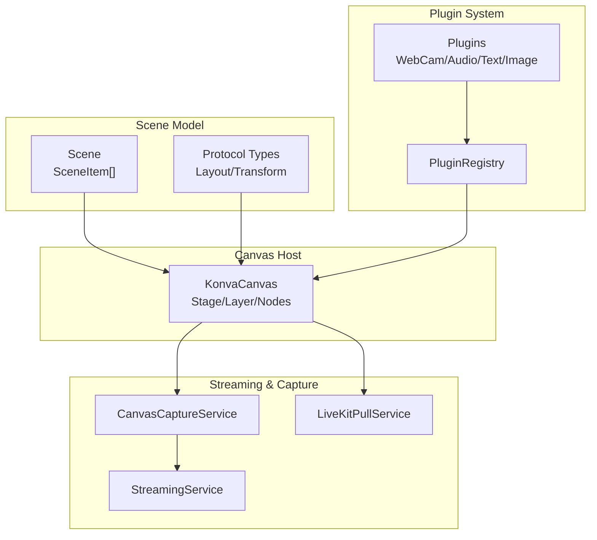

**Diagram sources**
- [konva-canvas.tsx:113-744](file://src/components/konva-canvas.tsx#L113-L744)
- [protocol.ts:20-89](file://src/types/protocol.ts#L20-L89)
- [plugin-registry.ts:5-168](file://src/services/plugin-registry.ts#L5-L168)
- [canvas-capture.ts:5-47](file://src/services/canvas-capture.ts#L5-L47)
- [livekit-pull.ts:49-352](file://src/services/livekit-pull.ts#L49-L352)
- [streaming.ts:6-177](file://src/services/streaming.ts#L6-L177)

**Section sources**
- [konva-canvas.tsx:113-744](file://src/components/konva-canvas.tsx#L113-L744)
- [protocol.ts:20-89](file://src/types/protocol.ts#L20-L89)
- [plugin-registry.ts:5-168](file://src/services/plugin-registry.ts#L5-L168)

## Core Components
- KonvaCanvas: Hosts the Stage, Layer, and Transformer. Manages sizing, HiDPI scaling, item rendering, drag/transform events, and exposes imperative methods to access the Stage and canvas.
- Scene model: Defines SceneItem and Transform structures used to drive rendering and transformations.
- Plugin system: Provides extensibility for custom renderers and canvas filtering/selectability.
- Canvas capture service: Converts the Stage’s canvas into a MediaStream for streaming.
- LiveKit integration: Renders remote participant video via HTML overlay and LiveKit client.

**Section sources**
- [konva-canvas.tsx:113-177](file://src/components/konva-canvas.tsx#L113-L177)
- [protocol.ts:13-89](file://src/types/protocol.ts#L13-L89)
- [plugin-registry.ts:144-157](file://src/services/plugin-registry.ts#L144-L157)
- [canvas-capture.ts:5-47](file://src/services/canvas-capture.ts#L5-L47)
- [livekit-stream-item.tsx:16-174](file://src/components/livekit-stream-item.tsx#L16-L174)

## Architecture Overview
The rendering pipeline begins with a Scene containing items. Items are filtered and sorted by z-index, then rendered either via built-in shapes or plugin renderers. Transformers enable interactive editing. A continuous render loop keeps the canvas stream alive during capture. LiveKit streams are overlaid as HTML video elements.

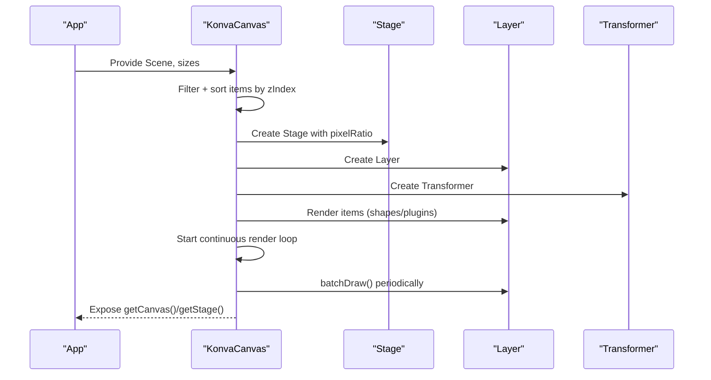

**Diagram sources**
- [konva-canvas.tsx:611-621](file://src/components/konva-canvas.tsx#L611-L621)
- [konva-canvas.tsx:649-694](file://src/components/konva-canvas.tsx#L649-L694)
- [konva-canvas.tsx:154-176](file://src/components/konva-canvas.tsx#L154-L176)

**Section sources**
- [konva-canvas.tsx:611-621](file://src/components/konva-canvas.tsx#L611-L621)
- [konva-canvas.tsx:649-694](file://src/components/konva-canvas.tsx#L649-L694)
- [konva-canvas.tsx:154-176](file://src/components/konva-canvas.tsx#L154-L176)

## Detailed Component Analysis

### KonvaCanvas: Stage, Layer, Nodes, and Rendering Pipeline
- Stage and Layer: The Stage holds the coordinate space and HiDPI pixel ratio; the Layer is the drawing surface.
- Item rendering: Items are filtered by plugin-provided shouldFilter, then sorted by zIndex. Each item maps to a Konva node or a plugin-rendered component.
- Transformers: Interactive editing is enabled via Transformer; minimum size enforcement and lock-aware behavior are applied.
- Drag and transform: DragEnd and TransformEnd update item layout/transform and reset scale to avoid cumulative scaling.
- Timer/clock updates: High-precision RAF-driven updates for dynamic text items.
- Auto-resize/scale: Container-based scaling with ResizeObserver and window resize handling.
- Continuous rendering: An RAF loop calls batchDraw on the Layer to keep captureStream alive.
- Imperative API: Methods to retrieve the Stage and underlying canvas element.

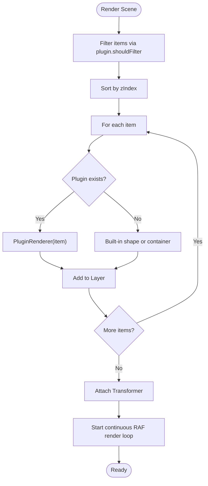

**Diagram sources**
- [konva-canvas.tsx:611-621](file://src/components/konva-canvas.tsx#L611-L621)
- [konva-canvas.tsx:411-601](file://src/components/konva-canvas.tsx#L411-L601)
- [konva-canvas.tsx:154-176](file://src/components/konva-canvas.tsx#L154-L176)

**Section sources**
- [konva-canvas.tsx:136-137](file://src/components/konva-canvas.tsx#L136-L137)
- [konva-canvas.tsx:302-357](file://src/components/konva-canvas.tsx#L302-L357)
- [konva-canvas.tsx:359-409](file://src/components/konva-canvas.tsx#L359-L409)
- [konva-canvas.tsx:411-601](file://src/components/konva-canvas.tsx#L411-L601)
- [konva-canvas.tsx:611-621](file://src/components/konva-canvas.tsx#L611-L621)
- [konva-canvas.tsx:649-694](file://src/components/konva-canvas.tsx#L649-L694)
- [konva-canvas.tsx:154-176](file://src/components/konva-canvas.tsx#L154-L176)

### Transform Operations and Interaction
- Positioning: Derived from item.layout.x/y.
- Scaling: Applied via node.scaleX/Y; reset after drag/transform to prevent accumulation.
- Rotation: Applied via node.rotation; persisted in item.transform.
- Opacity: Applied via node.opacity; persisted in item.transform.
- Locking: Locked items disable dragging and transforming.

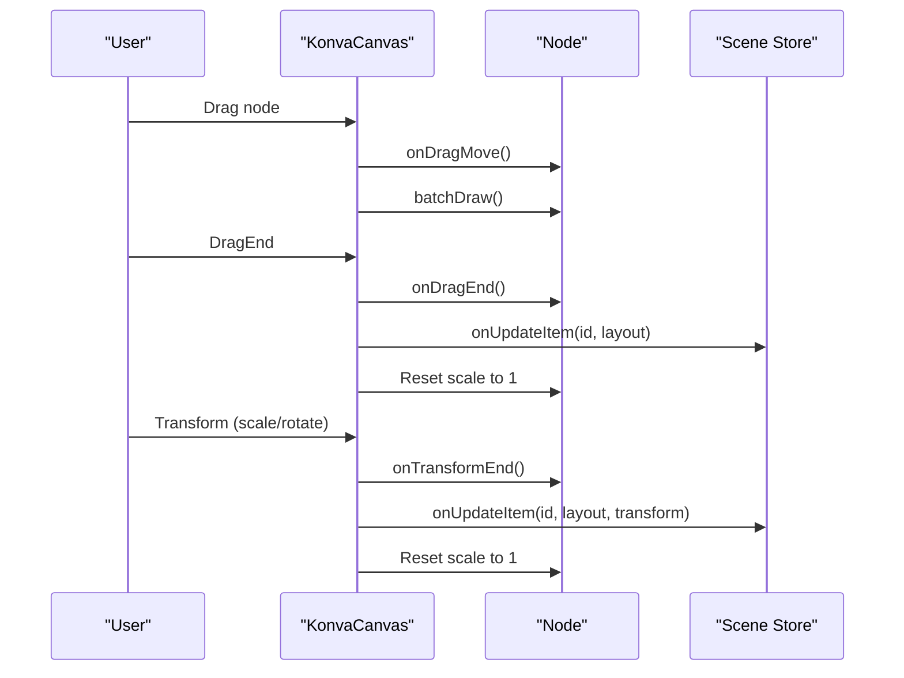

**Diagram sources**
- [konva-canvas.tsx:359-409](file://src/components/konva-canvas.tsx#L359-L409)
- [konva-canvas.tsx:411-456](file://src/components/konva-canvas.tsx#L411-L456)

**Section sources**
- [konva-canvas.tsx:411-456](file://src/components/konva-canvas.tsx#L411-L456)
- [konva-canvas.tsx:359-409](file://src/components/konva-canvas.tsx#L359-L409)

### Timer and Clock Rendering
- Timer items support countdown and countup modes with high-precision timing via RAF.
- Clock items display current time with configurable format.
- States are stored per item and updated on each RAF tick.

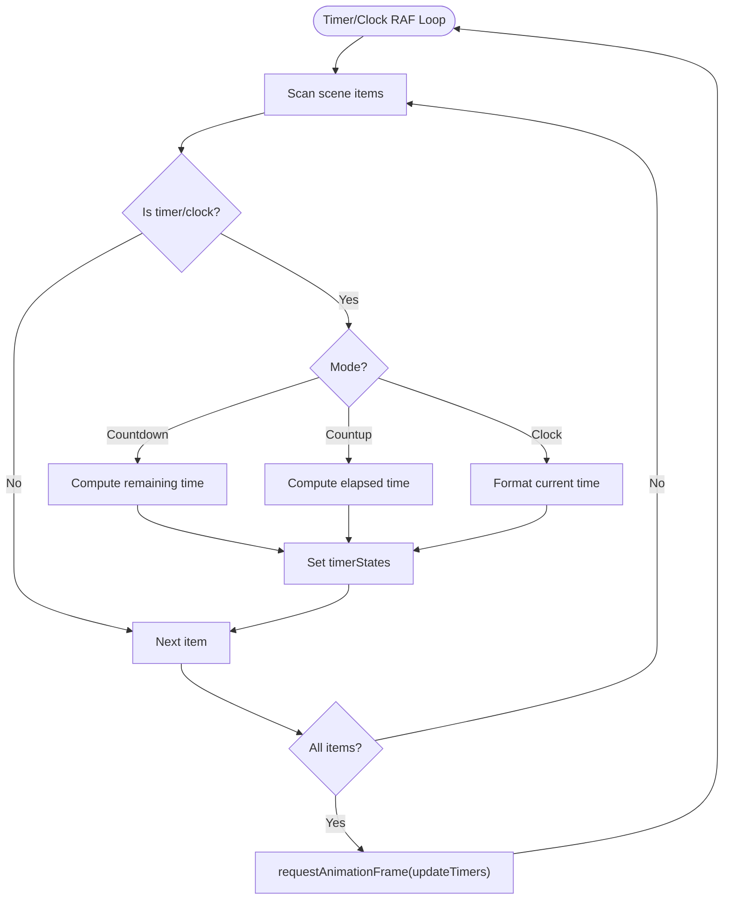

**Diagram sources**
- [konva-canvas.tsx:204-300](file://src/components/konva-canvas.tsx#L204-L300)

**Section sources**
- [konva-canvas.tsx:204-300](file://src/components/konva-canvas.tsx#L204-L300)

### LiveKit Overlay Integration
- LiveKit video streams are rendered as HTML video overlays positioned according to item layout and transform.
- The overlay sits above the Stage with a higher z-index and disables pointer events when the item is selected to allow selection of underlying shapes.

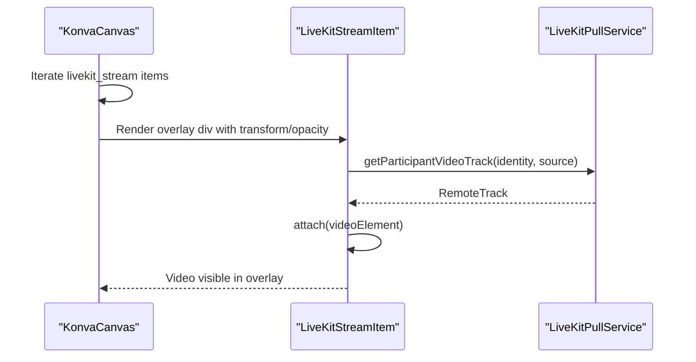

**Diagram sources**
- [konva-canvas.tsx:696-733](file://src/components/konva-canvas.tsx#L696-L733)
- [livekit-stream-item.tsx:26-108](file://src/components/livekit-stream-item.tsx#L26-L108)
- [livekit-pull.ts:269-291](file://src/services/livekit-pull.ts#L269-L291)

**Section sources**
- [konva-canvas.tsx:696-733](file://src/components/konva-canvas.tsx#L696-L733)
- [livekit-stream-item.tsx:16-174](file://src/components/livekit-stream-item.tsx#L16-L174)
- [livekit-pull.ts:269-291](file://src/services/livekit-pull.ts#L269-L291)

### Canvas Capture Service
- Converts an HTMLCanvasElement into a MediaStream using captureStream.
- Provides stopCapture and getStream helpers.
- Used to feed streaming services or recording pipelines.

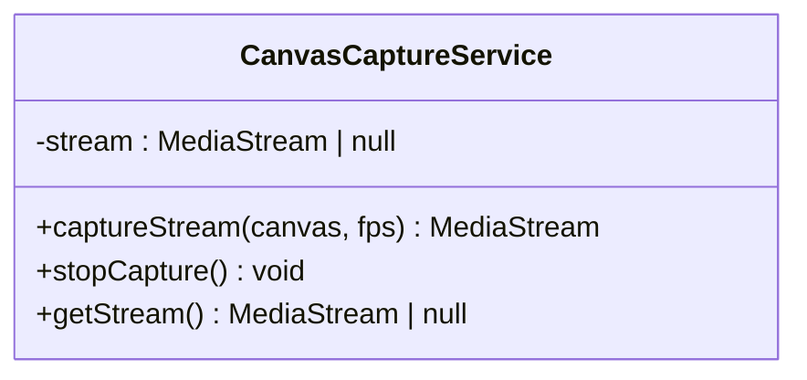

**Diagram sources**
- [canvas-capture.ts:5-47](file://src/services/canvas-capture.ts#L5-L47)

**Section sources**
- [canvas-capture.ts:5-47](file://src/services/canvas-capture.ts#L5-L47)

### Plugin-Based Renderer Implementation
- Plugins define render functions that receive commonProps (layout/transform) plus item-specific properties.
- Plugins can opt-in to canvasRender behaviors: shouldFilter (exclude from canvas), isSelectable (enable selection).
- Example plugins:
  - Webcam: Renders a KonvaImage from a video element with mirroring and opacity.
  - AudioInput: Can hide itself from canvas via shouldFilter.
  - Text/Image: Built-in plugins demonstrate property-driven rendering.

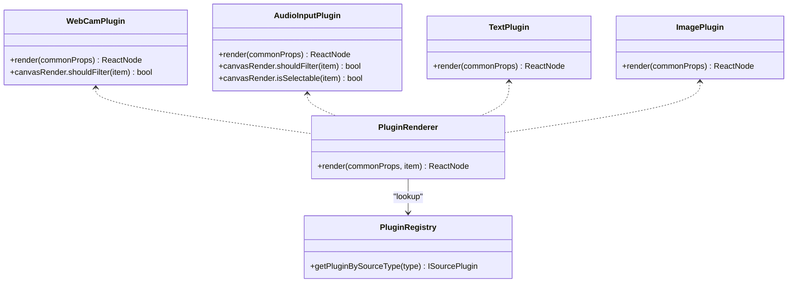

**Diagram sources**
- [konva-canvas.tsx:26-38](file://src/components/konva-canvas.tsx#L26-L38)
- [plugin-registry.ts:144-157](file://src/services/plugin-registry.ts#L144-L157)
- [webcam/index.tsx:234-473](file://src/plugins/builtin/webcam/index.tsx#L234-L473)
- [audio-input/index.tsx:141-145](file://src/plugins/builtin/audio-input/index.tsx#L141-L145)
- [text-plugin.tsx:83-104](file://src/plugins/builtin/text-plugin.tsx#L83-L104)
- [image-plugin.tsx:78-99](file://src/plugins/builtin/image-plugin.tsx#L78-L99)

**Section sources**
- [konva-canvas.tsx:26-38](file://src/components/konva-canvas.tsx#L26-L38)
- [plugin-registry.ts:144-157](file://src/services/plugin-registry.ts#L144-L157)
- [webcam/index.tsx:234-473](file://src/plugins/builtin/webcam/index.tsx#L234-L473)
- [audio-input/index.tsx:141-145](file://src/plugins/builtin/audio-input/index.tsx#L141-L145)
- [text-plugin.tsx:83-104](file://src/plugins/builtin/text-plugin.tsx#L83-L104)
- [image-plugin.tsx:78-99](file://src/plugins/builtin/image-plugin.tsx#L78-L99)

### Scene Model and Transform Structures
- SceneItem defines layout (x, y, width, height), transform (opacity, rotation, filters, borderRadius), visibility, locking, and type-specific properties.
- Transform supports filters and borderRadius for visual effects.

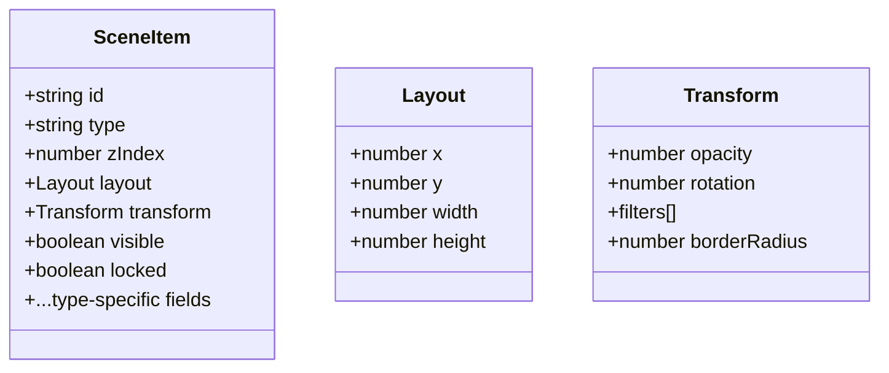

**Diagram sources**
- [protocol.ts:20-89](file://src/types/protocol.ts#L20-L89)

**Section sources**
- [protocol.ts:20-89](file://src/types/protocol.ts#L20-L89)

## Dependency Analysis
- KonvaCanvas depends on:
  - Scene model types for item definitions.
  - PluginRegistry to resolve plugin renderers and canvas behaviors.
  - LiveKit components for overlay rendering.
  - CanvasCaptureService for exporting the Stage canvas.
- Plugins depend on MediaStreamManager for unified stream lifecycle and device enumeration.
- StreamingService consumes a MediaStream (from canvas capture) to publish to LiveKit.

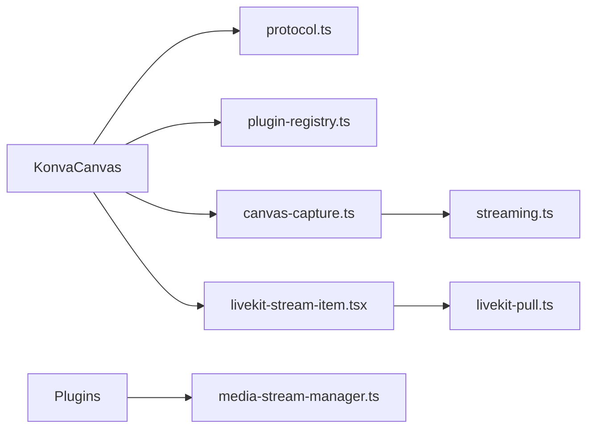

**Diagram sources**
- [konva-canvas.tsx:113-744](file://src/components/konva-canvas.tsx#L113-L744)
- [protocol.ts:20-89](file://src/types/protocol.ts#L20-L89)
- [plugin-registry.ts:5-168](file://src/services/plugin-registry.ts#L5-L168)
- [canvas-capture.ts:5-47](file://src/services/canvas-capture.ts#L5-L47)
- [livekit-stream-item.tsx:16-174](file://src/components/livekit-stream-item.tsx#L16-L174)
- [media-stream-manager.ts:39-323](file://src/services/media-stream-manager.ts#L39-L323)
- [streaming.ts:6-177](file://src/services/streaming.ts#L6-L177)
- [livekit-pull.ts:49-352](file://src/services/livekit-pull.ts#L49-L352)

**Section sources**
- [konva-canvas.tsx:113-744](file://src/components/konva-canvas.tsx#L113-L744)
- [plugin-registry.ts:5-168](file://src/services/plugin-registry.ts#L5-L168)
- [canvas-capture.ts:5-47](file://src/services/canvas-capture.ts#L5-L47)
- [livekit-stream-item.tsx:16-174](file://src/components/livekit-stream-item.tsx#L16-L174)
- [media-stream-manager.ts:39-323](file://src/services/media-stream-manager.ts#L39-L323)
- [streaming.ts:6-177](file://src/services/streaming.ts#L6-L177)
- [livekit-pull.ts:49-352](file://src/services/livekit-pull.ts#L49-L352)

## Performance Considerations
- HiDPI scaling:
  - Stage uses pixelRatio derived from window.devicePixelRatio to maintain crisp rendering on high-DPI displays.
- Continuous rendering:
  - An RAF loop periodically calls batchDraw on the Layer to keep the canvas stream alive during capture.
- Minimizing redraws:
  - Use batchDraw strategically; avoid unnecessary re-renders by filtering items via plugin.shouldFilter.
- Auto-resize:
  - Use ResizeObserver and window resize listeners to compute scale while preventing zero-sized containers.
- Transformer constraints:
  - Enforce minimum size and lock-aware behavior to reduce invalid states and redundant draws.
- LiveKit overlays:
  - HTML video overlays are separate from the Stage and do not participate in Konva redraws, reducing overhead.

**Section sources**
- [konva-canvas.tsx:136-137](file://src/components/konva-canvas.tsx#L136-L137)
- [konva-canvas.tsx:154-176](file://src/components/konva-canvas.tsx#L154-L176)
- [konva-canvas.tsx:302-357](file://src/components/konva-canvas.tsx#L302-L357)
- [konva-canvas.tsx:666-692](file://src/components/konva-canvas.tsx#L666-L692)

## Troubleshooting Guide
- Canvas not updating:
  - Ensure continuous rendering is started when capturing; call startContinuousRendering and verify renderLoopRef is active.
- Draggable/transformable items not responding:
  - Check item.locked flag; locked items are not draggable or transformable.
  - Verify plugin.canvasRender.isSelectable behavior for plugins that intentionally hide themselves from selection.
- Timer/clock not refreshing:
  - Confirm scene contains timer/clock items; the RAF loop only runs when present.
- LiveKit overlay not visible:
  - Ensure the item is visible and the participant/video track is available; check LiveKit connection state and track subscription.
- Memory leaks:
  - Stop streams via MediaStreamManager.removeStream or CanvasCaptureService.stopCapture to release tracks.
  - Ensure cleanup of video elements and analyser nodes in plugins.

**Section sources**
- [konva-canvas.tsx:154-176](file://src/components/konva-canvas.tsx#L154-L176)
- [konva-canvas.tsx:179-202](file://src/components/konva-canvas.tsx#L179-L202)
- [konva-canvas.tsx:204-300](file://src/components/konva-canvas.tsx#L204-L300)
- [livekit-stream-item.tsx:26-108](file://src/components/livekit-stream-item.tsx#L26-L108)
- [media-stream-manager.ts:77-91](file://src/services/media-stream-manager.ts#L77-L91)
- [canvas-capture.ts:29-43](file://src/services/canvas-capture.ts#L29-L43)

## Conclusion
LiveMixer Web’s canvas rendering system leverages Konva for efficient 2D rendering, with a flexible plugin architecture enabling extensible renderers. The Stage/Layer/Node hierarchy, combined with item filtering, z-index sorting, and interactive transformers, provides a robust foundation for real-time composition. The canvas capture service bridges the Stage to MediaStream for publishing, while LiveKit overlays integrate remote video seamlessly. With HiDPI scaling, continuous rendering, and careful memory management, the system supports smooth real-time performance.

## Appendices

### Canvas Export and Streaming Workflow
- Obtain the Stage’s canvas via KonvaCanvas.getCanvas().
- Capture a MediaStream using CanvasCaptureService.captureStream(canvas, fps).
- Publish to LiveKit via StreamingService.connect(..., mediaStream, ...).

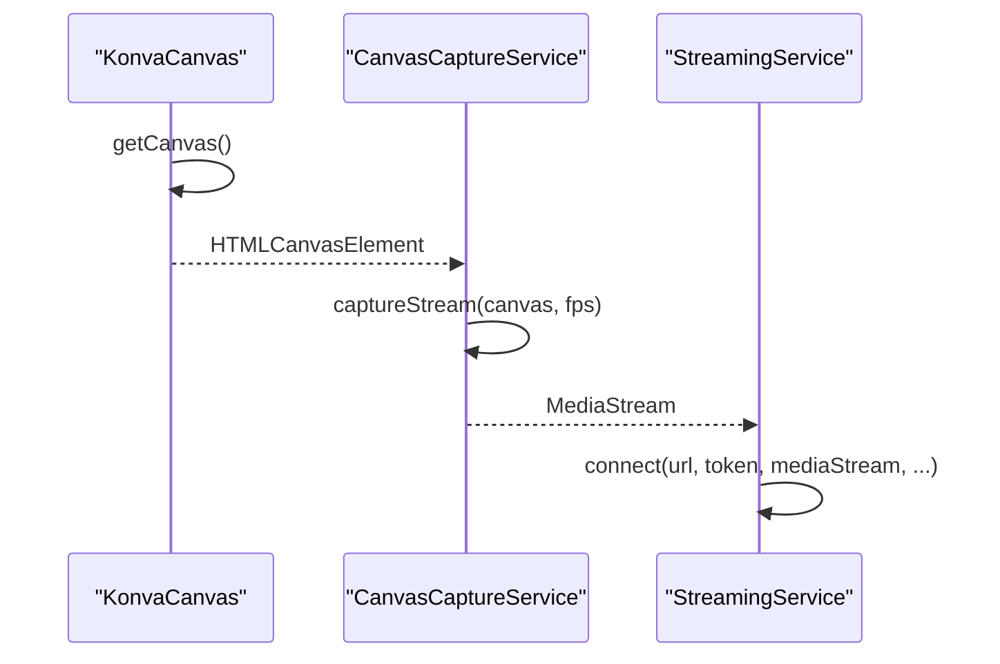

**Diagram sources**
- [konva-canvas.tsx:146-152](file://src/components/konva-canvas.tsx#L146-L152)
- [canvas-capture.ts:14-24](file://src/services/canvas-capture.ts#L14-L24)
- [streaming.ts:20-101](file://src/services/streaming.ts#L20-L101)

**Section sources**
- [konva-canvas.tsx:146-152](file://src/components/konva-canvas.tsx#L146-L152)
- [canvas-capture.ts:14-24](file://src/services/canvas-capture.ts#L14-L24)
- [streaming.ts:20-101](file://src/services/streaming.ts#L20-L101)

### Example: Custom Renderer Implementation
- Implement a plugin with render(commonProps) returning Konva nodes.
- Optionally expose canvasRender.shouldFilter and canvasRender.isSelectable to control visibility and selection on the canvas.
- Use MediaStreamManager for managing device streams and device enumeration.

**Section sources**
- [webcam/index.tsx:234-473](file://src/plugins/builtin/webcam/index.tsx#L234-L473)
- [audio-input/index.tsx:141-145](file://src/plugins/builtin/audio-input/index.tsx#L141-L145)
- [media-stream-manager.ts:147-273](file://src/services/media-stream-manager.ts#L147-L273)