# Item Manipulation

<cite>
**Referenced Files in This Document**
- [konva-canvas.tsx](file://src/components/konva-canvas.tsx)
- [property-panel.tsx](file://src/components/property-panel.tsx)
- [protocol.ts](file://src/types/protocol.ts)
- [plugin-registry.ts](file://src/services/plugin-registry.ts)
- [bottom-bar.tsx](file://src/components/bottom-bar.tsx)
- [toolbar.tsx](file://src/components/toolbar.tsx)
- [protocol.ts](file://src/store/protocol.ts)
</cite>

## Table of Contents
1. [Introduction](#introduction)
2. [Project Structure](#project-structure)
3. [Core Components](#core-components)
4. [Architecture Overview](#architecture-overview)
5. [Detailed Component Analysis](#detailed-component-analysis)
6. [Dependency Analysis](#dependency-analysis)
7. [Performance Considerations](#performance-considerations)
8. [Troubleshooting Guide](#troubleshooting-guide)
9. [Conclusion](#conclusion)
10. [Appendices](#appendices)

## Introduction
This document explains LiveMixer Web’s item manipulation system with a focus on:
- Drag-and-drop positioning and transform operations (scaling, rotation, opacity)
- Z-index management and selection mechanisms
- The Transformer component for interactive editing, anchors, and constraints
- Property panel integration for precise control
- Transform state persistence and animation support
- Batch operations and programmatic manipulation patterns

It synthesizes the canvas rendering, selection, transformation, and property editing flows to help both developers and power users operate items effectively.

## Project Structure
The item manipulation system spans several key areas:
- Canvas rendering and interaction (Konva-based)
- Property panel for precise editing
- Type definitions for items and transforms
- Plugin registry for extensibility
- Bottom bar and toolbar for selection and actions

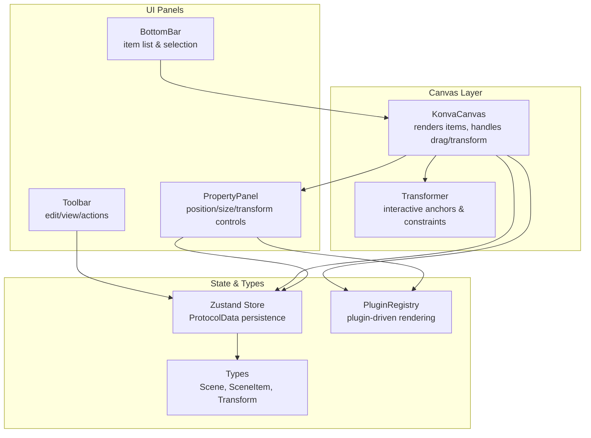

**Diagram sources**
- [konva-canvas.tsx:113-744](file://src/components/konva-canvas.tsx#L113-L744)
- [property-panel.tsx:643-1200](file://src/components/property-panel.tsx#L643-L1200)
- [protocol.ts:1-114](file://src/types/protocol.ts#L1-L114)
- [plugin-registry.ts:1-168](file://src/services/plugin-registry.ts#L1-L168)
- [bottom-bar.tsx:217-525](file://src/components/bottom-bar.tsx#L217-L525)
- [toolbar.tsx:1-165](file://src/components/toolbar.tsx#L1-L165)
- [protocol.ts:1-68](file://src/store/protocol.ts#L1-L68)

**Section sources**
- [konva-canvas.tsx:113-744](file://src/components/konva-canvas.tsx#L113-L744)
- [property-panel.tsx:643-1200](file://src/components/property-panel.tsx#L643-L1200)
- [protocol.ts:1-114](file://src/types/protocol.ts#L1-L114)
- [plugin-registry.ts:1-168](file://src/services/plugin-registry.ts#L1-L168)
- [bottom-bar.tsx:217-525](file://src/components/bottom-bar.tsx#L217-L525)
- [toolbar.tsx:1-165](file://src/components/toolbar.tsx#L1-L165)
- [protocol.ts:1-68](file://src/store/protocol.ts#L1-L68)

## Core Components
- KonvaCanvas: Renders items, manages selection, drag-and-drop, transform events, and z-order via sorting by zIndex.
- PropertyPanel: Provides sliders and inputs for opacity, rotation, position, size, and plugin-specific properties.
- Types: Define SceneItem, Layout, Transform, and Scene structures used across the system.
- PluginRegistry: Enables plugin-driven rendering and property panels.
- BottomBar: Lists items and supports single selection and basic actions.
- Toolbar: Provides edit/view actions; copy/paste/delete placeholders are present for future integration.
- Store: Persistently stores ProtocolData (scenes, canvas config) using Zustand.

**Section sources**
- [konva-canvas.tsx:411-621](file://src/components/konva-canvas.tsx#L411-L621)
- [property-panel.tsx:643-916](file://src/components/property-panel.tsx#L643-L916)
- [protocol.ts:20-89](file://src/types/protocol.ts#L20-L89)
- [plugin-registry.ts:144-157](file://src/services/plugin-registry.ts#L144-L157)
- [bottom-bar.tsx:225-242](file://src/components/bottom-bar.tsx#L225-L242)
- [toolbar.tsx:82-89](file://src/components/toolbar.tsx#L82-L89)
- [protocol.ts:38-67](file://src/store/protocol.ts#L38-L67)

## Architecture Overview
The item manipulation pipeline connects user interaction with state updates and rendering:

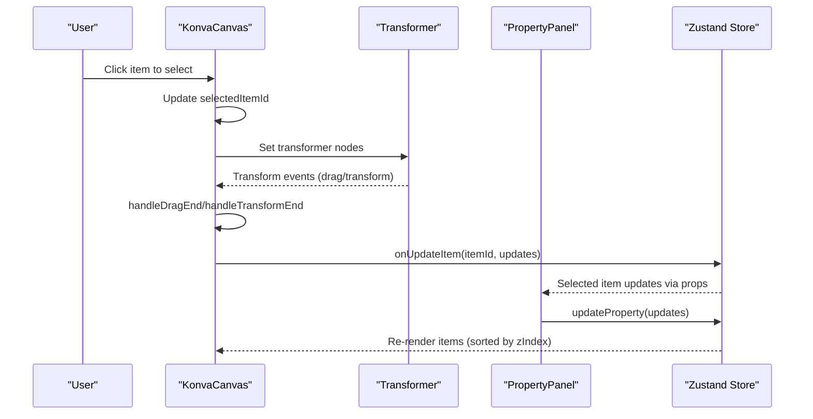

**Diagram sources**
- [konva-canvas.tsx:178-202](file://src/components/konva-canvas.tsx#L178-L202)
- [konva-canvas.tsx:359-409](file://src/components/konva-canvas.tsx#L359-L409)
- [property-panel.tsx:675-691](file://src/components/property-panel.tsx#L675-L691)
- [protocol.ts:44-54](file://src/store/protocol.ts#L44-L54)

## Detailed Component Analysis

### Drag-and-Drop Positioning
- Selection and click-to-clear: clicking empty stage area clears selection.
- Draggable items: only selected and unlocked items are draggable.
- Drag lifecycle:
  - onDragMove triggers incremental transformer updates.
  - onDragEnd persists layout.x/y and normalized width/height.
- Minimum size enforcement occurs during transform operations.

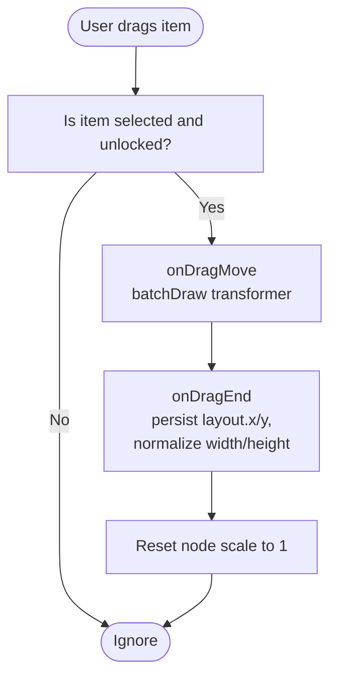

**Diagram sources**
- [konva-canvas.tsx:359-382](file://src/components/konva-canvas.tsx#L359-L382)
- [konva-canvas.tsx:384-409](file://src/components/konva-canvas.tsx#L384-L409)

**Section sources**
- [konva-canvas.tsx:417-456](file://src/components/konva-canvas.tsx#L417-L456)
- [konva-canvas.tsx:654-660](file://src/components/konva-canvas.tsx#L654-L660)
- [konva-canvas.tsx:359-409](file://src/components/konva-canvas.tsx#L359-L409)

### Transform Operations (Scaling, Rotation, Opacity)
- Scaling: handled by Transformer anchors; onTransformEnd normalizes width/height and persists rotation.
- Rotation: controlled via PropertyPanel slider; persisted in Transform.rotation.
- Opacity: controlled via PropertyPanel slider; persisted in Transform.opacity.
- Minimum size: enforced in Transformer boundBoxFunc to prevent collapsing.

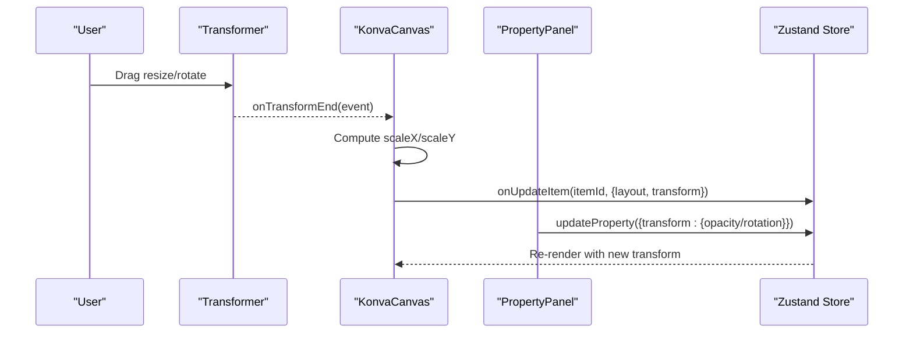

**Diagram sources**
- [konva-canvas.tsx:384-409](file://src/components/konva-canvas.tsx#L384-L409)
- [konva-canvas.tsx:664-692](file://src/components/konva-canvas.tsx#L664-L692)
- [property-panel.tsx:840-916](file://src/components/property-panel.tsx#L840-L916)

**Section sources**
- [konva-canvas.tsx:384-409](file://src/components/konva-canvas.tsx#L384-L409)
- [konva-canvas.tsx:664-692](file://src/components/konva-canvas.tsx#L664-L692)
- [property-panel.tsx:840-916](file://src/components/property-panel.tsx#L840-L916)

### Z-Index Management
- Sorting: items are sorted by zIndex before rendering to ensure correct layering.
- Control: PropertyPanel exposes a numeric input for zIndex editing.
- Overlay: LiveKit video overlays use higher z-index to appear above canvas.

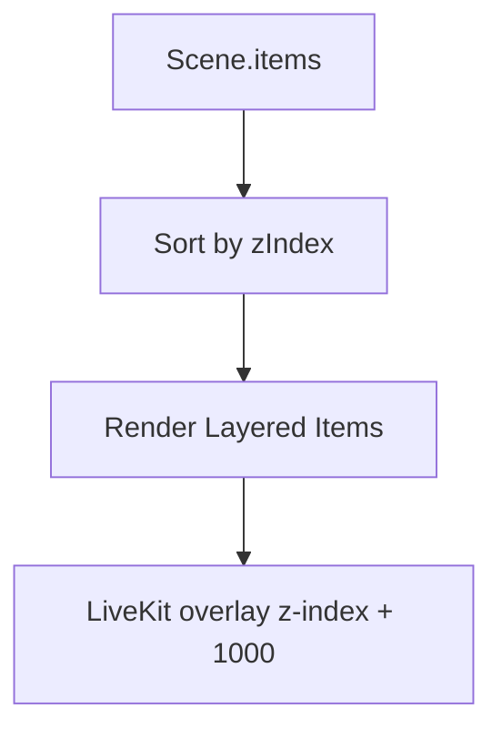

**Diagram sources**
- [konva-canvas.tsx:612-621](file://src/components/konva-canvas.tsx#L612-L621)
- [konva-canvas.tsx:719-720](file://src/components/konva-canvas.tsx#L719-L720)
- [property-panel.tsx:736-750](file://src/components/property-panel.tsx#L736-L750)

**Section sources**
- [konva-canvas.tsx:612-621](file://src/components/konva-canvas.tsx#L612-L621)
- [property-panel.tsx:736-750](file://src/components/property-panel.tsx#L736-L750)

### Transformer Component and Constraints
- Enabled anchors: corners, edges, and center anchors for scaling and rotation.
- Rotation enabled: allows free rotation.
- Keep ratio disabled: permits independent X/Y scaling.
- Bound box enforcement: prevents transforms when locked and enforces minimum size.

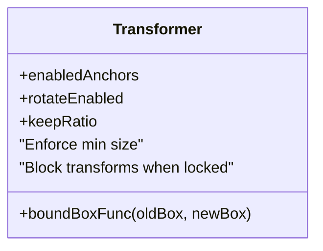

**Diagram sources**
- [konva-canvas.tsx:664-692](file://src/components/konva-canvas.tsx#L664-L692)

**Section sources**
- [konva-canvas.tsx:664-692](file://src/components/konva-canvas.tsx#L664-L692)

### Item Selection Mechanisms and Multi-Selection
- Single selection: clicking an item selects it; clicking empty stage clears selection.
- Selection state: passed to KonvaCanvas and PropertyPanel.
- Multi-selection: not implemented in the current codebase; only single selection is supported.

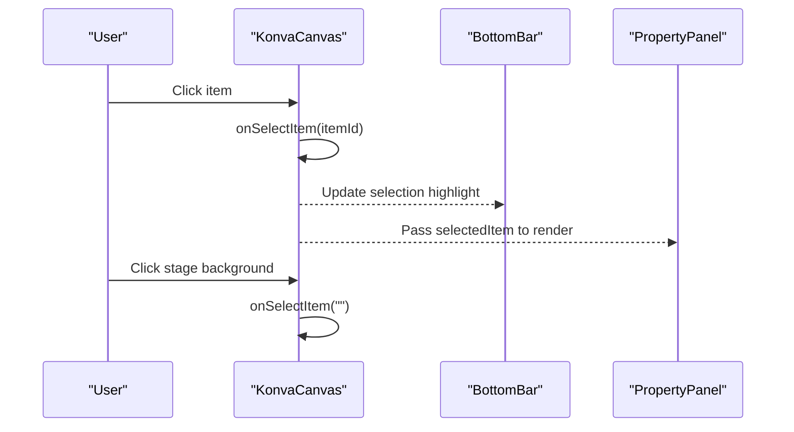

**Diagram sources**
- [konva-canvas.tsx:417-429](file://src/components/konva-canvas.tsx#L417-L429)
- [konva-canvas.tsx:654-660](file://src/components/konva-canvas.tsx#L654-L660)
- [bottom-bar.tsx:225-242](file://src/components/bottom-bar.tsx#L225-L242)

**Section sources**
- [konva-canvas.tsx:417-429](file://src/components/konva-canvas.tsx#L417-L429)
- [konva-canvas.tsx:654-660](file://src/components/konva-canvas.tsx#L654-L660)
- [bottom-bar.tsx:225-242](file://src/components/bottom-bar.tsx#L225-L242)

### Keyboard Shortcuts
- No explicit keyboard shortcuts are implemented in the current codebase.
- Copy/Paste/Delete entries exist in the toolbar menu; they are placeholders for future integration.

**Section sources**
- [toolbar.tsx:82-89](file://src/components/toolbar.tsx#L82-L89)

### Transform State Persistence and Animation Support
- Persistence: updates are applied via onUpdateItem/updateProperty and stored in Zustand ProtocolData.
- Animation: no built-in animation APIs are used; rendering relies on immediate state updates and batchDraw.

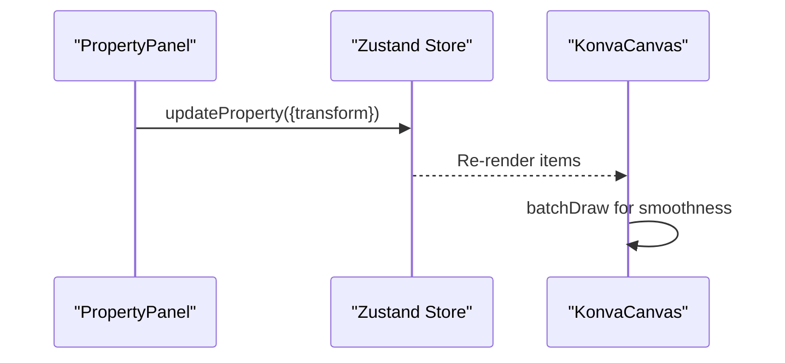

**Diagram sources**
- [property-panel.tsx:675-691](file://src/components/property-panel.tsx#L675-L691)
- [protocol.ts:44-54](file://src/store/protocol.ts#L44-L54)
- [konva-canvas.tsx:377-382](file://src/components/konva-canvas.tsx#L377-L382)

**Section sources**
- [property-panel.tsx:675-691](file://src/components/property-panel.tsx#L675-L691)
- [protocol.ts:44-54](file://src/store/protocol.ts#L44-L54)
- [konva-canvas.tsx:377-382](file://src/components/konva-canvas.tsx#L377-L382)

### Batch Operations
- No explicit batch operation APIs are present in the current codebase.
- Programmatic updates are performed per item via onUpdateItem/updateProperty.

**Section sources**
- [konva-canvas.tsx:393-404](file://src/components/konva-canvas.tsx#L393-L404)
- [property-panel.tsx:675-691](file://src/components/property-panel.tsx#L675-L691)

### Programmatic Item Manipulation Examples
- Move an item programmatically:
  - Call onUpdateItem(itemId, { layout: { x, y } }) from KonvaCanvas.
- Scale/rotate programmatically:
  - Call onUpdateItem(itemId, { layout: { width, height }, transform: { rotation } }).
- Change opacity:
  - Call updateProperty({ transform: { opacity } }) from PropertyPanel.
- Update zIndex:
  - Call updateProperty({ zIndex }) from PropertyPanel.

These patterns are derived from the event handlers and property update functions.

**Section sources**
- [konva-canvas.tsx:393-404](file://src/components/konva-canvas.tsx#L393-L404)
- [property-panel.tsx:675-691](file://src/components/property-panel.tsx#L675-L691)

### Custom Transform Handlers and Plugin Integration
- Plugins can influence selection and filtering via canvasRender hooks (e.g., isSelectable, shouldFilter).
- Property panels can expose plugin-specific controls via propsSchema and exclude lists.

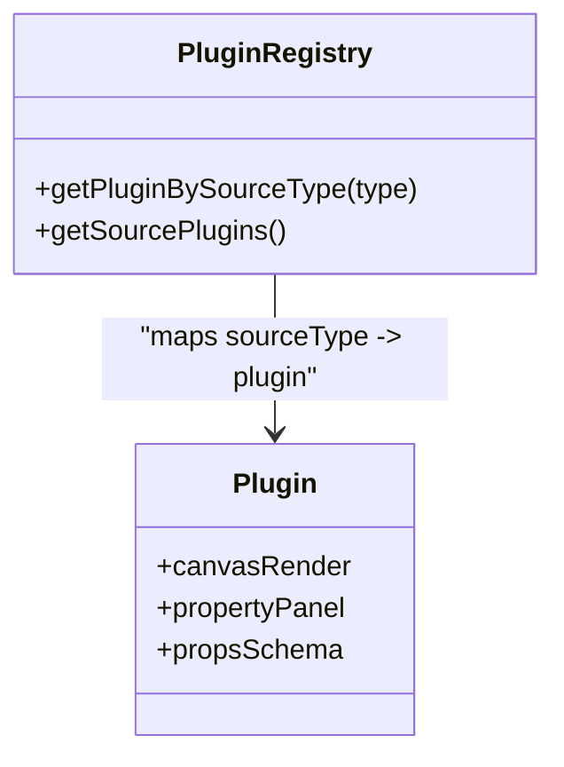

**Diagram sources**
- [plugin-registry.ts:144-157](file://src/services/plugin-registry.ts#L144-L157)
- [konva-canvas.tsx:187-195](file://src/components/konva-canvas.tsx#L187-L195)
- [property-panel.tsx:919-1040](file://src/components/property-panel.tsx#L919-L1040)

**Section sources**
- [plugin-registry.ts:144-157](file://src/services/plugin-registry.ts#L144-L157)
- [konva-canvas.tsx:187-195](file://src/components/konva-canvas.tsx#L187-L195)
- [property-panel.tsx:919-1040](file://src/components/property-panel.tsx#L919-L1040)

## Dependency Analysis
- KonvaCanvas depends on:
  - SceneItem definitions (Layout, Transform)
  - PluginRegistry for plugin-driven rendering and selection rules
  - Zustand store for state updates
- PropertyPanel depends on:
  - Selected SceneItem and updateProperty callback
  - PluginRegistry for plugin-specific property panels
- BottomBar depends on:
  - SelectedItemId for highlighting and actions
- Toolbar provides actions that integrate with the store and UI.

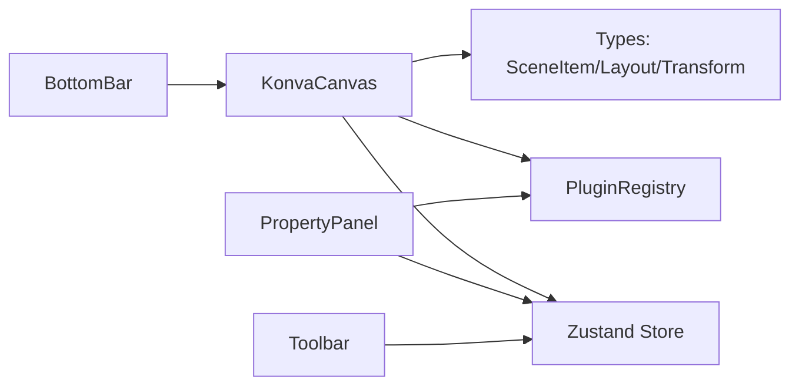

**Diagram sources**
- [konva-canvas.tsx:20-22](file://src/components/konva-canvas.tsx#L20-L22)
- [protocol.ts:20-89](file://src/types/protocol.ts#L20-L89)
- [plugin-registry.ts:1-168](file://src/services/plugin-registry.ts#L1-L168)
- [property-panel.tsx:643-1200](file://src/components/property-panel.tsx#L643-L1200)
- [bottom-bar.tsx:217-525](file://src/components/bottom-bar.tsx#L217-L525)
- [toolbar.tsx:1-165](file://src/components/toolbar.tsx#L1-L165)
- [protocol.ts:1-68](file://src/store/protocol.ts#L1-L68)

**Section sources**
- [konva-canvas.tsx:20-22](file://src/components/konva-canvas.tsx#L20-L22)
- [protocol.ts:20-89](file://src/types/protocol.ts#L20-L89)
- [plugin-registry.ts:1-168](file://src/services/plugin-registry.ts#L1-L168)
- [property-panel.tsx:643-1200](file://src/components/property-panel.tsx#L643-L1200)
- [bottom-bar.tsx:217-525](file://src/components/bottom-bar.tsx#L217-L525)
- [toolbar.tsx:1-165](file://src/components/toolbar.tsx#L1-L165)
- [protocol.ts:1-68](file://src/store/protocol.ts#L1-L68)

## Performance Considerations
- Continuous rendering loop: KonvaCanvas exposes startContinuousRendering/stopContinuousRendering to keep capture streams alive.
- batchDraw: Used during drag and transform to reduce redraw overhead.
- Minimizing re-renders: Sorting by zIndex and filtering via plugin shouldLimit rendering cost.

**Section sources**
- [konva-canvas.tsx:154-176](file://src/components/konva-canvas.tsx#L154-L176)
- [konva-canvas.tsx:377-382](file://src/components/konva-canvas.tsx#L377-L382)
- [konva-canvas.tsx:612-621](file://src/components/konva-canvas.tsx#L612-L621)

## Troubleshooting Guide
- Item not selectable:
  - Verify plugin canvasRender.isSelectable does not return false for the selected item.
- Transform anchors not working:
  - Ensure item is not locked; locked items bypass transforms.
- Drag does nothing:
  - Confirm item is selected and not locked; only selected/unlocked items are draggable.
- Opacity/rotation changes not reflected:
  - Ensure updateProperty is called and Zustand store is updating the item.

**Section sources**
- [konva-canvas.tsx:187-195](file://src/components/konva-canvas.tsx#L187-L195)
- [konva-canvas.tsx:664-692](file://src/components/konva-canvas.tsx#L664-L692)
- [konva-canvas.tsx:417-429](file://src/components/konva-canvas.tsx#L417-L429)
- [property-panel.tsx:675-691](file://src/components/property-panel.tsx#L675-L691)

## Conclusion
LiveMixer Web’s item manipulation system centers on a robust KonvaCanvas with Transformer-based editing, precise PropertyPanel controls, and a strongly typed SceneItem model. Selection is single-item, with z-index driving layering and plugins extending both rendering and property editing. While keyboard shortcuts and batch operations are not implemented, the architecture supports straightforward extension for these features.

## Appendices

### Data Model Overview
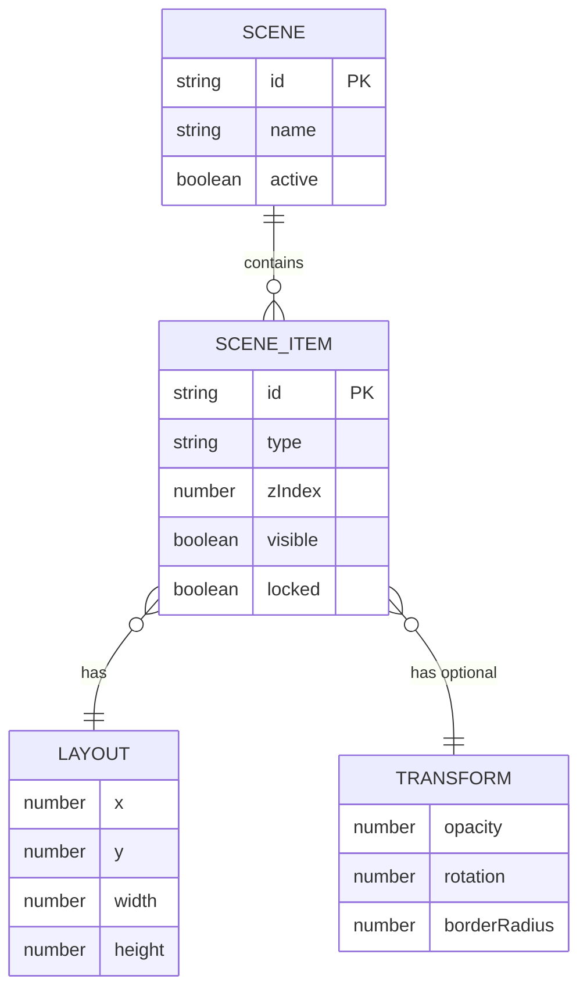

**Diagram sources**
- [protocol.ts:84-89](file://src/types/protocol.ts#L84-L89)
- [protocol.ts:20-82](file://src/types/protocol.ts#L20-L82)
- [protocol.ts:6-18](file://src/types/protocol.ts#L6-L18)