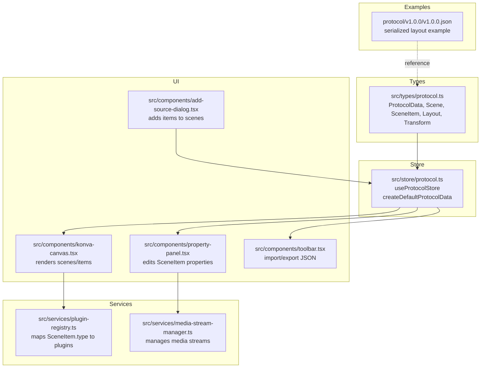
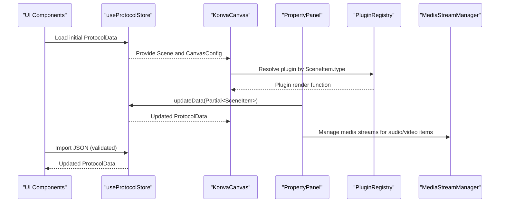
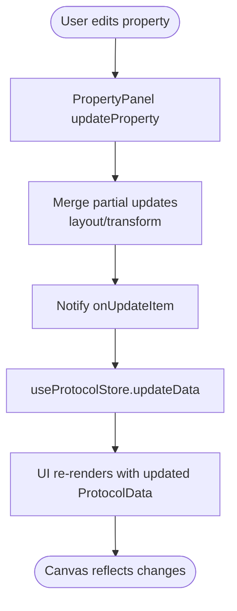
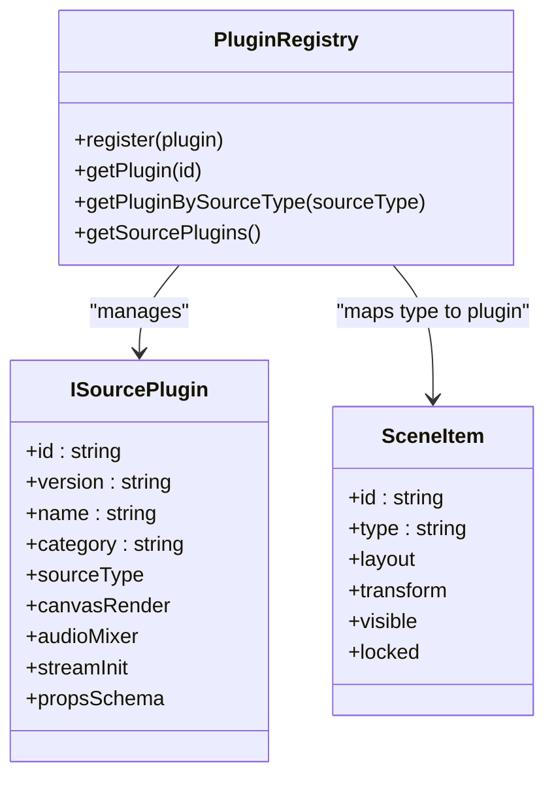
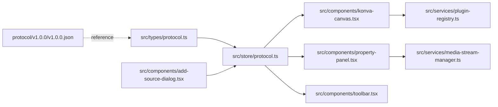

# Protocol Data Model

<cite>
**Referenced Files in This Document**
- [protocol.ts](file://src/types/protocol.ts)
- [protocol.ts](file://src/store/protocol.ts)
- [v1.0.0.json](file://protocol/v1.0.0/v1.0.0.json)
- [Readme.md](file://protocol/v1.0.0/Readme.md)
- [extensions.ts](file://src/types/extensions.ts)
- [toolbar.tsx](file://src/components/toolbar.tsx)
- [konva-canvas.tsx](file://src/components/konva-canvas.tsx)
- [property-panel.tsx](file://src/components/property-panel.tsx)
- [add-source-dialog.tsx](file://src/components/add-source-dialog.tsx)
- [plugin-registry.ts](file://src/services/plugin-registry.ts)
- [media-stream-manager.ts](file://src/services/media-stream-manager.ts)
- [audio-input/index.tsx](file://src/plugins/builtin/audio-input/index.tsx)
</cite>

## Table of Contents
1. [Introduction](#introduction)
2. [Project Structure](#project-structure)
3. [Core Components](#core-components)
4. [Architecture Overview](#architecture-overview)
5. [Detailed Component Analysis](#detailed-component-analysis)
6. [Dependency Analysis](#dependency-analysis)
7. [Performance Considerations](#performance-considerations)
8. [Troubleshooting Guide](#troubleshooting-guide)
9. [Conclusion](#conclusion)
10. [Appendices](#appendices)

## Introduction
This document provides comprehensive data model documentation for LiveMixer Web’s ProtocolData structure. It details the Scene and SceneItem types, their properties, validation rules, and default values. It explains the serialization format for project files, including versioning and backward compatibility considerations. It also covers the relationship between protocol data and UI state, including data binding patterns and synchronization mechanisms, along with validation, error handling, and migration strategies for protocol updates. Finally, it includes examples of protocol data manipulation, custom field extensions, and integration with external systems.

## Project Structure
The protocol data model is defined in TypeScript interfaces and enforced by a Zustand store. Example serialized layouts are provided under the protocol version directory. UI components bind to protocol data to render scenes and synchronize user interactions back into the protocol.

**Diagram sources**
- [protocol.ts:103-114](file://src/types/protocol.ts#L103-L114)
- [protocol.ts:5-28](file://src/store/protocol.ts#L5-L28)
- [konva-canvas.tsx:97-124](file://src/components/konva-canvas.tsx#L97-L124)
- [property-panel.tsx:22-25](file://src/components/property-panel.tsx#L22-L25)
- [toolbar.tsx:6-9](file://src/components/toolbar.tsx#L6-L9)
- [add-source-dialog.tsx:43-47](file://src/components/add-source-dialog.tsx#L43-L47)
- [plugin-registry.ts:5-20](file://src/services/plugin-registry.ts#L5-L20)
- [media-stream-manager.ts:39-65](file://src/services/media-stream-manager.ts#L39-L65)
- [v1.0.0.json:1-244](file://protocol/v1.0.0/v1.0.0.json#L1-L244)

**Section sources**
- [protocol.ts:103-114](file://src/types/protocol.ts#L103-L114)
- [protocol.ts:5-28](file://src/store/protocol.ts#L5-L28)
- [v1.0.0.json:1-244](file://protocol/v1.0.0/v1.0.0.json#L1-L244)

## Core Components
This section documents the ProtocolData structure and its core parts: metadata, canvas configuration, resources, scenes, and items.

- ProtocolData
  - version: string
  - metadata: { name: string; createdAt: string; updatedAt: string }
  - canvas: { width: number; height: number }
  - resources?: { sources: Source[] }
  - scenes: Scene[]
- Scene
  - id: string
  - name: string
  - active?: boolean
  - items: SceneItem[]
- SceneItem
  - id: string
  - type: string
  - zIndex: number
  - layout: { x: number; y: number; width: number; height: number }
  - transform?: { opacity?: number; rotation?: number; filters?: { name: string; value: number }[]; borderRadius?: number }
  - visible?: boolean
  - locked?: boolean
  - Additional type-specific fields:
    - color?: string
    - content?: string
    - properties?: { fontSize?: number; color?: string }
    - url?: string
    - source?: string
    - children?: SceneItem[]
    - refSceneId?: string
    - timerConfig?: { mode: 'countdown' | 'countup' | 'clock'; duration?: number; startValue?: number; format?: string; running?: boolean; currentTime?: number; startTime?: number; pausedAt?: number }
    - livekitStream?: { participantIdentity: string; streamSource: 'camera' | 'screen_share' }
    - deviceId?: string
    - muted?: boolean
    - volume?: number
    - mirror?: boolean
    - showOnCanvas?: boolean

Defaults and validation rules:
- Default ProtocolData is created with version "1.0.0", canvas 1920x1080, empty scenes array with one active scene named "Scene 1", and empty resources.sources.
- Validation during import checks for presence of version, scenes, and canvas.
- UI components enforce additional constraints (e.g., minimum size during transforms, locked state preventing edits).

**Section sources**
- [protocol.ts:103-114](file://src/types/protocol.ts#L103-L114)
- [protocol.ts:5-28](file://src/store/protocol.ts#L5-L28)
- [toolbar.tsx:28-36](file://src/components/toolbar.tsx#L28-L36)

## Architecture Overview
The protocol data flows from the store to UI components for rendering and editing, then back to the store. Plugins and services integrate with the protocol via type mappings and stream management.

**Diagram sources**
- [protocol.ts:38-67](file://src/store/protocol.ts#L38-L67)
- [konva-canvas.tsx:113-124](file://src/components/konva-canvas.tsx#L113-L124)
- [property-panel.tsx:643-691](file://src/components/property-panel.tsx#L643-L691)
- [plugin-registry.ts:144-157](file://src/services/plugin-registry.ts#L144-L157)
- [media-stream-manager.ts:39-99](file://src/services/media-stream-manager.ts#L39-L99)

## Detailed Component Analysis

### ProtocolData and Default Values
- Default creation sets version to "1.0.0", timestamps to ISO strings, canvas to 1920x1080, empty resources.sources, and a single active scene with an empty items array.
- The store automatically updates metadata.updatedAt on any update.

**Section sources**
- [protocol.ts:5-28](file://src/store/protocol.ts#L5-L28)
- [protocol.ts:45-53](file://src/store/protocol.ts#L45-L53)

### Scene and SceneItem Properties
- Scene: identifies scenes, supports activation, and holds items.
- SceneItem: generic representation for all on-canvas elements with layout, transform, visibility, locking, and type-specific fields.

Type-specific fields and defaults:
- color: default not specified; falls back to black in renderer.
- text: content and optional properties.fontSize/color.
- image/media: url.
- video/screen/window: source.
- container: children array.
- scene_ref: refSceneId.
- timer/clock: timerConfig with mode, duration/startValue, format, running/currentTime/startTime/pausedAt.
- livekit_stream: participantIdentity and streamSource.
- video_input/audio_input: deviceId, muted, volume, mirror (video), showOnCanvas (audio).

**Section sources**
- [protocol.ts:20-82](file://src/types/protocol.ts#L20-L82)
- [protocol.ts:84-89](file://src/types/protocol.ts#L84-L89)

### Serialization and Versioning
- Export: JSON.stringify of the current ProtocolData.
- Import: JSON.parse with basic structural validation (presence of version, scenes, canvas).
- Example layout: protocol/v1.0.0/v1.0.0.json demonstrates a complete serialized layout including metadata, canvas, resources, and scenes with items.

Backward compatibility considerations:
- The example layout includes fields not present in the current TypeScript interfaces (e.g., per-scene transition and sourceStates). These are not part of the current ProtocolData definition and would require explicit migration logic if adopted into the core schema.

**Section sources**
- [toolbar.tsx:50-65](file://src/components/toolbar.tsx#L50-L65)
- [toolbar.tsx:14-48](file://src/components/toolbar.tsx#L14-L48)
- [v1.0.0.json:1-244](file://protocol/v1.0.0/v1.0.0.json#L1-L244)

### UI State Binding and Synchronization
- Data binding:
  - KonvaCanvas receives a Scene and renders items according to layout and transform.
  - PropertyPanel edits SceneItem properties and calls onUpdateItem with partial updates.
  - AddSourceDialog selects a type and adds items to the active scene.
- Synchronization:
  - useProtocolStore.updateData merges incoming updates and refreshes updatedAt.
  - MediaStreamManager coordinates media streams for audio/video items, notifying UI of changes.

**Diagram sources**
- [property-panel.tsx:675-691](file://src/components/property-panel.tsx#L675-L691)
- [protocol.ts:45-53](file://src/store/protocol.ts#L45-L53)
- [konva-canvas.tsx:411-601](file://src/components/konva-canvas.tsx#L411-L601)

**Section sources**
- [konva-canvas.tsx:97-124](file://src/components/konva-canvas.tsx#L97-L124)
- [property-panel.tsx:643-691](file://src/components/property-panel.tsx#L643-L691)
- [add-source-dialog.tsx:98-122](file://src/components/add-source-dialog.tsx#L98-L122)
- [protocol.ts:38-67](file://src/store/protocol.ts#L38-L67)

### Relationship Between Protocol Data and Plugins
- PluginRegistry maps SceneItem.type to plugin implementations for rendering and behavior.
- Plugins define propsSchema, canvasRender filtering, and streamInit configuration.
- Example: AudioInputPlugin defines default layout, audio mixer integration, and canvas filtering based on showOnCanvas.

**Diagram sources**
- [plugin-registry.ts:5-20](file://src/services/plugin-registry.ts#L5-L20)
- [plugin-registry.ts:144-157](file://src/services/plugin-registry.ts#L144-L157)
- [audio-input/index.tsx:105-150](file://src/plugins/builtin/audio-input/index.tsx#L105-L150)

**Section sources**
- [plugin-registry.ts:144-157](file://src/services/plugin-registry.ts#L144-L157)
- [audio-input/index.tsx:105-150](file://src/plugins/builtin/audio-input/index.tsx#L105-L150)

### Data Validation and Error Handling
- Import validation ensures version, scenes, and canvas exist; otherwise, an error message is shown.
- Export handles exceptions and shows an error message.
- PropertyPanel prevents edits when locked and merges layout/transform updates carefully.
- KonvaCanvas enforces minimum size during transforms and respects locked state.

**Section sources**
- [toolbar.tsx:28-43](file://src/components/toolbar.tsx#L28-L43)
- [property-panel.tsx:675-691](file://src/components/property-panel.tsx#L675-L691)
- [konva-canvas.tsx:377-409](file://src/components/konva-canvas.tsx#L377-L409)

### Migration Strategies for Protocol Updates
- Version field indicates schema version; future migrations should:
  - Detect version in imported data.
  - Apply transformations to normalize older structures to the current schema.
  - Preserve unknown fields to maintain forward compatibility.
- Example layout (v1.0.0) includes fields not in the current interfaces (e.g., per-scene transition and sourceStates). A migration strategy should:
  - Map these fields into appropriate locations or ignore them if not applicable.
  - Maintain backward compatibility by not removing fields unexpectedly.

**Section sources**
- [v1.0.0.json:38-63](file://protocol/v1.0.0/v1.0.0.json#L38-L63)
- [Readme.md:1-4](file://protocol/v1.0.0/Readme.md#L1-L4)

### Examples of Protocol Data Manipulation
- Adding a new SceneItem:
  - Select type in AddSourceDialog.
  - Insert item into active Scene.items via store updates.
- Editing a SceneItem:
  - Use PropertyPanel to update layout, transform, or type-specific properties.
  - Store merges partial updates and refreshes UI.
- Importing a layout:
  - Use Toolbar import to parse JSON and validate structure.
  - Replace current ProtocolData with imported data.

**Section sources**
- [add-source-dialog.tsx:98-122](file://src/components/add-source-dialog.tsx#L98-L122)
- [property-panel.tsx:675-691](file://src/components/property-panel.tsx#L675-L691)
- [toolbar.tsx:14-48](file://src/components/toolbar.tsx#L14-L48)

### Custom Field Extensions and Integration
- Extensions interface allows hosts to provide onSave/onLoad/onShare callbacks and integrate custom i18n resources.
- Plugins can define propsSchema and canvasRender behavior, enabling extensibility without modifying core types.
- MediaStreamManager integrates with protocol items to manage media streams for audio/video sources.

**Section sources**
- [extensions.ts:53-81](file://src/types/extensions.ts#L53-L81)
- [extensions.ts:106-124](file://src/types/extensions.ts#L106-L124)
- [media-stream-manager.ts:39-99](file://src/services/media-stream-manager.ts#L39-L99)

## Dependency Analysis
The following diagram shows key dependencies among protocol types, store, UI, and services.

**Diagram sources**
- [protocol.ts:103-114](file://src/types/protocol.ts#L103-L114)
- [protocol.ts:38-67](file://src/store/protocol.ts#L38-L67)
- [konva-canvas.tsx:97-124](file://src/components/konva-canvas.tsx#L97-L124)
- [property-panel.tsx:22-25](file://src/components/property-panel.tsx#L22-L25)
- [toolbar.tsx:6-9](file://src/components/toolbar.tsx#L6-L9)
- [add-source-dialog.tsx:43-47](file://src/components/add-source-dialog.tsx#L43-L47)
- [plugin-registry.ts:5-20](file://src/services/plugin-registry.ts#L5-L20)
- [media-stream-manager.ts:39-65](file://src/services/media-stream-manager.ts#L39-L65)
- [v1.0.0.json:1-244](file://protocol/v1.0.0/v1.0.0.json#L1-L244)

**Section sources**
- [protocol.ts:103-114](file://src/types/protocol.ts#L103-L114)
- [protocol.ts:38-67](file://src/store/protocol.ts#L38-L67)
- [v1.0.0.json:1-244](file://protocol/v1.0.0/v1.0.0.json#L1-L244)

## Performance Considerations
- Rendering efficiency:
  - Sorting items by zIndex reduces draw order ambiguity.
  - Plugins can opt-in to filtering items via canvasRender.shouldFilter to reduce DOM overhead.
- Media streams:
  - MediaStreamManager stops tracks when streams are removed to conserve resources.
- Continuous rendering:
  - KonvaCanvas exposes start/stop continuous rendering to keep capture streams alive when needed.

[No sources needed since this section provides general guidance]

## Troubleshooting Guide
Common issues and resolutions:
- Import fails with invalid format:
  - Ensure the file contains version, scenes, and canvas fields.
- Export fails:
  - Verify ProtocolData is serializable; handle exceptions gracefully.
- Locked items cannot be edited:
  - Check SceneItem.locked flag and prevent property updates.
- Minimum size constraint violated:
  - Transforms enforce a minimum size; adjust accordingly.

**Section sources**
- [toolbar.tsx:28-43](file://src/components/toolbar.tsx#L28-L43)
- [toolbar.tsx:50-65](file://src/components/toolbar.tsx#L50-L65)
- [property-panel.tsx:675-691](file://src/components/property-panel.tsx#L675-L691)
- [konva-canvas.tsx:666-679](file://src/components/konva-canvas.tsx#L666-L679)

## Conclusion
The ProtocolData model in LiveMixer Web provides a robust foundation for scene composition and runtime behavior. Its TypeScript interfaces define clear contracts, while the Zustand store and UI components ensure seamless data binding and synchronization. The example layouts demonstrate practical usage, and the plugin and media stream services enable extensibility and integration. For future evolution, version-aware migrations and careful handling of extended fields will preserve backward compatibility.

[No sources needed since this section summarizes without analyzing specific files]

## Appendices

### Appendix A: Example Serialized Layout Reference
- The v1.0.0 example layout includes metadata, canvas, resources, and scenes with items. It serves as a reference for expected structure and optional fields.

**Section sources**
- [v1.0.0.json:1-244](file://protocol/v1.0.0/v1.0.0.json#L1-L244)
- [Readme.md:1-4](file://protocol/v1.0.0/Readme.md#L1-L4)