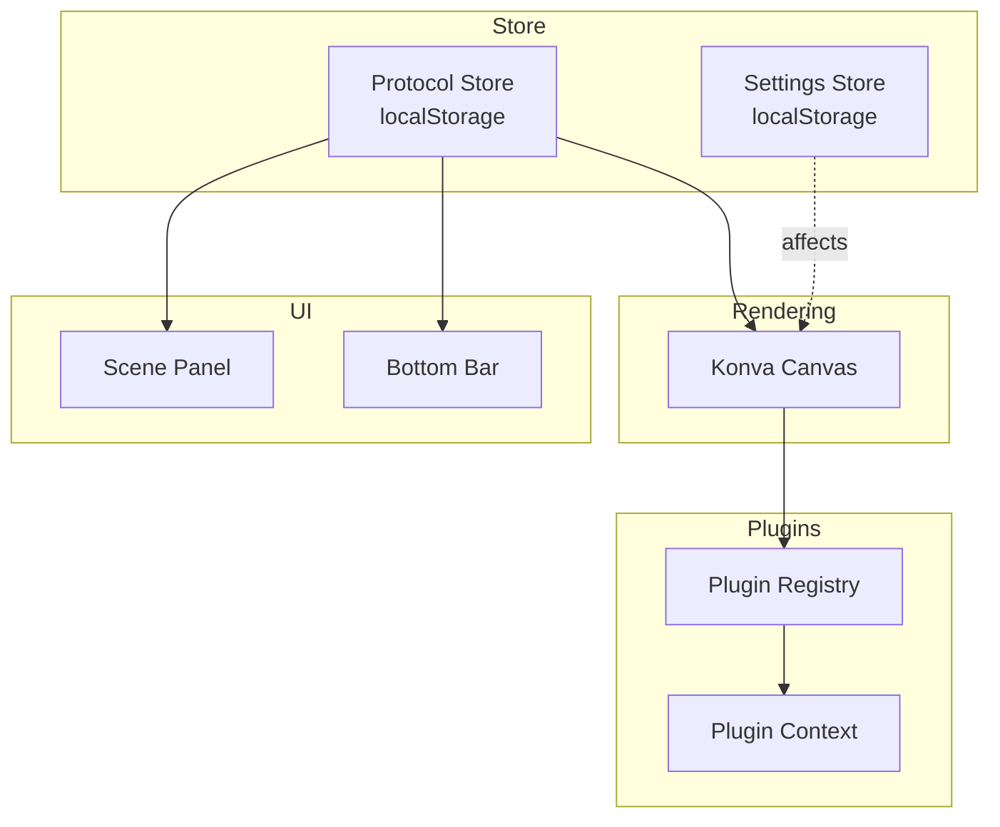
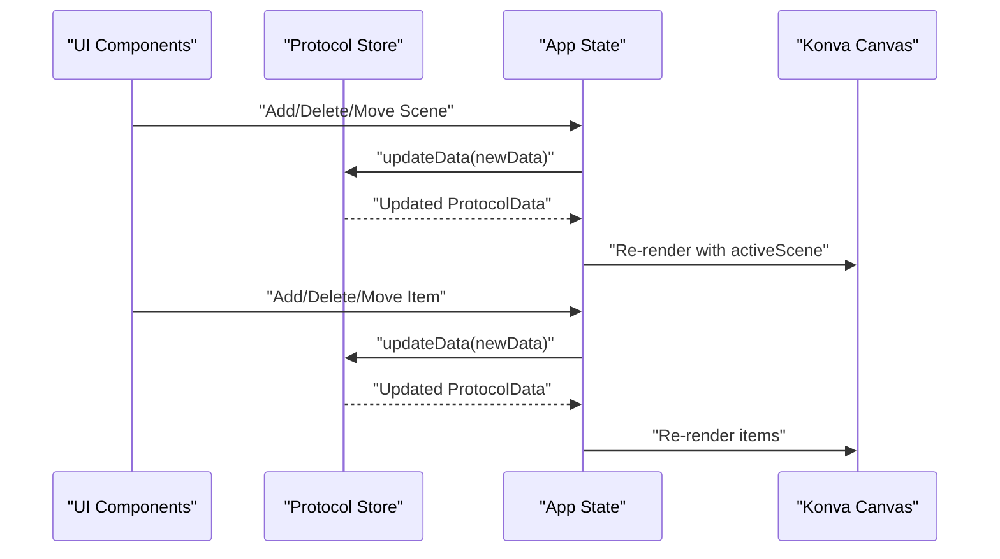
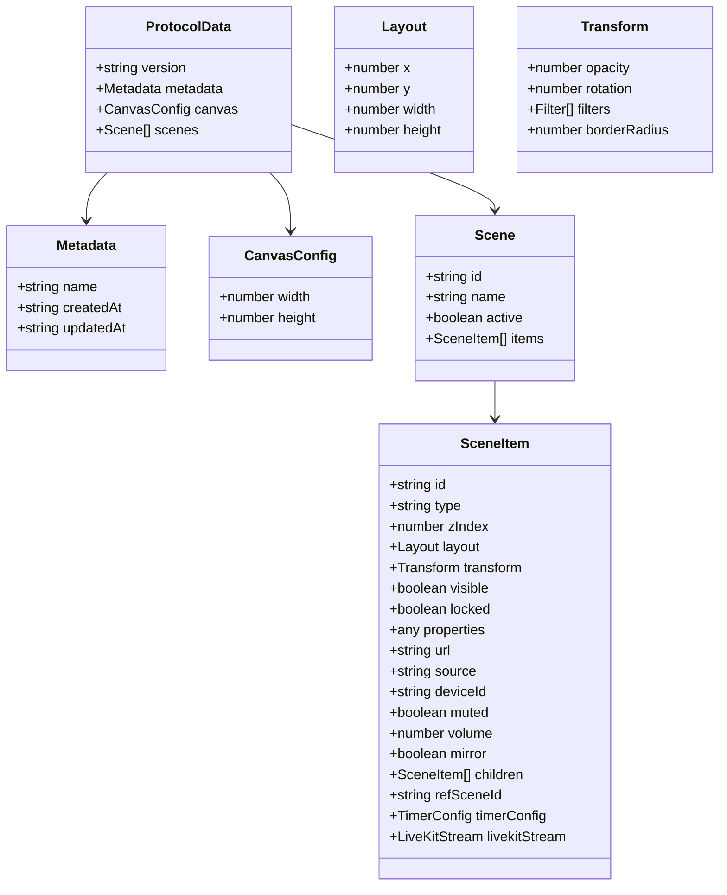
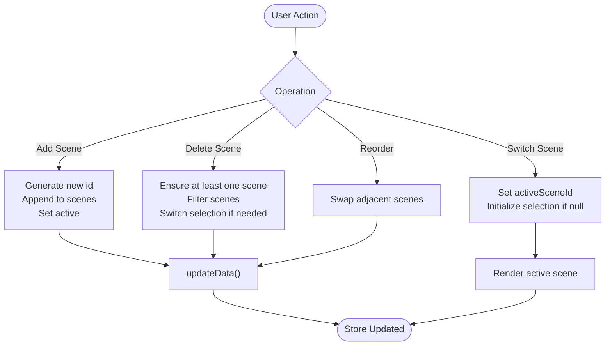
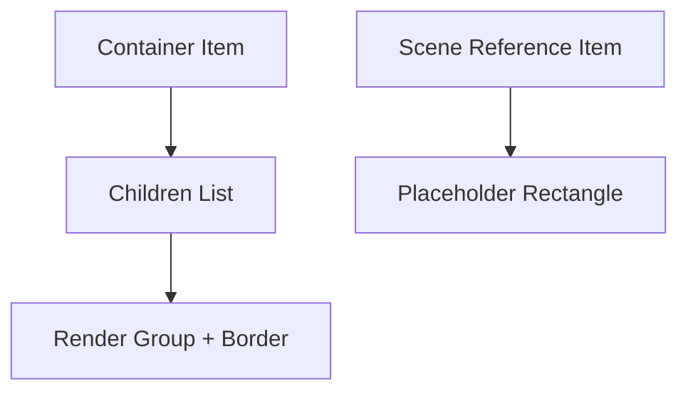
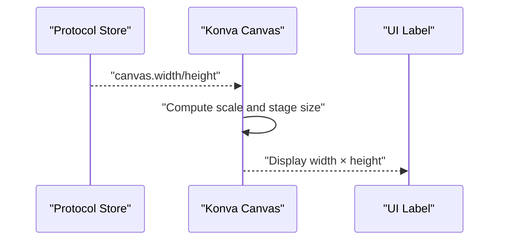
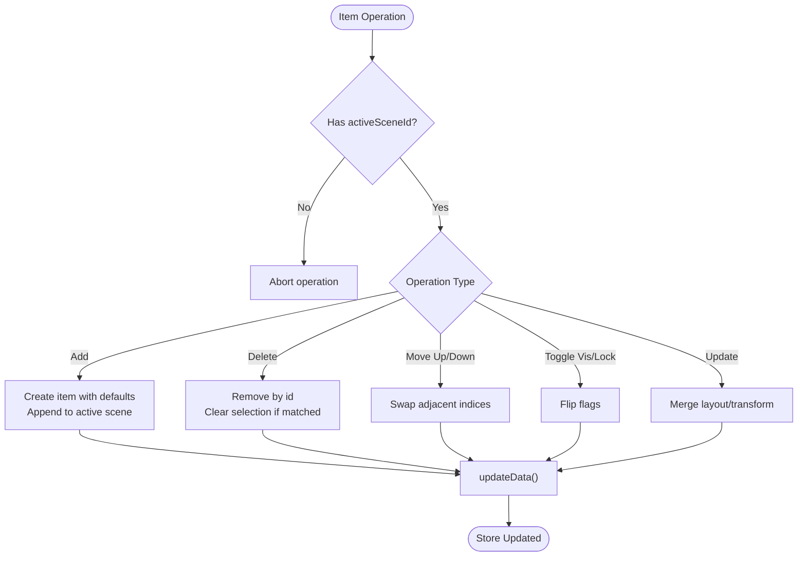
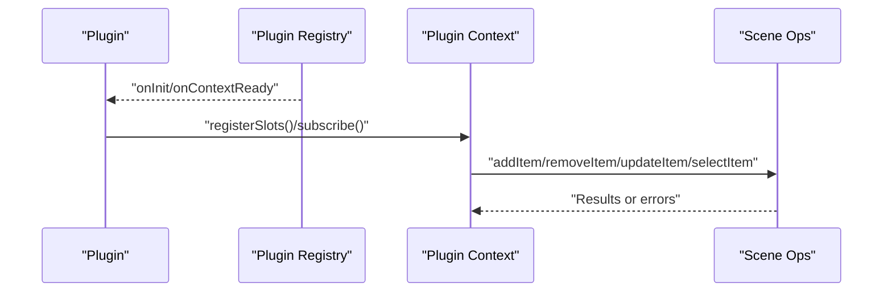
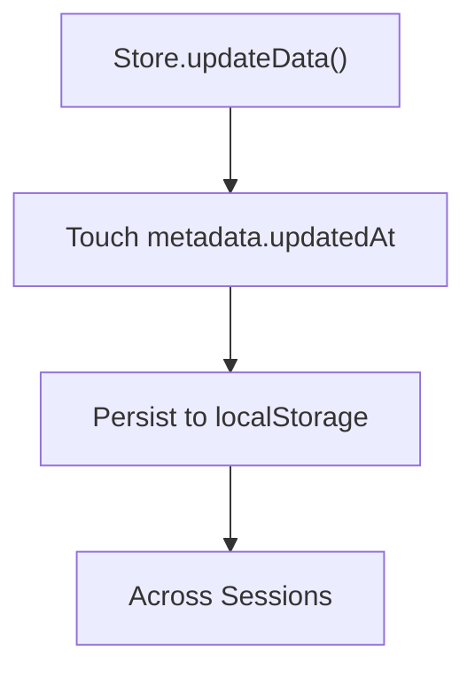
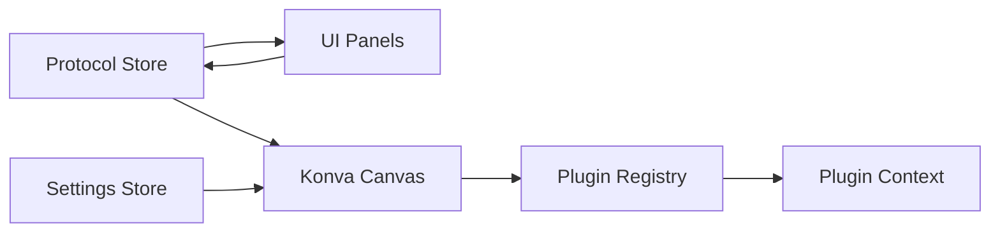

# Scene Management

<cite>
**Referenced Files in This Document**
- [App.tsx](file://src/App.tsx)
- [protocol.ts](file://src/store/protocol.ts)
- [protocol.ts (types)](file://src/types/protocol.ts)
- [konva-canvas.tsx](file://src/components/konva-canvas.tsx)
- [scene-panel.tsx](file://src/components/scene-panel.tsx)
- [bottom-bar.tsx](file://src/components/bottom-bar.tsx)
- [plugin-registry.ts](file://src/services/plugin-registry.ts)
- [plugin-context.ts](file://src/services/plugin-context.ts)
- [setting.ts](file://src/store/setting.ts)
</cite>

## Table of Contents
1. [Introduction](#introduction)
2. [Project Structure](#project-structure)
3. [Core Components](#core-components)
4. [Architecture Overview](#architecture-overview)
5. [Detailed Component Analysis](#detailed-component-analysis)
6. [Dependency Analysis](#dependency-analysis)
7. [Performance Considerations](#performance-considerations)
8. [Troubleshooting Guide](#troubleshooting-guide)
9. [Conclusion](#conclusion)

## Introduction
This document explains LiveMixer Web’s scene management system. It covers how scenes are created, deleted, and switched; how nested scenes and scene references work; how containers organize child items; and how scene configuration (canvas dimensions, background, and properties) is modeled and persisted. It also documents state persistence and synchronization across sessions, practical multi-scene workflows, transitions, dynamic manipulation, validation, error handling, and performance considerations for complex hierarchies.

## Project Structure
The scene management system spans several layers:
- Store layer: protocol state (including scenes and canvas configuration) persisted to localStorage
- UI layer: scene panel and bottom bar for scene/item operations
- Rendering layer: Konva canvas for visualizing scenes and items
- Plugin layer: extensible rendering and behavior for items
- Settings layer: persistent runtime configuration affecting output and rendering

**Diagram sources**
- [protocol.ts:38-67](file://src/store/protocol.ts#L38-L67)
- [setting.ts:92-138](file://src/store/setting.ts#L92-L138)
- [scene-panel.tsx:16-75](file://src/components/scene-panel.tsx#L16-L75)
- [bottom-bar.tsx:59-79](file://src/components/bottom-bar.tsx#L59-L79)
- [konva-canvas.tsx:113-176](file://src/components/konva-canvas.tsx#L113-L176)
- [plugin-registry.ts:5-20](file://src/services/plugin-registry.ts#L5-L20)
- [plugin-context.ts:542-578](file://src/services/plugin-context.ts#L542-L578)

**Section sources**
- [protocol.ts:38-67](file://src/store/protocol.ts#L38-L67)
- [setting.ts:92-138](file://src/store/setting.ts#L92-L138)
- [scene-panel.tsx:16-75](file://src/components/scene-panel.tsx#L16-L75)
- [bottom-bar.tsx:59-79](file://src/components/bottom-bar.tsx#L59-L79)
- [konva-canvas.tsx:113-176](file://src/components/konva-canvas.tsx#L113-L176)
- [plugin-registry.ts:5-20](file://src/services/plugin-registry.ts#L5-L20)
- [plugin-context.ts:542-578](file://src/services/plugin-context.ts#L542-L578)

## Core Components
- Protocol data model: defines scenes, items, canvas configuration, and metadata
- Protocol store: manages the global state and persists it to localStorage
- Scene panel: lists scenes and allows selection and basic operations
- Bottom bar: scene and item management controls
- Konva canvas: renders the active scene with plugins and special item types
- Plugin registry and context: enable extensibility and permissions for scene operations

Key responsibilities:
- Scene lifecycle: add, delete, reorder, and switch scenes
- Item lifecycle: add, delete, move, toggle visibility/lock, update properties
- Persistence: automatic updates to metadata timestamps and localStorage sync
- Rendering: plugin-aware rendering, timers/clocks, containers, and scene references

**Section sources**
- [protocol.ts (types):84-113](file://src/types/protocol.ts#L84-L113)
- [protocol.ts:38-67](file://src/store/protocol.ts#L38-L67)
- [scene-panel.tsx:16-75](file://src/components/scene-panel.tsx#L16-L75)
- [bottom-bar.tsx:59-79](file://src/components/bottom-bar.tsx#L59-L79)
- [konva-canvas.tsx:411-621](file://src/components/konva-canvas.tsx#L411-L621)
- [plugin-registry.ts:144-157](file://src/services/plugin-registry.ts#L144-L157)
- [plugin-context.ts:542-578](file://src/services/plugin-context.ts#L542-L578)

## Architecture Overview
The system is event-driven and stateful:
- UI components trigger actions via callbacks
- Actions mutate the protocol store immutably
- The store updates metadata timestamps and persists to localStorage
- The active scene is derived from the store and rendered by the canvas

**Diagram sources**
- [App.tsx:205-277](file://src/App.tsx#L205-L277)
- [App.tsx:371-574](file://src/App.tsx#L371-L574)
- [protocol.ts:44-54](file://src/store/protocol.ts#L44-L54)
- [konva-canvas.tsx:611-621](file://src/components/konva-canvas.tsx#L611-L621)

## Detailed Component Analysis

### Scene Model and Configuration
- Scenes are identified by id and name, contain items, and may be marked active
- Items define layout, transform, visibility, locking, and type-specific properties
- Canvas configuration includes width and height
- Metadata tracks project name and timestamps

**Diagram sources**
- [protocol.ts (types):103-113](file://src/types/protocol.ts#L103-L113)
- [protocol.ts (types):84-89](file://src/types/protocol.ts#L84-L89)
- [protocol.ts (types):20-82](file://src/types/protocol.ts#L20-L82)
- [protocol.ts (types):1-18](file://src/types/protocol.ts#L1-L18)

**Section sources**
- [protocol.ts (types):1-113](file://src/types/protocol.ts#L1-L113)

### Scene Creation, Deletion, and Switching
- Creation: generates a new scene id and appends to scenes array; selects automatically
- Deletion: prevents deleting the last scene; removes from scenes and switches selection if needed
- Switching: sets activeSceneId; initializes selection if none exists
- Reordering: swaps adjacent scenes in the scenes array

**Diagram sources**
- [App.tsx:205-243](file://src/App.tsx#L205-L243)
- [App.tsx:245-277](file://src/App.tsx#L245-L277)
- [App.tsx:158-165](file://src/App.tsx#L158-L165)

**Section sources**
- [App.tsx:205-277](file://src/App.tsx#L205-L277)
- [App.tsx:158-165](file://src/App.tsx#L158-L165)

### Container Items and Nested Scenes
- Container items hold children and render them as a grouped layer
- Scene references are represented as a dedicated item type; they can be rendered as placeholders on canvas
- Containers are interactive only for selection/transform when unlocked; children are non-interactive

**Diagram sources**
- [protocol.ts (types):55-58](file://src/types/protocol.ts#L55-L58)
- [konva-canvas.tsx:548-567](file://src/components/konva-canvas.tsx#L548-L567)
- [konva-canvas.tsx:569-581](file://src/components/konva-canvas.tsx#L569-L581)

**Section sources**
- [protocol.ts (types):55-58](file://src/types/protocol.ts#L55-L58)
- [konva-canvas.tsx:548-581](file://src/components/konva-canvas.tsx#L548-L581)

### Canvas Dimensions and Background
- Canvas dimensions are stored centrally and applied to the Stage and scaling logic
- The canvas label shows current width × height
- Rendering scales to fit the container while preserving aspect ratio

**Diagram sources**
- [protocol.ts:13-16](file://src/store/protocol.ts#L13-L16)
- [konva-canvas.tsx:302-357](file://src/components/konva-canvas.tsx#L302-L357)
- [konva-canvas.tsx:735-738](file://src/components/konva-canvas.tsx#L735-L738)

**Section sources**
- [protocol.ts:13-16](file://src/store/protocol.ts#L13-L16)
- [konva-canvas.tsx:302-357](file://src/components/konva-canvas.tsx#L302-L357)
- [konva-canvas.tsx:735-738](file://src/components/konva-canvas.tsx#L735-L738)

### Item Operations and Validation
- Add item: generates a unique id per type, applies default layout, merges plugin defaults, and appends to active scene
- Delete item: removes by id and clears selection if needed
- Move item up/down: swaps adjacent indices in the active scene
- Toggle visibility/lock: flips flags and updates selection visuals
- Update item: merges layout/transform updates safely

Validation and safeguards:
- Prevents deleting the last scene
- Disables movement when already at boundaries
- Skips updates when activeSceneId is missing
- Filters items for rendering based on plugin configuration

**Diagram sources**
- [App.tsx:371-574](file://src/App.tsx#L371-L574)
- [App.tsx:576-693](file://src/App.tsx#L576-L693)
- [App.tsx:227-243](file://src/App.tsx#L227-L243)

**Section sources**
- [App.tsx:371-693](file://src/App.tsx#L371-L693)
- [App.tsx:227-243](file://src/App.tsx#L227-L243)

### Plugin Integration and Permissions
- Plugins register via the plugin registry and can render items, control selection/filtering, and expose APIs
- The plugin context exposes scene operations with permission checks
- Plugins can define default layouts, stream initialization, and property schemas

**Diagram sources**
- [plugin-registry.ts:78-118](file://src/services/plugin-registry.ts#L78-L118)
- [plugin-context.ts:542-578](file://src/services/plugin-context.ts#L542-L578)

**Section sources**
- [plugin-registry.ts:78-118](file://src/services/plugin-registry.ts#L78-L118)
- [plugin-context.ts:542-578](file://src/services/plugin-context.ts#L542-L578)

### Scene State Persistence and Synchronization
- Protocol data is persisted to localStorage with a Zustand persist middleware
- Metadata updatedAt is refreshed on every update
- Settings are split into persistent and sensitive parts; sensitive settings remain in-memory

**Diagram sources**
- [protocol.ts:44-54](file://src/store/protocol.ts#L44-L54)
- [protocol.ts:62-67](file://src/store/protocol.ts#L62-L67)
- [setting.ts:120-138](file://src/store/setting.ts#L120-L138)

**Section sources**
- [protocol.ts:44-67](file://src/store/protocol.ts#L44-L67)
- [setting.ts:120-138](file://src/store/setting.ts#L120-L138)

### Practical Multi-Scene Workflows and Transitions
- Multi-scene workflow: create multiple scenes, populate each with relevant items, switch between scenes for scene changes
- Dynamic manipulation: reorder scenes to change presentation order, add/remove items per scene, toggle visibility/lock for fine-grained control
- Transitions: scene switching is immediate; transitions can be implemented by animating item properties or using plugin effects

[No sources needed since this section provides general guidance]

### Error Handling and Validation
- UI guards prevent destructive actions (e.g., deleting the last scene)
- Permission checks in plugin context prevent unauthorized scene operations
- Canvas rendering filters items based on plugin configuration to avoid invalid states

**Section sources**
- [App.tsx:227-243](file://src/App.tsx#L227-L243)
- [plugin-context.ts:542-578](file://src/services/plugin-context.ts#L542-L578)
- [konva-canvas.tsx:611-621](file://src/components/konva-canvas.tsx#L611-L621)

## Dependency Analysis
- UI depends on the protocol store for data and on callbacks for actions
- Canvas depends on the active scene and plugin registry for rendering
- Plugin registry and context provide extension points and permissions
- Settings influence rendering and streaming behavior

**Diagram sources**
- [protocol.ts:38-67](file://src/store/protocol.ts#L38-L67)
- [bottom-bar.tsx:59-79](file://src/components/bottom-bar.tsx#L59-L79)
- [konva-canvas.tsx:113-176](file://src/components/konva-canvas.tsx#L113-L176)
- [plugin-registry.ts:144-157](file://src/services/plugin-registry.ts#L144-L157)
- [plugin-context.ts:542-578](file://src/services/plugin-context.ts#L542-L578)
- [setting.ts:92-138](file://src/store/setting.ts#L92-L138)

**Section sources**
- [protocol.ts:38-67](file://src/store/protocol.ts#L38-L67)
- [bottom-bar.tsx:59-79](file://src/components/bottom-bar.tsx#L59-L79)
- [konva-canvas.tsx:113-176](file://src/components/konva-canvas.tsx#L113-L176)
- [plugin-registry.ts:144-157](file://src/services/plugin-registry.ts#L144-L157)
- [plugin-context.ts:542-578](file://src/services/plugin-context.ts#L542-L578)
- [setting.ts:92-138](file://src/store/setting.ts#L92-L138)

## Performance Considerations
- Rendering: the canvas sorts items by zIndex and filters based on plugin configuration to reduce unnecessary draws
- Timers/clocks: use requestAnimationFrame loops only when items exist to minimize overhead
- Continuous rendering: canvas supports continuous rendering for capture scenarios; stop when not needed
- Scaling: auto-scale to container size with guardrails to avoid invalid dimensions

Recommendations:
- Prefer lightweight item types for heavy compositions
- Use containers to group related items and reduce per-item overhead
- Limit frequent updates to layout/transform to reduce re-renders
- Disable continuous rendering during idle periods

**Section sources**
- [konva-canvas.tsx:611-621](file://src/components/konva-canvas.tsx#L611-L621)
- [konva-canvas.tsx:204-300](file://src/components/konva-canvas.tsx#L204-L300)
- [konva-canvas.tsx:154-176](file://src/components/konva-canvas.tsx#L154-L176)
- [konva-canvas.tsx:302-357](file://src/components/konva-canvas.tsx#L302-L357)

## Troubleshooting Guide
Common issues and resolutions:
- Scene deletion fails: ensure more than one scene exists; the UI prevents deleting the last scene
- Item operations do nothing: verify an active scene is selected; operations require activeSceneId
- Canvas not updating: confirm metadata updatedAt is being refreshed and the store is persisting changes
- Plugin rendering anomalies: check plugin canvasRender.shouldFilter/isSelectable configurations
- Permission errors: verify plugin context permissions for scene operations

**Section sources**
- [App.tsx:227-243](file://src/App.tsx#L227-L243)
- [App.tsx:371-574](file://src/App.tsx#L371-L574)
- [protocol.ts:44-54](file://src/store/protocol.ts#L44-L54)
- [plugin-context.ts:542-578](file://src/services/plugin-context.ts#L542-L578)
- [konva-canvas.tsx:611-621](file://src/components/konva-canvas.tsx#L611-L621)

## Conclusion
LiveMixer Web’s scene management system combines a robust data model, a reactive store with persistence, and a flexible plugin ecosystem. Scenes and items are managed declaratively, with strong safeguards and clear separation of concerns. The canvas renders efficiently with plugin-aware logic, and the system supports practical multi-scene workflows, dynamic manipulation, and performance-conscious rendering. Extensibility is achieved through the plugin registry and context, enabling powerful integrations while maintaining safety via permissions.