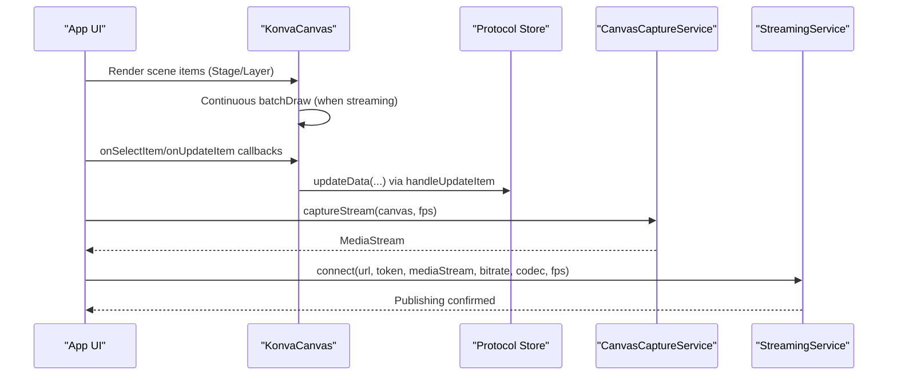
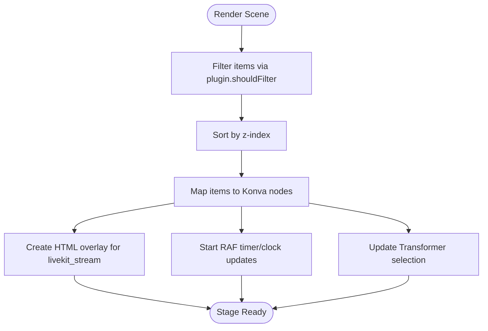
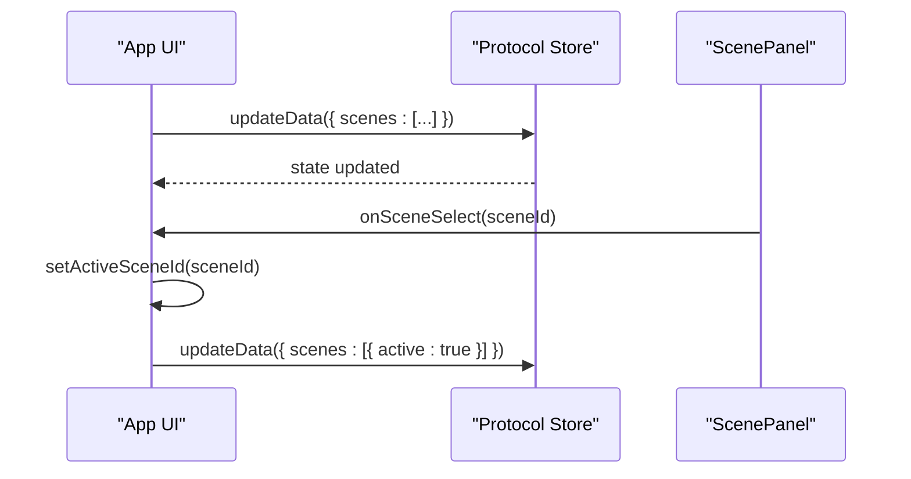
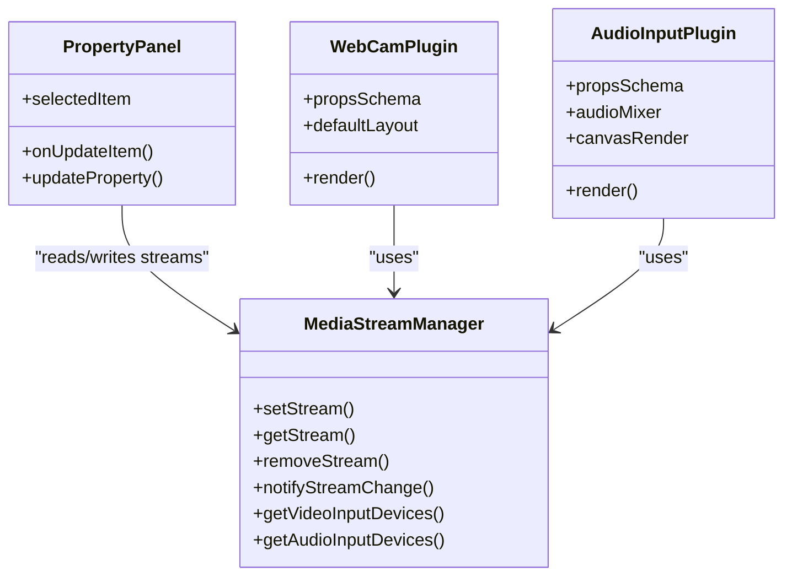
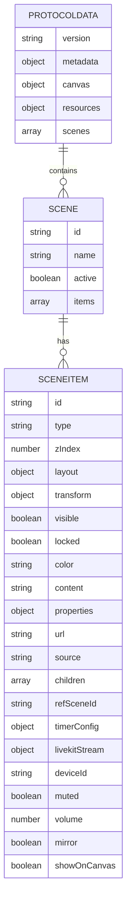
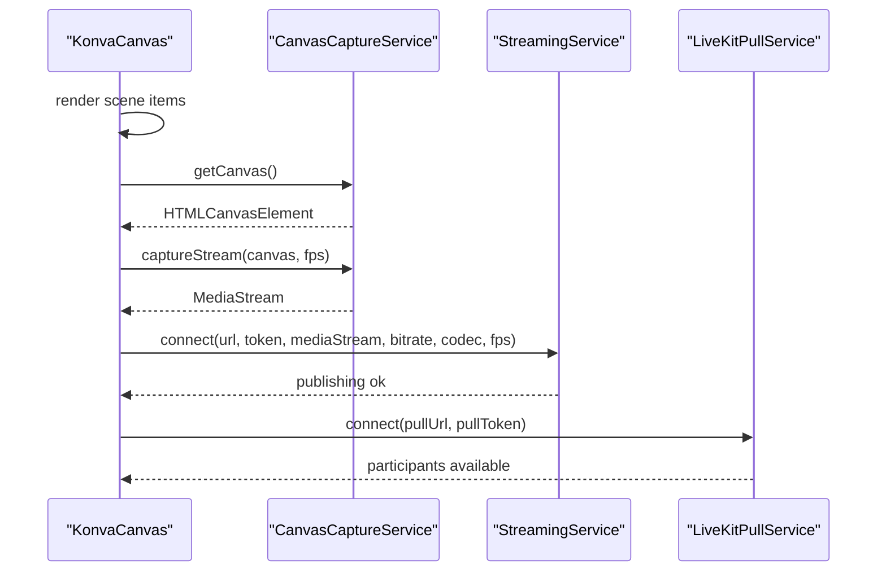
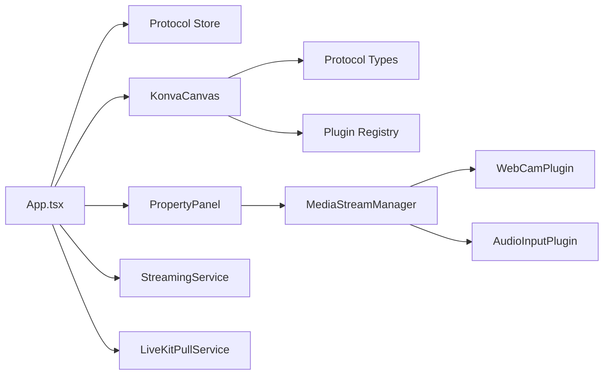

# Video Mixing Engine

<cite>
**Referenced Files in This Document**
- [App.tsx](file://src/App.tsx)
- [konva-canvas.tsx](file://src/components/konva-canvas.tsx)
- [protocol.ts](file://src/store/protocol.ts)
- [protocol.ts (types)](file://src/types/protocol.ts)
- [streaming.ts](file://src/services/streaming.ts)
- [canvas-capture.ts](file://src/services/canvas-capture.ts)
- [livekit-stream-item.tsx](file://src/components/livekit-stream-item.tsx)
- [livekit-pull.ts](file://src/services/livekit-pull.ts)
- [media-stream-manager.ts](file://src/services/media-stream-manager.ts)
- [property-panel.tsx](file://src/components/property-panel.tsx)
- [scene-panel.tsx](file://src/components/scene-panel.tsx)
- [webcam plugin](file://src/plugins/builtin/webcam/index.tsx)
- [audio-input plugin](file://src/plugins/builtin/audio-input/index.tsx)
</cite>

## Table of Contents
1. [Introduction](#introduction)
2. [Project Structure](#project-structure)
3. [Core Components](#core-components)
4. [Architecture Overview](#architecture-overview)
5. [Detailed Component Analysis](#detailed-component-analysis)
6. [Dependency Analysis](#dependency-analysis)
7. [Performance Considerations](#performance-considerations)
8. [Troubleshooting Guide](#troubleshooting-guide)
9. [Conclusion](#conclusion)
10. [Appendices](#appendices)

## Introduction
This document explains LiveMixer Web’s video mixing engine centered around a canvas-based composition system powered by Konva. It covers:
- Scene management: creation, activation, and organization
- Item manipulation: drag-and-drop positioning, transform operations (opacity, rotation, filters), and z-index ordering
- ProtocolData structure for storing scene configurations and state
- Relationship between scene items, canvas rendering, and stream publishing
- Practical mixing scenarios and performance optimization techniques for smooth real-time rendering

## Project Structure
LiveMixer Web organizes the mixing engine around a few core areas:
- Canvas rendering and interactivity: Konva-based canvas with draggable/translatable items and a Transformer overlay
- Scene and item model: ProtocolData and SceneItem types define the composition graph
- Store and state: Zustand-backed Protocol store persists and updates the project state
- Streaming pipeline: Canvas capture, LiveKit publishing, and pull services for remote participants
- Plugins: Built-in plugins for webcam, audio input, and others extend the item palette
- Property panel: Real-time editing of item properties and transforms

```mermaid
graph TB
subgraph "UI"
App["App.tsx"]
ScenePanel["ScenePanel"]
PropertyPanel["PropertyPanel"]
end
subgraph "Canvas"
KonvaCanvas["KonvaCanvas"]
LiveKitOverlay["LiveKitStreamItem Overlay"]
end
subgraph "State"
ProtocolStore["Protocol Store (Zustand)"]
Types["Protocol Types"]
end
subgraph "Streaming"
CanvasCapture["CanvasCaptureService"]
Streaming["StreamingService (LiveKit Publisher)"]
Pull["LiveKitPullService"]
end
subgraph "Plugins"
WebcamPlugin["WebCamPlugin"]
AudioPlugin["AudioInputPlugin"]
MediaMgr["MediaStreamManager"]
end
App --> ScenePanel
App --> PropertyPanel
App --> KonvaCanvas
KonvaCanvas --> LiveKitOverlay
App --> ProtocolStore
ProtocolStore --> Types
App --> CanvasCapture
CanvasCapture --> Streaming
App --> Pull
App --> MediaMgr
MediaMgr --> WebcamPlugin
MediaMgr --> AudioPlugin
```

**Diagram sources**
- [App.tsx:953-962](file://src/App.tsx#L953-L962)
- [konva-canvas.tsx:649-694](file://src/components/konva-canvas.tsx#L649-L694)
- [livekit-stream-item.tsx:16-21](file://src/components/livekit-stream-item.tsx#L16-L21)
- [protocol.ts:38-67](file://src/store/protocol.ts#L38-L67)
- [protocol.ts (types):103-114](file://src/types/protocol.ts#L103-L114)
- [canvas-capture.ts:14-24](file://src/services/canvas-capture.ts#L14-L24)
- [streaming.ts:20-124](file://src/services/streaming.ts#L20-L124)
- [livekit-pull.ts:60-179](file://src/services/livekit-pull.ts#L60-L179)
- [media-stream-manager.ts:56-106](file://src/services/media-stream-manager.ts#L56-L106)
- [webcam plugin:110-478](file://src/plugins/builtin/webcam/index.tsx#L110-L478)
- [audio-input plugin:105-555](file://src/plugins/builtin/audio-input/index.tsx#L105-L555)

**Section sources**
- [App.tsx:913-1022](file://src/App.tsx#L913-L1022)
- [konva-canvas.tsx:623-741](file://src/components/konva-canvas.tsx#L623-L741)
- [protocol.ts:38-67](file://src/store/protocol.ts#L38-L67)
- [protocol.ts (types):103-114](file://src/types/protocol.ts#L103-L114)

## Core Components
- Canvas composition with Konva:
  - Stage/Layer rendering items sorted by z-index
  - Transformer overlay enabling drag, scale, rotate with minimum size enforcement
  - Special handling for timers/clocks with high-precision RAF updates
  - HTML overlay for LiveKit video streams to bypass Konva limitations
- ProtocolData and SceneItem:
  - Versioned project metadata, canvas dimensions, and scenes/items
  - Layout (x, y, width, height), Transform (opacity, rotation, filters, borderRadius), visibility/locking flags
  - Rich item types including color, image, text, media, window, screen, container, scene_ref, timer, clock, livekit_stream, and plugin-defined types
- Protocol store:
  - Zustand store with localStorage persistence
  - Provides update/reset actions and timestamps metadata
- Streaming pipeline:
  - CanvasCaptureService captures a Canvas stream at target FPS
  - StreamingService publishes to LiveKit with configurable codec, bitrate, and framerate
  - LiveKitPullService connects to pull remote participant streams
- Plugins:
  - MediaStreamManager centralizes stream lifecycle and device enumeration
  - Built-in plugins for webcam and audio input integrate with the canvas and property panels

**Section sources**
- [konva-canvas.tsx:113-176](file://src/components/konva-canvas.tsx#L113-L176)
- [konva-canvas.tsx:611-621](file://src/components/konva-canvas.tsx#L611-L621)
- [konva-canvas.tsx:664-692](file://src/components/konva-canvas.tsx#L664-L692)
- [konva-canvas.tsx:204-300](file://src/components/konva-canvas.tsx#L204-L300)
- [konva-canvas.tsx:695-733](file://src/components/konva-canvas.tsx#L695-L733)
- [protocol.ts (types):20-82](file://src/types/protocol.ts#L20-L82)
- [protocol.ts (types):84-89](file://src/types/protocol.ts#L84-L89)
- [protocol.ts (types):103-114](file://src/types/protocol.ts#L103-L114)
- [protocol.ts:38-67](file://src/store/protocol.ts#L38-L67)
- [canvas-capture.ts:14-24](file://src/services/canvas-capture.ts#L14-L24)
- [streaming.ts:20-124](file://src/services/streaming.ts#L20-L124)
- [livekit-pull.ts:60-179](file://src/services/livekit-pull.ts#L60-L179)
- [media-stream-manager.ts:56-106](file://src/services/media-stream-manager.ts#L56-L106)

## Architecture Overview
The mixing engine composes a real-time video output by rendering items onto a Konva Stage, capturing the resulting canvas as a MediaStream, and publishing it to LiveKit. Remote participants can be mixed into the composition via HTML overlays for video streams.



**Diagram sources**
- [App.tsx:725-788](file://src/App.tsx#L725-L788)
- [konva-canvas.tsx:154-176](file://src/components/konva-canvas.tsx#L154-L176)
- [canvas-capture.ts:14-24](file://src/services/canvas-capture.ts#L14-L24)
- [streaming.ts:20-124](file://src/services/streaming.ts#L20-L124)

## Detailed Component Analysis

### Canvas Composition and Interactions
- Rendering pipeline:
  - Items are filtered by plugin-provided shouldFilter and sorted by z-index before rendering
  - Each item maps to a Konva node based on type (color, image, text, rect-like shapes, containers, etc.)
  - Timer/clock items compute display text via high-precision RAF loops
- Selection and transforms:
  - Transformer targets selection; locked items cannot be transformed
  - Drag-end and transform-end update layout and transform properties atomically
  - Minimum size enforcement prevents collapsing items
- LiveKit overlay:
  - livekit_stream items render a placeholder rectangle in Konva and an HTML overlay for the actual video
  - Overlay respects rotation/opacity and pointer-events to avoid interfering with selection



**Diagram sources**
- [konva-canvas.tsx:611-621](file://src/components/konva-canvas.tsx#L611-L621)
- [konva-canvas.tsx:204-300](file://src/components/konva-canvas.tsx#L204-L300)
- [konva-canvas.tsx:179-202](file://src/components/konva-canvas.tsx#L179-L202)
- [konva-canvas.tsx:695-733](file://src/components/konva-canvas.tsx#L695-L733)

**Section sources**
- [konva-canvas.tsx:411-601](file://src/components/konva-canvas.tsx#L411-L601)
- [konva-canvas.tsx:359-409](file://src/components/konva-canvas.tsx#L359-L409)
- [konva-canvas.tsx:664-692](file://src/components/konva-canvas.tsx#L664-L692)
- [konva-canvas.tsx:204-300](file://src/components/konva-canvas.tsx#L204-L300)
- [livekit-stream-item.tsx:16-173](file://src/components/livekit-stream-item.tsx#L16-L173)

### Scene Management
- Scenes are stored in ProtocolData.scenes with active scene tracking
- App manages scene creation, deletion, reordering, and selection
- Property panel reads the selected item and updates it via handleUpdateItem
- ScenePanel lists scenes with item counts and selection UI



**Diagram sources**
- [App.tsx:205-277](file://src/App.tsx#L205-L277)
- [scene-panel.tsx:16-75](file://src/components/scene-panel.tsx#L16-L75)
- [protocol.ts:38-67](file://src/store/protocol.ts#L38-L67)

**Section sources**
- [App.tsx:128-203](file://src/App.tsx#L128-L203)
- [App.tsx:205-277](file://src/App.tsx#L205-L277)
- [scene-panel.tsx:16-75](file://src/components/scene-panel.tsx#L16-L75)
- [protocol.ts:38-67](file://src/store/protocol.ts#L38-L67)

### Item Manipulation and Properties
- Drag-and-drop:
  - Draggable items update layout on drag-end; scale resets after transform
- Transform operations:
  - Opacity and rotation sliders update Transform
  - Border radius applies to window/scene_ref/color rects
- Z-index management:
  - Property panel allows numeric z-index editing
  - Sorting by z-index ensures correct layering
- Plugin-driven properties:
  - Plugins define propsSchema; PropertyPanel renders typed controls (number, string, boolean)
  - Plugin-controlled exclusion of default properties (e.g., url/deviceId)



**Diagram sources**
- [property-panel.tsx:643-1040](file://src/components/property-panel.tsx#L643-L1040)
- [media-stream-manager.ts:56-106](file://src/services/media-stream-manager.ts#L56-L106)
- [webcam plugin:110-478](file://src/plugins/builtin/webcam/index.tsx#L110-L478)
- [audio-input plugin:105-555](file://src/plugins/builtin/audio-input/index.tsx#L105-L555)

**Section sources**
- [property-panel.tsx:740-750](file://src/components/property-panel.tsx#L740-L750)
- [property-panel.tsx:840-916](file://src/components/property-panel.tsx#L840-L916)
- [property-panel.tsx:918-1040](file://src/components/property-panel.tsx#L918-L1040)
- [webcam plugin:234-473](file://src/plugins/builtin/webcam/index.tsx#L234-L473)
- [audio-input plugin:255-550](file://src/plugins/builtin/audio-input/index.tsx#L255-L550)

### ProtocolData Structure
ProtocolData is the canonical project model:
- version: semantic versioning for the schema
- metadata: project name, creation/update timestamps
- canvas: width/height for the composition
- resources: optional collection of sources
- scenes: array of scenes, each with id, name, active flag, and items

SceneItem defines each compositional element:
- id, type, zIndex, layout, transform, visibility/locking flags
- type-specific fields (e.g., color, content, url, source, children, refSceneId, timerConfig, livekitStream, audio/video properties)
- Transform supports opacity, rotation, filters, and borderRadius



**Diagram sources**
- [protocol.ts (types):103-114](file://src/types/protocol.ts#L103-L114)
- [protocol.ts (types):84-89](file://src/types/protocol.ts#L84-L89)
- [protocol.ts (types):20-82](file://src/types/protocol.ts#L20-L82)

**Section sources**
- [protocol.ts (types):103-114](file://src/types/protocol.ts#L103-L114)
- [protocol.ts (types):84-89](file://src/types/protocol.ts#L84-L89)
- [protocol.ts (types):20-82](file://src/types/protocol.ts#L20-L82)

### Relationship Between Items, Canvas, and Streams
- Canvas rendering:
  - KonvaCanvas renders items and a Transformer for selection
  - Timer/clock items are updated via RAF; LiveKit items render HTML overlays
- Stream publishing:
  - CanvasCaptureService captures the Stage’s canvas as a MediaStream
  - StreamingService publishes the stream to LiveKit with configurable codec/bitrate/framerate
- Pulling participants:
  - LiveKitPullService connects to a room and exposes participant tracks for overlay placement



**Diagram sources**
- [konva-canvas.tsx:145-176](file://src/components/konva-canvas.tsx#L145-L176)
- [canvas-capture.ts:14-24](file://src/services/canvas-capture.ts#L14-L24)
- [streaming.ts:20-124](file://src/services/streaming.ts#L20-L124)
- [livekit-pull.ts:60-179](file://src/services/livekit-pull.ts#L60-L179)

**Section sources**
- [App.tsx:725-788](file://src/App.tsx#L725-L788)
- [App.tsx:826-897](file://src/App.tsx#L826-L897)
- [konva-canvas.tsx:145-176](file://src/components/konva-canvas.tsx#L145-L176)
- [canvas-capture.ts:14-24](file://src/services/canvas-capture.ts#L14-L24)
- [streaming.ts:20-124](file://src/services/streaming.ts#L20-L124)
- [livekit-pull.ts:60-179](file://src/services/livekit-pull.ts#L60-L179)

## Dependency Analysis
- App orchestrates UI, store, canvas, streaming, and pull services
- KonvaCanvas depends on plugin registry and timer/clock RAF logic
- PropertyPanel depends on MediaStreamManager and plugin propsSchema
- MediaStreamManager decouples plugin internals from UI
- Plugins depend on MediaStreamManager for stream lifecycle and device enumeration



**Diagram sources**
- [App.tsx:913-1022](file://src/App.tsx#L913-L1022)
- [konva-canvas.tsx:20-22](file://src/components/konva-canvas.tsx#L20-L22)
- [property-panel.tsx:13-17](file://src/components/property-panel.tsx#L13-L17)
- [media-stream-manager.ts:39-106](file://src/services/media-stream-manager.ts#L39-L106)
- [webcam plugin:110-478](file://src/plugins/builtin/webcam/index.tsx#L110-L478)
- [audio-input plugin:105-555](file://src/plugins/builtin/audio-input/index.tsx#L105-L555)

**Section sources**
- [App.tsx:913-1022](file://src/App.tsx#L913-L1022)
- [konva-canvas.tsx:20-22](file://src/components/konva-canvas.tsx#L20-L22)
- [property-panel.tsx:13-17](file://src/components/property-panel.tsx#L13-L17)
- [media-stream-manager.ts:39-106](file://src/services/media-stream-manager.ts#L39-L106)

## Performance Considerations
- Continuous rendering during streaming:
  - Start a continuous render loop to keep captureStream alive; stop it when not streaming
  - Use batchDraw to minimize redraw overhead
- RAF-based timers/clocks:
  - High-precision RAF loop updates timer/clock text efficiently
- Minimize redraws:
  - Use transformerRef.getLayer().batchDraw during drag-move
  - Filter items via plugin.shouldFilter to skip expensive rendering
- Stream capture and publishing:
  - Use Canvas API captureStream with appropriate FPS
  - Tune videoBitrate, codec, and maxFramerate to balance quality and CPU/network
- Overlay strategy:
  - Render livekit_stream placeholders in Konva and HTML overlays for actual video avoids heavy Konva video nodes

Practical tips:
- Keep z-index increments predictable to reduce frequent sort operations
- Prefer plugin-provided shouldFilter for heavy items
- Limit simultaneous high-resolution streams (webcam/screen/audio) to maintain smooth capture

**Section sources**
- [konva-canvas.tsx:154-176](file://src/components/konva-canvas.tsx#L154-L176)
- [konva-canvas.tsx:377-382](file://src/components/konva-canvas.tsx#L377-L382)
- [konva-canvas.tsx:611-621](file://src/components/konva-canvas.tsx#L611-L621)
- [canvas-capture.ts:14-24](file://src/services/canvas-capture.ts#L14-L24)
- [streaming.ts:20-124](file://src/services/streaming.ts#L20-L124)

## Troubleshooting Guide
- Cannot start push streaming:
  - Verify LiveKit URL and token are configured
  - Ensure canvas is available and continuous rendering is started
  - Confirm MediaStream has a video track and constraints applied
- Timer/clock not updating:
  - Check RAF loop is active when timer/clock items exist
  - Validate timerConfig fields (mode, duration, startValue, format)
- LiveKit stream not visible:
  - Confirm participant identity and source match
  - Ensure overlay is positioned and sized correctly
  - Check pointer-events are disabled on overlay when selected
- Device permissions:
  - Use MediaStreamManager helpers to enumerate devices and request permissions
  - Handle fallback getUserMedia when enumerateDevices lacks labels
- Property panel not updating:
  - Ensure item is not locked
  - Verify plugin propsSchema excludes conflicting keys

**Section sources**
- [App.tsx:725-788](file://src/App.tsx#L725-L788)
- [App.tsx:826-897](file://src/App.tsx#L826-L897)
- [konva-canvas.tsx:204-300](file://src/components/konva-canvas.tsx#L204-L300)
- [livekit-stream-item.tsx:26-108](file://src/components/livekit-stream-item.tsx#L26-L108)
- [media-stream-manager.ts:150-273](file://src/services/media-stream-manager.ts#L150-L273)
- [property-panel.tsx:675-691](file://src/components/property-panel.tsx#L675-L691)

## Conclusion
LiveMixer Web’s video mixing engine combines a flexible canvas-based composition system with a robust streaming pipeline. The ProtocolData model cleanly separates scene configuration from rendering, while plugins extend the item palette. The PropertyPanel and MediaStreamManager provide a unified interface for managing media sources and properties. With careful attention to continuous rendering, RAF-driven updates, and overlay strategies, the engine delivers smooth real-time mixing suitable for live production.

## Appendices

### Practical Mixing Scenarios
- Mixed live streams:
  - Pull remote participants via LiveKitPullService and add livekit_stream items to the scene
  - Adjust overlay positions and sizes; use opacity and rotation for visual effect
- Timers and clocks:
  - Add timer/clock items; configure mode, duration/startValue, and display format
  - Use PropertyPanel to start/pause/reset and adjust font size and color
- Media overlays:
  - Add image/media items; choose URL or local file; adjust opacity and border radius
- Webcam/audio:
  - Use WebCamPlugin/AudioInputPlugin to capture and mix audiovisual sources
  - Manage device selection and mute/volume via PropertyPanel

**Section sources**
- [App.tsx:826-897](file://src/App.tsx#L826-L897)
- [property-panel.tsx:1411-1599](file://src/components/property-panel.tsx#L1411-L1599)
- [webcam plugin:110-478](file://src/plugins/builtin/webcam/index.tsx#L110-L478)
- [audio-input plugin:105-555](file://src/plugins/builtin/audio-input/index.tsx#L105-L555)